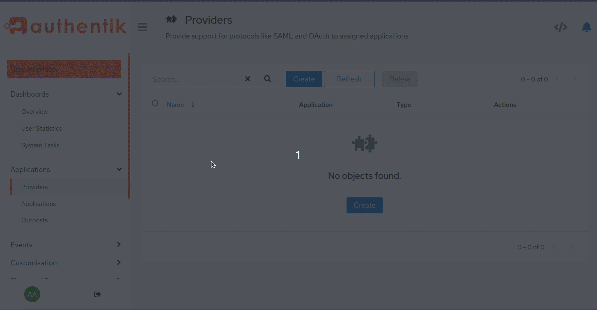

# Authentik

This guide shows how to setup {{ extra.project }} + [Authentik](https://goauthentik.io/) as OIDC identity provider.
It was tested with Authentik 2023.10.7

To follow this guide you need one {{ extra.project }} and one Authentik instance. For
this guide we have:

    http://authk.trusel.net:9000/ (Authentik instance)
    http://demo.trusel.net:12000/ ({{extra.project}} instance)

Of course for your specific deployment you'll want to serve both apps over
https, with valid certificates and without featuring ports in URLs, but for
our guide we will skip those parts.

In first part of the guide we will add administrative user
(superuser). Superuser has all permissions, in other words, superuser is the
most privileged user in {{ extra.project }}. In second part of the guide we will add
one non-superuser.

## Administrative User (Superuser)

### Step 1 - Create Application

Create new application.
Applications -> Create:

    Name: Papermerge
    Slug: papermerge
    Policy engine mode: any

Leave `Provider` field empty for this moment, we will fill it in later.

### Step 2 - Create Provider

Create OIDC provider.
Applications -> Providers -> Create:

    Choose OAuth2/OpenID Provider
    Name: papermerge
    Authentication flow: default-authentication-flow
    Authorization flow: default-provider-authorization-explicit-consent
    Client type: confidential
    Subject mode (in Advanced protocol settings): Based on User's UUID
    Scopes (in Advanced protocol settings): make sure email, openid, profile are selected

Last point is very important as it will setup `sub` claim to contain user's UUID.

