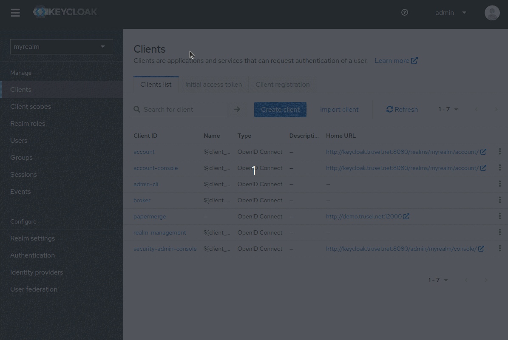

# Keycloak

This guide shows how to setup Papermerge + [Keyloak](https://keycloak.org) as OIDC identity
provider. It was tested with Keycloak 24.0.2.

To follow this guide you need one {{ extra.project }} and one Keycloak instance.
For this guide we have:

- http://keycloak.trusel.net:8080/ (Keycloak instance)
- http://demo.trusel.net:12000/  ({{extra.project}} instance)

Of course for your specific deployment you'll want to serve both apps over
https, with valid certificates and without featuring ports in URLs, but for
our guide we will skip those parts.

First we will configure Keycloak, and then we will start {{ extra.project }}
with correct environment variables.

## Administrative User (Superuser)

### Step 1 - Create Realm

Create a new realm in Keycloak as described [here](https://www.keycloak.org/getting-started/getting-started-docker#_create_a_realm). We will name it "myrealm".


### Step 2 - Create User

In "myrealm" create a user, as described [here](https://www.keycloak.org/getting-started/getting-started-docker#_create_a_user) with following details:

    - username: bender
    - email: bender@mail.com
    - password: benderpass

User "bender" will be administrative user in {{ extra.project }}.
Let's create OIDC client.

### Step 3 - Create OIDC Client

Make sure you are currently in "myrealm".
Click Clients -> Create client.
Choose:

    - Client type: OpenID Connect
    - Client ID: papermerge
    - Client authentication: "ON"
    - Home URL: http://demo.trusel.net:12000
    - Valid redirect URIs: http://demo.trusel.net:12000/oidc/callback

Click "Save"

Now, with OIDC Client saved, you can go to it's "Credentials" tab and
note its "Client Secret". You will need it in next step.
For this guide, the Client Secret is:

    - Client Secret: OHGMBgyAjcvDtn4PAu8w8vE9yf06aHn1


### Step 4 - Configure "username" Claim

By default JWT token does not contain "username" claim.
Add "username" claim: Keycloak -> Clients -> papermerge -> Client Scopes -> papermerge-dedicated
-> Configure new mapper -> "User Attribute".
Choose as attribute "username".

Token Claim Name: should be set to "username".
Name: set it to "username"




### Step 5 - Start Papermerge

Now, start {{ extra.project }} with OIDC enabled, with following docker compose:

```yaml
version: "3.9"

x-backend: &common
  image: papermerge/papermerge:{{extra.docker_image_version}}
  environment:
    PAPERMERGE__SECURITY__SECRET_KEY: super-secret-12345
    PAPERMERGE__AUTH__USERNAME: bender
    PAPERMERGE__AUTH__EMAIL: bender@mail.com
    PAPERMERGE__AUTH__PASSWORD: 1234-not-relevant-but-still-needs-to-be-here
    PAPERMERGE__AUTH__OIDC_CLIENT_SECRET: OHGMBgyAjcvDtn4PAu8w8vE9yf06aHn1
    PAPERMERGE__AUTH__OIDC_CLIENT_ID: papermerge
    PAPERMERGE__AUTH__OIDC_AUTHORIZE_URL: http://keycloak.trusel.net:8080/realms/myrealm/protocol/openid-connect/auth
    PAPERMERGE__AUTH__OIDC_ACCESS_TOKEN_URL: http://keycloak.trusel.net:8080/realms/myrealm/protocol/openid-connect/token
    PAPERMERGE__AUTH__OIDC_INTROSPECT_URL: http://keycloak.trusel.net:8080/realms/myrealm/protocol/openid-connect/token/introspect
    PAPERMERGE__AUTH__OIDC_USER_INFO_URL: http://keycloak.trusel.net:8080/realms/myrealm/protocol/openid-connect/userinfo
    PAPERMERGE__AUTH__OIDC_LOGOUT_URL: http://keycloak.trusel.net:8080/realms/myrealm/protocol/openid-connect/logout
    PAPERMERGE__AUTH__OIDC_REDIRECT_URL: http://demo.trusel.net:12000/oidc/callback
services:
  web:
    <<: *common
    ports:
     - "12000:80"
  worker:
    <<: *common
    command: worker
```

Note that `PAPERMERGE__AUTH__OIDC_CLIENT_SECRET`, `PAPERMERGE__AUTH__OIDC_CLIENT_ID` should match
their counterpart from step 3.

`PAPERMERGE__AUTH__USERNAME` and `PAPERMERGE__AUTH__EMAIL` should match the user we created in step 2. As it was
mentioned, we will use "bender" as administrative user in {{extra.project}}.
Note that you need to specify `PAPERMERGE__AUTH__PASSWORD`, but whatever you put there is completely irrelevant
because administrative user will login with password managed in Keyloak (in our example it is "benderpass").

`PAPERMERGE__AUTH__OIDC_REDIRECT_URL` should match "Valid redirect URIs" from Step 3 and it should be of
format: `[http|https]://<papermerge-instance-domain>/oidc/callback`.


### Step 6 - Login as Superuser


!!! Note

    There is a known issue that after successful login - "sign in" view is still shown.
    As workaround you need to hit browser's refresh button.


## Groups / Permissions

## Troubleshooting