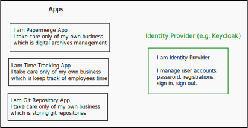
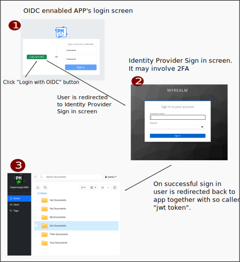

# Overview

OpenID Connect (OIDC) is an interoperable authentication protocol based on the OAuth
2.0 framework of specifications.

It is usual for organizations to use multiple software applications. Even a
small home lab features dozens of different apps.

Imagine a small home lab with 7 apps and each of those app uses separate
authentication system. This means that the user of the home lab will need to
keep 7 separate accounts: 7 separate users and 7 different passwords!

Of course users will use various tricks to make their life easier, like register
in all 7 accounts with same username and password. But still, they will need
to sign in daily - 7 times :).

Sticking with same home lab example, wouldn't it be great to have one
single account with which user can sign in once and it will
take effect across all 7 apps? In other words, wouldn't it be great
to use single account for all application within home lab/organization/company ?

Enter OIDC.

OIDC solves above mentioned problem of multiple accounts hell.

With OIDC, the accounts registration, authentication, accounts management
(e.g. password management), is offloaded from the shoulders of the app to
separate entity - **identity provider**.

!!! Note

    "Authenticate" means same as "sign in", "login".
    Verbs "authenticate", "sign in", "login" are used interchangeably

With OIDC, instead of authenticating in each individual app, user
authenticates with on identity provider (IP) side. To authenticate users,
identity provider can employ various schemes like 2FA (two factor
authentication). Once authentication is successful on the identity provider
side, IP sends {{ extra.project }} a digitally signed token. All the
subsequent requests to {{extra.project}} need to have that token, or otherwise
they will be denied as not authorized.

It may sounds abstract, because it is abstract.
I think couple of illustration will clear the waters.

First, in order to authenticate, OIDC enabled app ({{ extra.project }}) will
redirect user to OIDC provider sign in page. On successful authentication
{{ extra.project }} receives a token - so called jwt token.

In above illustration, for step 1 -> 2 to work `PAPERMERGE__AUTH__OIDC_AUTHORIZE_URL` setting
is employed. For step 2 -> 3 to work `PAPERMERGE__AUTH__OIDC_REDIRECT_URL` is used.

The trophy, which {{ extra.project }} receives from identity provider for
successful sign in, is so call called [jwt token](https://jwt.io/). Users
have no idea (and rightfully so) about jwt tokens, as all token business
happens behind the scenes.

!!! Note

    All processes described from here on, are not visible to the users. It all happens
    behind the scenes. Information which follows is only for devs, DevOps, SREs,
    and all curious species out there.

You OIDC application needs jwt token as prove of
successful authentication. As you may guess, jwt token will be carried inside
each subsequent http requsts as a header.

All incoming http requests are proved for validity of jwt token. If http request
has a valid jwt token - request is permitted to reach app. If http request does not
contain a valid jwt token - it is denied access to the app.

!!! Note

    By "valid jwt token" is usually meant that it contain valid digital signature,
    it is not expired and maybe some other checks specific to identity provider.

