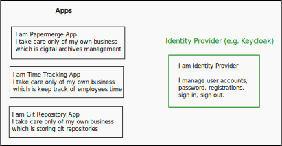

# Overview

OpenID Connect (OIDC) is an interoperable authentication protocol based on the OAuth
2.0 framework of specifications.

It is usual for organizations to use multiple software applications. Even a
small home lab features dozens of different apps.

Imagine a small homelab with 7 apps and each of those app uses separate
authentication system. This means that the user of the home lab will need to
keep 7 separate accounts: 7 separate users and 7 different passwords!

Of course users will use various tricks to make their life easier, like register
in all 7 accounts with same username and password. But still, they will need
to sign in daily - 7 times :).

Sticking with same homelab example, wouldn't it be great to have one
single account with which user can sign in once and it will
take effect across all 7 apps? In other words, wouldn't it be great
to use single account for all application within home lab/organization/company ?

Enter OIDC.

OIDC solves above mentioned problem of multiple accounts hell.

With OIDC, the accounts registration, authentication, accounts management
(e.g. password management), is offloaded from the shoulders of the app to
separate entity - **identity provider**.

With OIDC, instead of authenticating (siging in, logging in ?) in each
individual app, user authenticated with identity provider. Similarely, to
sign out, user again is redirected to sign out on the identity provider page.

