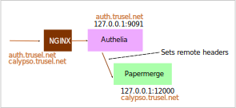
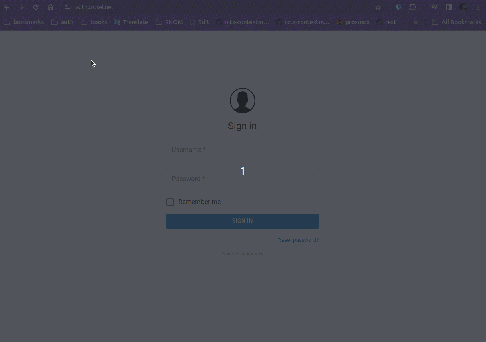
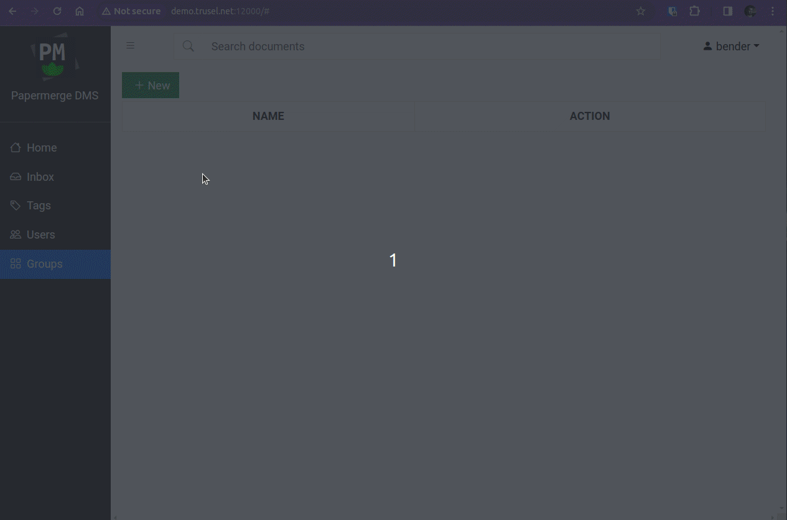
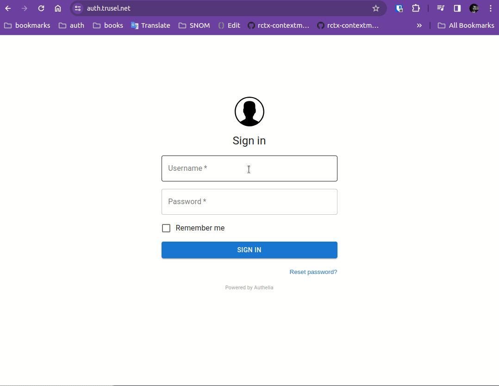

# Authelia

Following guide is based on [Self-Hosted SSO with Authelia and NGINX](https://matwick.ca/authelia-nginx-sso/).

In this guide adoptation, we will use two domains:

- auth.trusel.net (Authelia)
- calypso.trusel.net (Papermerge)

Both domains are accessiable via HTTPS (with valid certificates). Both domains
are resolved to the same host. There is an NGINX which receives requests for
above mentioned domains (and takes care of the certs) and proxy passes
the requests to the locally running {{ extra.project }} or Authelia.

Local Authelia will run on `127.0.0.1:9091` and local {{ extra.project }} will
run on `127.0.0.1:12000`.



## Step 1 - Authelia's Compose

Let's start with docker compose file for Authelia:

```yaml
networks:
  net:
    driver: bridge

services:
  authelia:
    image: authelia/authelia
    container_name: authelia
    volumes:
      - ${PWD}/authelia/authelia:/config
    networks:
      - net
    ports:
      - 9091:9091
    restart: unless-stopped
    environment:
      - PUID=1000
      - PGID=1000
      - TZ=Europe/Berlin

  redis:
    image: redis:alpine
    container_name: redis_authelia
    volumes:
      - ./redis:/data
    networks:
      - net
    expose:
      - 6379
    restart: unless-stopped
    environment:
      - TZ=Europe/Berlin
      - PUID=1000
      - PGID=1000
```

## Step 2 - Authelia's Configs

As you can see in compose file, there is a mount from local "authelia/authelia" folder to "/config".
Let's create that folder and place all configuration in it:

	mkdir -p authelia/authelia
	cd authelia/authelia
	touch configuration.yml

In configuration.yml put following:

```yaml
server:
  host: 0.0.0.0
  port: 9091
log:
  level: info
jwt_secret: zgpWgPv7lPDkxb0mJFZYc8DkE90jJ1LEl66RjQ6i6ekI7pXYrJQGmvHB6L6xNEEo
default_redirection_url: https://auth.trusel.net

authentication_backend:
  file:
    path: /config/users_database.yml

access_control:
  default_policy: deny
  rules:
    - domain:
        - "auth.trusel.net"
      policy: bypass
    - domain:
        - "calypso.trusel.net"
      policy: one_factor

session:
  name: authelia_session
  secret: zgpWgPv7lPDkxb0mJFZYc8DkE90jJ1LEl66RjQ6i6ekI7pXYrJQGmvHB6L6xNEEo
  expiration: 12h           # 12 hours
  inactivity: 100m           # 100 minutes
  remember_me_duration: 1M  # 1 month
  domain: trusel.net

  redis:
    host: redis_authelia
    port: 6379

regulation:
  max_retries: 6
  find_time: 5m
  ban_time: 15m

storage:
  encryption_key: 12341234123412341234556987239847239478akjdhahdkjh
  local:
    path: /config/db2.sqlite3

notifier:
  disable_startup_check: false
  filesystem:
    filename: /config/notification.txt
```

The important part to note here is:

```yaml
...
access_control:
  default_policy: deny
  rules:
    - domain:
        - "auth.trusel.net"
      policy: bypass
    - domain:
        - "calypso.trusel.net"
      policy: one_factor
...
```

Which setups access control for two domains: `auth.trusel.net` - which is the domain
under which Authelia is available and `calypso.trusel.net` the domain
under which {{ extra.project }} application is available.


## Step 3 - Authelia's Users

Let's create users on Authelia side.
There are two users: "bender" and "leela".
"bender" is administrative (superuser).
"leela" is normal user and she is part of "family" group.

Here is the content of `users_database.yml`:

```yaml
users:
  bender:
    displayname: "Bender"
    password: $argon2id$v=19$m=65536,t=3,p=4$ML2qiuCXKNtSh1SC2zdiDA$Zq6ar+W+J1qUTbweP6uKfDCzPbhbHG3rrScaA6uKkcc
    email: bender@mail.com
  leela:
    displayname: "Leela"
    password: $argon2id$v=19$m=65536,t=3,p=4$Oe6oxqot1BT4Z8pb2EdNpw$qib0A48D71bybWPslNWBZ8ieK6B++XFtKbAvKMj0Px0
    email: leela@mail.com
    groups:
      - family
```

## Step 4 - NGINX

NGINX's sites-enabled has two files `auth.trusel.net`, which is Authelia's domain and
`calypso.trusel.net` which is {{extra.project}} domain.

Here is the content of `/etc/nginx/sites-enabled/auth.trusel.net`:

```
server {
    server_name auth.trusel.net;
    listen 80;
    return 301 https://$server_name$request_uri;
}

server {
    server_name auth.trusel.net;
    listen 443 ssl;
    ssl_certificate /etc/letsencrypt/live/auth.trusel.net/fullchain.pem;
    ssl_certificate_key /etc/letsencrypt/live/auth.trusel.net/privkey.pem;

    location / {
        set $upstream_authelia http://127.0.0.1:9091;
        proxy_pass $upstream_authelia;

		add_header Access-Control-Allow-Origin *;

        client_body_buffer_size 128k;

        #Timeout if the real server is dead
        proxy_next_upstream error timeout invalid_header http_500 http_502     http_503;

        # Advanced Proxy Config
        send_timeout 5m;
        proxy_read_timeout 360;
        proxy_send_timeout 360;
        proxy_connect_timeout 360;

        # Basic Proxy Config
        proxy_set_header Host $host;
        proxy_set_header X-Real-IP $remote_addr;
        proxy_set_header X-Forwarded-For $proxy_add_x_forwarded_for;
        proxy_set_header X-Forwarded-Proto $scheme;
        proxy_set_header X-Forwarded-Host $http_host;
        proxy_set_header X-Forwarded-Uri $request_uri;
        proxy_set_header X-Forwarded-Ssl on;
        proxy_redirect  http://  $scheme://;
        proxy_http_version 1.1;
        proxy_set_header Connection "";
        proxy_cache_bypass $cookie_session;
        proxy_no_cache $cookie_session;
        proxy_buffers 64 256k;

        # If behind reverse proxy, forwards the correct IP
        set_real_ip_from 10.0.0.0/8;
        set_real_ip_from 172.0.0.0/8;
        set_real_ip_from 192.168.0.0/16;
        set_real_ip_from fc00::/7;
        real_ip_header X-Forwarded-For;
        real_ip_recursive on;
    }
}
```

And below is the content of `/etc/nginx/sites-enabled/calypso.trusel.net`:

```
server {
    server_name calypso.trusel.net;
    listen 80;
    return 301 https://$server_name$request_uri;
}

server {
    server_name calypso.trusel.net;
    listen 443 ssl http2;
    ssl_certificate /etc/letsencrypt/live/calypso.trusel.net/fullchain.pem;
    ssl_certificate_key /etc/letsencrypt/live/calypso.trusel.net/privkey.pem;

    include snippets/authelia.conf; # Authelia auth endpoint

    location / {
	    proxy_pass http://127.0.0.1:12000;
	    proxy_set_header Host $host;
	    proxy_set_header X-Real-IP $remote_addr;
	    proxy_set_header X-Forwarded-For $proxy_add_x_forwarded_for;

	    include snippets/auth.conf; # Protect this endpoint
    }
}
```

It includes two snippets. One is `snippets/authelia.conf`:

```
location /authelia {
    internal;
    set $upstream_authelia http://127.0.0.1:9091/api/verify;
    proxy_pass_request_body off;
    proxy_pass $upstream_authelia;
    proxy_set_header Content-Length "";

    # Timeout if the real server is dead
    proxy_next_upstream error timeout invalid_header http_500 http_502 http_503;

    # [REQUIRED] Needed by Authelia to check authorizations of the resource.
    # Provide either X-Original-URL and X-Forwarded-Proto or
    # X-Forwarded-Proto, X-Forwarded-Host and X-Forwarded-Uri or both.
    # Those headers will be used by Authelia to deduce the target url of the     user.
    # Basic Proxy Config
    client_body_buffer_size 128k;
    proxy_set_header Host $host;
    proxy_set_header X-Original-URL $scheme://$http_host$request_uri;
    proxy_set_header X-Real-IP $remote_addr;
    proxy_set_header X-Forwarded-For $remote_addr;
    proxy_set_header X-Forwarded-Proto $scheme;
    proxy_set_header X-Forwarded-Host $http_host;
    proxy_set_header X-Forwarded-Uri $request_uri;
    proxy_set_header X-Forwarded-Ssl on;
    proxy_redirect  http://  $scheme://;
    proxy_http_version 1.1;
    proxy_set_header Connection "";
    proxy_cache_bypass $cookie_session;
    proxy_no_cache $cookie_session;
    proxy_buffers 4 32k;

    # Advanced Proxy Config
    send_timeout 5m;
    proxy_read_timeout 240;
    proxy_send_timeout 240;
    proxy_connect_timeout 240;
}
```

And another snippet is `snippets/auth.conf`.
This is the heart and the most relevant part of this guide!


## The Most Important

**!! The most important part of the entire guide - START !!**

This is where "remote-user" header magic actually takes place.
It is `snippets/auth.conf` file included `calypso.trusel.net`.

Here is its content:

```
# Basic Authelia Config
# Send a subsequent request to Authelia to verify if the user is authenticated
# and has the right permissions to access the resource.
auth_request /authelia;

# Set the `target_url` variable based on the request. It will be used to build the portal
# URL with the correct redirection parameter.
auth_request_set $target_url $scheme://$http_host$request_uri;

# Set the X-Forwarded-User and X-Forwarded-Groups with the headers
# returned by Authelia for the backends which can consume them.
# This is not safe, as the backend must make sure that they come from the
# proxy. In the future, it's gonna be safe to just use OAuth.
auth_request_set $user $upstream_http_remote_user;
auth_request_set $groups $upstream_http_remote_groups;
auth_request_set $name $upstream_http_remote_name;
auth_request_set $email $upstream_http_remote_email;

proxy_set_header Remote-User $user;
proxy_set_header Remote-Groups $groups;
proxy_set_header Remote-Name $name;
proxy_set_header Remote-Email $email;
add_header Set-Cookie "remote_user=$user; path=/";
add_header Set-Cookie "remote_groups=$groups; path=/";
add_header Set-Cookie "remote_name=$name; path=/";
add_header Set-Cookie "remote_email=$email; path=/";

# If Authelia returns 401, then nginx redirects the user to the login portal.
# If it returns 200, then the request pass through to the backend.
# For other type of errors, nginx will handle them as usual.
error_page 401 =302 https://auth.trusel.net/?rd=$target_url;
```

The utmost importance are following lines:
```
proxy_set_header Remote-User $user;
proxy_set_header Remote-Groups $groups;
proxy_set_header Remote-Name $name;
proxy_set_header Remote-Email $email;
add_header Set-Cookie "remote_user=$user; path=/";
add_header Set-Cookie "remote_groups=$groups; path=/";
add_header Set-Cookie "remote_name=$name; path=/";
add_header Set-Cookie "remote_email=$email; path=/";
```

In above statements remote headers are set. Notice that besides "Remote-User"
etc headers there also are "Set-Cookie" in other words, the user information
is also passed as cookie. Passing Remote-User information along via cookies
as well is required by {{ extra.project }}.

**!! The most important part of the entire guide - END !!**

## Step 5 - Papermerge

Start {{ extra.project }} with following docker compose file:

```

services:
  paper:
    image: papermerge/papermerge:3.2
    container_name: paper
    ports:
      - 12000:80
    restart: unless-stopped
    environment:
      - PAPERMERGE__SECURITY__SECRET_KEY=abc-secret
      - PAPERMERGE__AUTH__REMOTE=yes
      - PAPERMERGE__AUTH__REMOTE_LOGOUT_ENDPOINT=https://auth.trusel.net/logout
      - PAPERMERGE__AUTH__USERNAME=bender
      - PAPERMERGE__AUTH__PASSWORD=not-used-but-needs-to-be-present
      - PAPERMERGE__AUTH__EMAIL=bender@mail.com
```

Some key points to notice:

1. The username should match existing user configured in Authelia. In our case it is "bender".
2. The email should match the bender's email from Authelia side.
3. User "shared" between Authelia and {{ extra.project }} is superuser i.e. administrative user.
4. You need to supply `PAPERMERGE__AUTH__PASSWORD` value, however its value is not relevent,
as you will be authenticating with password configured on Authelia side.
5. Any non-empty value will do for `PAPERMERGE__AUTH__REMOTE`. It may be "1", "True", "yes".


## Step 6 - Sign In with Superuser

In this guide superuser account is "bender". Its password is managed
on Authelia side.

Once you have all containers + nginx up and running you
can sign in with superuser.



## Step 7 - Create "family" Group

Once inside {{ extra.project }} with superuser account, create
"family" group. Any user from "family" group will have all
permissions but to manage users and groups.
In our configuration example the only user from "family" group is "leela".



## Step 8 - Sign In as "leela"

Sign in as "leela". Notice that for user "leela" there are no "users"
and "groups" tab on the left side panel, as she does not have permissions to
manage users and groups.


