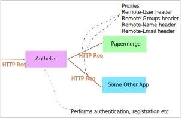

# Overview

"Remote User" user authentication method is conventional, which means
there are some conventions on how to set it up - but no standards around it.

The general approach is that there is another application "placed in front"
of {{extra.project}} which takes care of authentication, registration,
passwords, 2FA etc. In our case it will be [Authelia](https://www.authelia.com/).

{{ extra.project }} will receive only information about already authenticated
users via HTTP headers. The name of respective headers usually starts
with "Remote", hence the name "Remote User" authentication.

With this approach there is no more {{extra.project}} own login view. Authelia
takes over entirely login screen part as well. In other words
{{ extra.project }} does not participate in authentication process at all, it
will just receive the ready user ID (plus some extra info) via HTTP header.

While it is very easy to conceptualize, it is actually tricky to setup.
[Next section](./authelia.md) will detail into specifics.