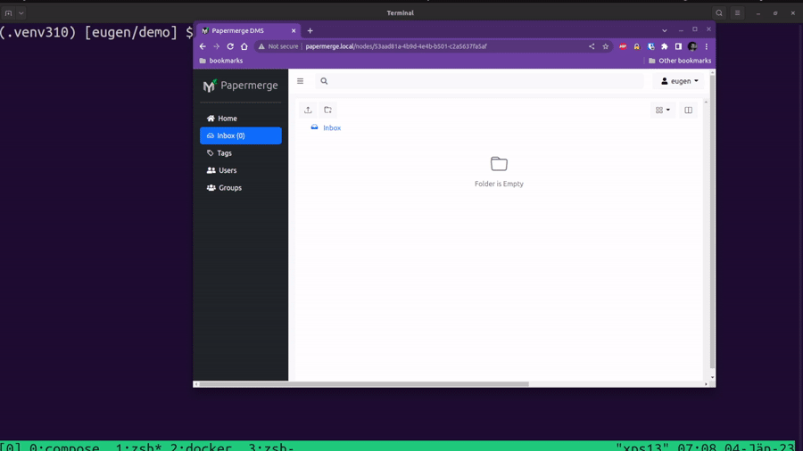
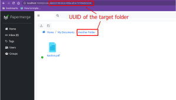
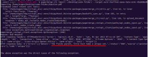

# Papermerge CLI

Command line utility which uses REST API to interact with your {{ extra.project }}
instance. It can be used to:

* upload/import documents from local filesystem
* download documents and folder
* search through documents

## Requirements

In order to use `papermerge-cli` you need to have python installed.
You need python version >= 3.10.

## Install

Install `papermerge-cli` with following command:

    pip install papermerge-cli

pip is package installer for python - it usually comes with python
interpreter. In order to install pip on Ubuntu use following command:

    sudo apt install python3-pip

## Configuration

Papermerge Cli is configured via environment variables:

* `PAPERMERGE_CLI__HOST`
* `PAPERMERGE_CLI__TOKEN`

as the name suggests, the first one is the host of the REST API server
and second value is the REST API token.

REST API server should be specified with `http://` or `https://`
prefix, but without the `/api` suffix. Valid values examples: http://papermege.local,
https://my-dms.papermerge.de.

!!! note

     The host may or may not contain the `/`. E.g. http://papermege.local and
    http://papermerge.local/ are both valid values and point to the same host

REST API token can be obtained either from {{ extra.project }} `user menu -> API Tokens <rest_api_token>`
or directly from command line by using `auth` subcommand:

    export PAPERMERGE_CLI__HOST=https://mydms.some-vps.com
    papermerge-cli auth

Papermerge Cli will prompt you for username and password. On successful
authentication your REST API token will be displayed - now you can use
this token for all subsequent authentications.

!!! note

    REST API host can be provided by command line option `--host`

## Help

In order to get general help about the command use:

      papermerge-cli --help

In order to get help for individual commands, place `--help` flag after the command:

      papermerge-cli import --help

## List - Browse Nodes

Now, with `PAPERMERGE_CLI__HOST` and `PAPERMERGE_CLI__TOKEN` environment
variables set you can use list content of you home folder:

      papermerge-cli list

In order to list content of specific folder (including inbox folder)::

      papermerge-cli list --parent-uuid=UUID-of-the-folder

## Me - Current User Details

In order to see current user details (current user UUID, home folder UUID, inbox
folder UUID, username etc):

      papermerge-cli me

## List Preferences

List all preferences:

      papermerge-cli pref-list

List specific section of the preferences::

      papermerge-cli pref-list --section=ocr

Show value of preference `trigger` from section `ocr`:

      papermerge-cli pref-list --section=ocr --name=trigger

## Update Preferences

Update value of the preference `trigger` from section `ocr`:

    papermerge-cli pref-update --section=ocr --name=trigger --value=auto

## Import Folders/Documents

Recursively imports folder from local filesystem. For example, in order
to import recursively all documents from local folder::

    papermerge-cli import /path/to/local/folder/

You can also import one single document:

    papermerge-cli import /path/to/some/document.pdf

By default all documents are imported to your user's `.inbox` folder. If you want to import
to another folder, use `--target-uuid`:

    papermerge-cli import /path/to/some/document.pdf --target-uuid <uuid>

In order to learn UUID of the folder you want to import to use `papermerge-cli list` command.
To get UUIDs of `.home` and `.inbox` folders, use `papermerge-cli me` command.
Another way see UUID of the target folder is via browser UI:

If you import same document twice to same target location, you will get a not
very friendly error which says something about "The fields parent, title
must make a unique set.", it means that you cannot have two documents with
same title in one folder, to put it in other words "You already have document
with same title in target folder":

If you want the local copy the uploaded documents to be deleted after
successful import - use `--delete` flag:

    papermerge-cli import --delete /path/to/folder/

!!! danger

     Be careful with `--delete` flag! When present,
   `papermerge-cli` will irreversible delete the local copy of all
   documents and folders in the `/path/to/folder/`!

!!! danger

    Always, before using this flag make safe backup of the documents to be uploaded!

!!! note: `--delete` flag deletes the local copy of the documents/path to import
    after successful upload - this means that even if though you local copy
    of the documents vanished - the originals are still available in {{ extra.project }}!

## Search

Search for node (document or folder) by text or by tags:

    papermerge-cli search -q apotheke

Returns all documents (or folders with such title) containing OCRed
text 'apotheke'.

You can search by tags only:

    papermerge-cli search --tags important

Will search for all documents (and folders) which were tagged with
tag 'important' When multiple tags are provided, by default, will search for
nodes with all mentioned tags:

    papermerge-cli search --tags important,letters  # returns nodes with both tags important AND letters

In case you want to search for nodes with ANY of the provided tags, use
`tags-op` parameter:

      papermerge-cli search --tags important,letters --tags-op any

Finally, `tags` and `q` may be combined::

    papermerge-cli search --tags important -q apartment

## Download

Downloads a folder or a document:

    papermerge-cli download --uuid <document or folder uuid>

In case uuid is the ID of specific folder - a zip file will be downloaded; zip
file will contain all nodes insides specified folder.

You can use `--uuid` multiple times::

    papermerge-cli download --uuid <uuid of doc1> --uuid <uuid of doc2> --uuid <uuid of folder 1>

If you want to download content to specific file on your file-system, use `-f`
option:

    papermerge-cli download --uuid <doc-uuid> -f /path/to/file-system/document.pdf

or in case of uuid is a folder:

    papermerge-cli download --uuid <folder-uuid>  -f /path/to/file-system/folder.zip

You can also specify the format/type of the downloaded archive (e.g. in case node is either a folder):

    papermerge-cli download --uuid <folder-uuid>  -f /path/to/file-system/folder.targz -t targz
