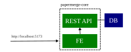
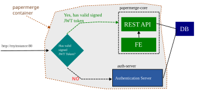
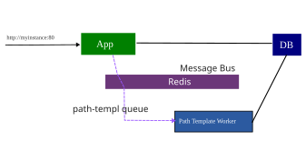
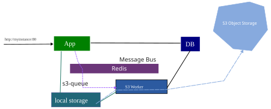

# High-Level Architecture

This section describes the different components of {{extra.project}}, their roles, and how they interact.
It is important to understand that the architecture is intentionally designed to avoid a monolithic structure—that is, bundling everything into a single piece.

In this regard, {{extra.project}} adheres to the proven Unix philosophy:
Build small, focused parts with clear interfaces, and combine them as needed.

Please note: Ignore technical details for now and focus on the overall structure.
This section is not intended as a setup guide for your development environment, but rather as a high-level architectural overview.

## The Core Part 1 – REST API

If you have `git`, `python`, and the `poetry` package manager installed on your computer, try the following:

1. `git clone https://github.com/papermerge/papermerge-core`
2. `cd papermerge-core/`
3. `poetry install`
4. `poetry run task server`

The last command attempts to start the REST API server on port **8000**.

Well, almost—it's likely to throw some errors if you don’t have a database configured yet.
For example, you might not have PostgreSQL running, or the required environment variables might be missing.

However, **assuming** you have:

* PostgreSQL up and running,
* a database already created,
* and the correct environment variables (such as `PAPERMERGE__DATABASE__URL`) set,

...then the REST API server should start successfully.

The illustration below shows a basic REST API server waiting for HTTP requests on port **8000**:


---

## Two Very Important Points

There are two key things to understand about the Core REST API server:

1. **There is no UI** (i.e. no frontend)
2. **There is no authentication**

Let’s unpack both points.

---

### 1. No UI

I assume you already know what a REST API is. Personally, I find it intuitive to think of a REST API **without any UI**—and you probably do as well.

---

### 2. No Authentication

Now, this is where even experienced developers might get confused.

Let’s start with a very basic REST API call:

```bash
curl http://localhost:8000/users/me
```

This request is meant to return information about the **current user**—that is, the user making the HTTP request.

But wait—didn’t I just say there is **no authentication**?

So… who is the current user?
And is there **any user** at all in the database's `users` table?

Yes, the Core REST API server really **has no authentication**. None. Zero. Nada.

---

### So, who is the current user?

**Answer:** Whoever we say it is.

The REST API is a naive creature—it trusts the information you give it. You can tell it who the current user is by using a custom HTTP header.

Example:

```bash
curl -H "Remote-User: admin" http://localhost:8000/users/me
```

This request informs REST API server to use user with username `admin` as current one.
Assuming you have a user named `admin` in your database, the server will respond with details about `admin`.

In fact, as long as the username exists in your database, you can perform **any REST API call** just by supplying the `Remote-User` header.

> **Note:**
> The REST API server has no concept of authentication.
> It simply receives information about the current user via HTTP headers and trusts it.

---

### What About JWT?

The `Remote-User` example works—but it’s pretty basic.

A more standardized and feature-rich method is to use a **JWT (JSON Web Token)**. JWTs allow you to pass more structured information in the header—like username, user ID, roles, and more.

So instead of:

```http
Remote-User: admin
```

You might pass something like:

```http
Authorization: Bearer <your_jwt_token_here>
```

The principle remains the same:
Whatever information about the current user is provided in the HTTP headers, the REST API server will **extract it and trust it**.

No validation.
No verification.
No actual authentication.

All authentication logic is expected to happen **upstream**—in whatever system is calling the REST API (e.g. an API gateway or a separate auth service).

---

## The Core Part 2 – UI

This part is basically the same as Part 1—except that instead of interacting directly with the REST API, the **end user** interacts with a **fancy UI** (the frontend).
Put another way: the frontend communicates with the REST API server **on behalf of the user**.



The illustration above shows the frontend (FE) running on port **5173**.
That’s true **only in development mode**, where a developer can start the frontend server using:

```bash
yarn install
yarn workspace ui dev
```

Really, this setup is **identical to Part 1**, just **wrapped in a nice UI**.

---

### A Few Important Points

1. **Both the frontend and backend live in the same repository**:

   * Frontend (FE) = TypeScript / JavaScript / CSS / HTML
   * Backend (BE) = REST API server in Python
   * GitHub repo: [papermerge/papermerge-core](https://github.com/papermerge/papermerge-core/)

2. **There is still no authentication**:

   * The REST API server accepts whatever the upstream passes as the current user via an HTTP header—
     e.g., `Remote-User` or `Authorization: Bearer <JWT token>`.

3. **Everything shown so far lives in one single repo**:
   [https://github.com/papermerge/papermerge-core/](https://github.com/papermerge/papermerge-core/)


## Authentication Server

Now let’s introduce one more piece of the puzzle: the **Authentication Server**.

At some point, there must be a component that takes a username and password and responds with one of two answers:

1. ✅ Yes – the credentials are valid, the user is authenticated.
2. ❌ No – the credentials are invalid, access denied.

That component is the **authentication server**.

A common source of confusion is that many web frameworks (looking at you, Django!) bundle authentication logic into the framework itself. This leads to a general assumption that authentication is just part of the app—not a standalone service.

In the **{{ extra.project }}** universe, the **Authentication Server is a separate web application.**

!!! Remember
        
    ❗️ **Authentication Server is just another web application** ❗️

Typically, the Authentication Server displays a login form where users can enter their credentials. If the combination of username and password is valid, the server responds with a **JWT (JSON Web Token)**.

This token is **cryptographically signed** using a secret. That signature allows other services to later verify the token’s origin and integrity.

!!! Remember
    
    ❗️ **Authentication Server issues JWT tokens** ❗️


---

All incoming HTTP requests are then checked for a valid JWT token. A token is considered valid if:

* It is properly formed.
* It was signed using the expected secret.

If a request lacks a valid JWT, it is **redirected to the login form**.
If it includes a valid JWT, the request proceeds to the REST API (which sits behind the UI).

Here’s how this flow is illustrated:



---

### Included Authentication Server

**{{ extra.project }}** includes a very basic authentication server. Its source code is here:
[https://github.com/papermerge/auth-server](https://github.com/papermerge/auth-server)

All components inside the gray box outlined with a brown dotted line are bundled in the official Papermerge container:

```bash
docker run -p 12000:80 \
    -e PAPERMERGE__SECURITY__SECRET_KEY=abc \
    -e PAPERMERGE__AUTH__PASSWORD=pass123 \
    papermerge/papermerge:3.5.2
```

!!! Remember

    ❗️ Core + Auth Server = App Container ❗️
    
    where
    
    Core = BE + FE
    
    where
    
    * BE = REST API Server
    * FE = Frontend Application

---

### Pluggable Authentication

The beauty of this design is its flexibility: the included authentication server is **basic by design**—you can easily replace it.

For example, the included server does **not** support:

* 2FA (Two-Factor Authentication)
* User registration flows

But that’s by design. You can replace it with more full-featured authentication systems like:

* [Keycloak](https://www.keycloak.org/)
* [Authelia](https://www.authelia.com/)

---

## Workers and Redis

So far, we’ve only discussed components that deal with HTTP—the **web-facing parts** of the system.

Now let’s explore the **workers**.

Workers are small background applications that handle long-running or asynchronous tasks. They **don’t use HTTP** to communicate. Instead, they interact with the main app via a **message queue**.

* The **main app** acts as the **producer**, placing tasks onto the queue.
* The **workers** act as **consumers**, picking up and executing those tasks.

The transport mechanism is **Redis**, which functions as the message bus. Communication happens via **named queues**.

{{ extra.project }} uses the following workers:

* [Path Template Worker](https://github.com/papermerge/path-tmpl-worker)
* [S3 Worker](https://github.com/papermerge/s3-worker)
* [OCR Worker](https://github.com/papermerge/ocr-worker)
* [i3 Worker](https://github.com/papermerge/i3-worker)

---

## Path Template Worker

Each document **category** in {{ extra.project }} has an associated [Jinja](https://jinja.palletsprojects.com/) path template
that defines where documents in that category should be stored.

Example 1 – basic template:



```jinja

    /home/My Documents/Invoices/{{ document.id }}.pdf

    /home/My Documents/Invoices/

```



Example 2 – more sophisticated template:



```jinja

    /home/Receipts/{{ document.cf['Shop'] }}-{{ document.cf['Effective Date'] }}.pdf

    /home/Receipts/{{ document.id }}.pdf

```



Now imagine you have **63,000 documents** in the "receipts" category, and you change the template from example 1 to example 2. The system must now **re-evaluate the path** for each of those 63,000 documents.

This is a huge task—and that’s exactly what the **Path Template Worker** is for.



🔗 [Path Template Worker – Source Code](https://github.com/papermerge/path-tmpl-worker)

---

## S3 Worker

**{{ extra.project }}** supports S3-compatible storage systems. When S3 is enabled, all documents are uploaded to the S3 bucket.

The **S3 Worker** handles this upload process.



The **S3 Worker** must have access to the **same local storage** used by the app (i.e., where documents are uploaded by the user).

In deployments:

* With **Docker Compose**: local storage is typically a **Docker volume**.
* With **Kubernetes**: local storage is usually a **pod volume**.

🔗 [S3 Worker – Source Code](https://github.com/papermerge/s3-worker)

---

## OCR Worker

📌 *Coming soon*

---

## i3 Worker

📌 *Coming soon*
