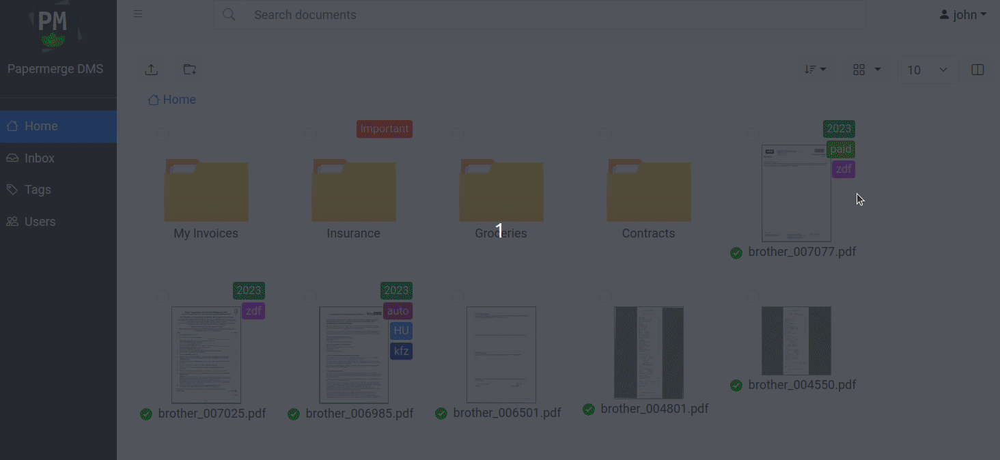

# Reference

Papermerge REST API is exposed via <a href="https://www.openapis.org/" class="external-link" target="_blank">Open API</a> standard.

{{ extra.project }} ships with swagger REST API documentation reference.
You can access it in your running {{ extra.project }} instance from user menu -> REST API:

