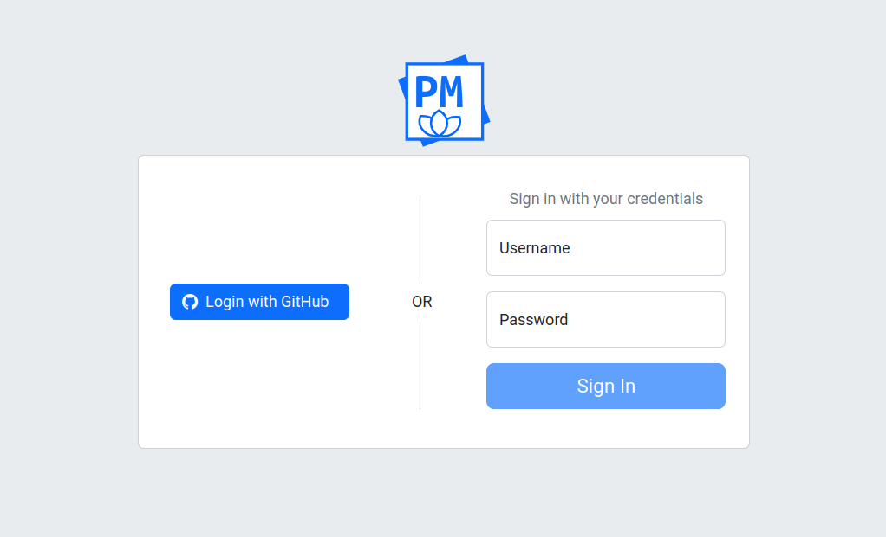

# Authentication

{{ extra.project }} supports different authentication modes:

- Database (default)
- OAuth 2.0
- LDAP

The difference consist in who decides if user with given username and
password, are valid. In first mode i.e. database authentication - it is
 {{ extra.project }} who decides if credentials are valid, this is why this
database authentication is also called "internal authentication". For other
two authentication modes it is the other party, external one like LDAP, which
decides on validity of the given credentials.


## Database Authentication

In this case authentication is performed against credentials stored in
database configured with `PAPERMERGE__DATABASE__URL`. This is default
operation mode.


## OAuth 2.0

{{ extra.project }} supports OAuth 2.0 authentication protocol with Google and GitHub providers.


### Google Provider

For Google provider you need to configure following environment variables:

```
* PAPERMERGE__AUTH__GOOGLE_CLIENT_SECRET=<google oauth 2.0 client secret>
* PAPERMERGE__AUTH__GOOGLE_CLIENT_ID=<google oauth 2.0 client ID>
* PAPERMERGE__AUTH__GOOGLE_AUTHORIZE_URL=https://accounts.google.com/o/oauth2/auth
* PAPERMERGE__AUTH__GOOGLE_REDIRECT_URI=<https|http>://<your-domain>/google/callback
```

Note that `PAPERMERGE__AUTH__GOOGLE_AUTHORIZE_URL` should always hold the same value:
 `https://accounts.google.com/o/oauth2/auth`
If all four environment variables are provided, the sign in view will render
one extra button "Login with Google" as in picture below:


### GitHub Provider

For GitHub provider you need to configure following environment variables:

```
* PAPERMERGE__AUTH__GITHUB_CLIENT_SECRET=<github oauth 2.0 client secret>
* PAPERMERGE__AUTH__GITHUB_CLIENT_ID=<github oauth 2.0 client ID>
* PAPERMERGE__AUTH__GITHUB_AUTHORIZE_URL=https://github.com/login/oauth/authorize
* PAPERMERGE__AUTH__GITHUB_REDIRECT_URI=<https|http>://<your-domain>/github/callback
```

Note that `PAPERMERGE__AUTH__GITHUB_AUTHORIZE_URL` should always hold the same value:
 `https://github.com/login/oauth/authorize`

If all four environment variables are provided, the sign in view will render
one extra button "Login with Github" as in picture below:





## LDAP

{{ extra.project }} can perform authentication against users stored in LDAP system.
In order to enable LDAP authentication you need to provide at least
two environment variables:

- [PAPERMERGE__AUTH__LDAP_URL](../settings/auth.md#auth__ldap_url)
- [PAPERMERGE__AUTH__LDAP_USER_DN_FORMAT](../settings/auth.md#auth__ldap_user_dn_format)


First one is the URL to your ldap server, without scheme, example:

	PAPERMERGE__AUTH__LDAP_URL=ldap.trusel.net

By default, {{ extra.project }} will connect to LDAP server using secure TLS connection. If you want {{ extra.project }} to access LDAP server using plain text connection, set [PAPERMERGE__AUTH__LDAP_USE_SSL](../settings/auth.md#auth__ldap_use_ssl) to False:

	PAPERMERGE__AUTH__LDAP_USE_SSL=False

The second mandatory option is [PAPERMERGE__AUTH__LDAP_USER_DN_FORMAT](../settings/auth.md#auth__ldap_user_dn_format). It instructs {{ extra.project }} the DN (distingueshed name) of the user
you want to authenticate against. Example:

	PAPERMERGE__AUTH__LDAP_USER_DN_FORMAT=uid={username},ou=People,dc=ldap,dc=trusel,dc=net

Notice "{username}" part - it must be literaly this value; the "{username}" will be replaced with actual
username of the user when performing LDAP bind.

!!! Info

	In case you are curious, {{ extra.project }} uses [ldap3](https://ldap3.readthedocs.io/en/latest/) python package to perform LDAP authentication. [Here is source code](https://github.com/papermerge/auth-server/blob/main/auth_server/backends/ldap.py) of ldap authentication part.

By default {{ extra.project }} will try to extract user's email from `mail` attribute of LDAP entry identified `PAPERMERGE__AUTH__LDAP_USER_DN_FORMAT` distingueshed name.
You can instruct {{ extra.project }} about email attribute in LDAP entry with [PAPERMERGE__AUTH__LDAP_URL](../settings/auth.md#auth__ldap_email_attr).

