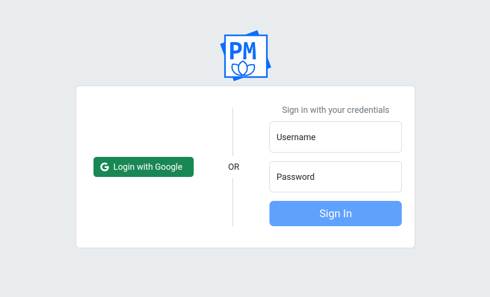

# Authentication

{{ extra.project }} suppors different modes of authentications:

- Database (default)
- OAuth 2.0
- LDAP

The difference consist in who decides if user with given username and
password, are valid. In first mode i.e. database authentication - it is {
{ extra.project }} who decides if credentials are valid, this is why this
database authentication is also called "internal authentication". For other
two authentication modes it is the other party, external one like LDAP, which
decides on validity of the given credentials.


## Database Authentication

In this case authentication is performed against credentials stored in
database configured with `PAPERMERGE__DATABASE__URL`. This is default
operation mode.


## OAuth 2.0

{{ extra.project }} supports OAuth 2.0 authenication protocol with Google and GitHub providers.


### Google Provider

For Google provider you need to configure following environment variables:

```
* PAPERMERGE__AUTH__GOOGLE_CLIENT_SECRET=<google oauth 2.0 client secret>
* PAPERMERGE__AUTH__GOOGLE_CLIENT_ID=<google oauth 2.0 client ID>
* PAPERMERGE__AUTH__GOOGLE_AUTHORIZE_URL=https://accounts.google.com/o/oauth2/auth
* PAPERMERGE__AUTH__GOOGLE_REDIRECT_URI=<your-domain>/google/callback
```

Note that `PAPERMERGE__AUTH__GOOGLE_AUTHORIZE_URL` should always hold the same value.
If all four environment variables are provided, the sign in view will render
one extra button "Login with Google" as in picture below:





### GitHub Provider