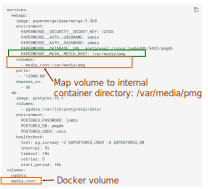
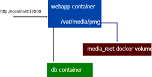
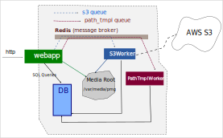
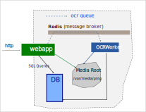
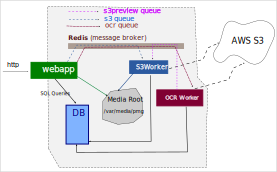

# Docker Compose

This section describes how to setup {{ extra.project }} using docker compose.
As mentioned in overview section, {{ extra.project }} philosophy revolves around
progressive setup concept. As such, you are advised to start with simple setups
and progress, in small steps, towards more complicated scenarios. The idea is
that on the way you will learn and understand better internals, which in
turn will enable you to be build very creative deployments.


## Database/PostgreSQL

By default, web app uses SQLite database. SQLite is great for quick demos, not for
production environments.

Following docker compose file starts {{extra.project}} with PostgreSQL 16.1 database:

```yaml
services:
  webapp:
    image: papermerge/papermerge:{{ extra.docker_image_version }}
    environment:
      PAPERMERGE__SECURITY__SECRET_KEY: 12345
      PAPERMERGE__AUTH__USERNAME: admin
      PAPERMERGE__AUTH__PASSWORD: admin
      PAPERMERGE__DATABASE__URL: postgresql://coco:jumbo@db:5432/pmgdb
    ports:
     - "12000:80"
    depends_on:
      - db
  db:
    image: postgres:16.1
    volumes:
      - pgdata:/var/lib/postgresql/data/
    environment:
      POSTGRES_PASSWORD: jumbo
      POSTGRES_DB: pmgdb
      POSTGRES_USER: coco
    healthcheck:
      test: pg_isready -U $$POSTGRES_USER -d $$POSTGRES_DB
      interval: 5s
      timeout: 10s
      retries: 5
      start_period: 10s
volumes:
  pgdata:
```

Start it with:

```
  $ docker compose up
```


You can access {{ extra.project }} user interface using any modern web browser (e.g. Firefox, Chrome).
Open your web browser and point it to http://localhost:12000.

🥳 Congratulations! 🥳 You have two microservices running: web app and
PostgreSQL 16.1 database. The web app will wait until db service is up and
running - and only then it will start.

The format `PAPERMERGE__DATABASE__URL` is documented in [database settings](../settings/database.md#database__url).

However, in this setup has a problem 🙁. To understand it - upload couple of documents.
Now if you remove docker containers with:

```
  $ docker compose down
```

And then bring them back with:

```
  $ docker compose up
```
You will notice that all documents "sort of disappeared". You can see document's titles, but when opening them there are errors.

Why so?

The problem is that the storage where uploaded documents are stored is not persistent i.e. it uploaded pdf files
lives inside docker container and when docker container is removed - so are our documents! Only documents "titles"
are still there, because that part is stored in database, which at this time is persistent.

!!! note

    Uploaded **files are NOT stored in database**! They are stored in file system directory called **media root**


## Persistent Media Storage

Uploaded files are not stored in database. They are stored in file system directory called *media root*.
In order to persist uploaded files, you need to:

1. Mount persistent volume
2. Point {{ extra.project }} to upload files to the persisted directory

In our example we will create docker compose volume `media_root` and mount it to internal (to container) directory `/var/media/pmg`. Finally, we use `PAPERMERGE__MAIN__MEDIA_ROOT` environment variable to tell
{{ extra.project }} where to upload documents.
Here is docker compose file:

```yaml
services:
  webapp:
    image: papermerge/papermerge:{{ extra.docker_image_version }}
    environment:
      PAPERMERGE__SECURITY__SECRET_KEY: 12345
      PAPERMERGE__AUTH__USERNAME: admin
      PAPERMERGE__AUTH__PASSWORD: admin
      PAPERMERGE__DATABASE__URL: postgresql://coco:jumbo@db:5432/pmgdb
      PAPERMERGE__MAIN__MEDIA_ROOT: /var/media/pmg
    volumes:
      - media_root:/var/media/pmg
    ports:
     - "12000:80"
    depends_on:
      - db
  db:
    image: postgres:16.1
    volumes:
      - pgdata:/var/lib/postgresql/data/
    environment:
      POSTGRES_PASSWORD: jumbo
      POSTGRES_DB: pmgdb
      POSTGRES_USER: coco
    healthcheck:
      test: pg_isready -U $$POSTGRES_USER -d $$POSTGRES_DB
      interval: 5s
      timeout: 10s
      retries: 5
      start_period: 10s
volumes:
  pgdata:
  media_root:
```

Now you can:

```
$ docker compose up
```
and
```
$ docker compose down
```
How many times you want! Your documents will still be there for you 🥳! We call that - persistent 😎.

Here are important parts of the compose file highlighted:



Following illustration visualizes the concept of persistent media storage:




## Path Templates Worker

This one is optional, but you definitely want it in your team. To understand why,
you need to understand why is [Path Templates](/user/path-templates) feature all about.

```yaml
services:
  webapp:
    image: papermerge/papermerge:{{ extra.docker_image_version }}
    environment:
      PAPERMERGE__SECURITY__SECRET_KEY: 12345
      PAPERMERGE__AUTH__USERNAME: admin
      PAPERMERGE__AUTH__PASSWORD: admin
      PAPERMERGE__DATABASE__URL: postgresql://coco:jumbo@db:5432/pmgdb
      PAPERMERGE__MAIN__MEDIA_ROOT: /var/media/pmg
      PAPERMERGE__REDIS__URL: redis://redis:6379/0
    volumes:
      - media_root:/var/media/pmg
    ports:
     - "12000:80"
    depends_on:
      - db
      - redis
  path_template_worker:
    image: papermerge/path-tmpl-worker:{{ extra.path_tmpl_worker_version }}
    command: worker
    environment:
      PAPERMERGE__DATABASE__URL: postgresql://coco:jumbo@db:5432/pmgdb
      PAPERMERGE__REDIS__URL: redis://redis:6379/0
      PATH_TMPL_WORKER_ARGS: "-Q path_tmpl -c 2"
    depends_on:
      - redis
  db:
    image: postgres:16.1
    volumes:
      - pgdata:/var/lib/postgresql/data/
    environment:
      POSTGRES_PASSWORD: jumbo
      POSTGRES_DB: pmgdb
      POSTGRES_USER: coco
    healthcheck:
      test: pg_isready -U $$POSTGRES_USER -d $$POSTGRES_DB
      interval: 5s
      timeout: 10s
      retries: 5
      start_period: 10s
  redis:
    image: bitnami/redis:7.2
    ports:
      - "6379:6379"
    environment:
      ALLOW_EMPTY_PASSWORD: "yes"
volumes:
  pgdata:
  media_root:
```


## S3 Object Storage

{{ extra.project }} supports S3 object storage. This means that it can synchronize
local media storage with remote S3 in other words all your documents will
be copied to remote S3 storage.

!!! Note

    If you delete a document, then both copies - the local one and S3
    one will be deleted as well - this is what "synchronized" means.
    Stated other way: in simple scenarios when you have only one web app
    running - S3 storage is exact copy of you local media storage.


To enable S3 storage backend you need to add another worker - `s3worker`.
Here is docker compose file:

```yaml
services:
  webapp:
    image: papermerge/papermerge:{{ extra.docker_image_version }}
    environment:
      PAPERMERGE__SECURITY__SECRET_KEY: 12345
      PAPERMERGE__AUTH__USERNAME: admin
      PAPERMERGE__AUTH__PASSWORD: admin
      PAPERMERGE__DATABASE__URL: postgresql://coco:jumbo@db:5432/pmgdb
      PAPERMERGE__MAIN__MEDIA_ROOT: /var/media/pmg
      PAPERMERGE__REDIS__URL: redis://redis:6379/0
    volumes:
      - media_root:/var/media/pmg
    ports:
     - "12000:80"
    depends_on:
      - db
      - redis
  path_template_worker:
    image: papermerge/path-tmpl-worker:{{ extra.path_tmpl_worker_version }}
    command: worker
    environment:
      PAPERMERGE__DATABASE__URL: postgresql://coco:jumbo@db:5432/pmgdb
      PAPERMERGE__REDIS__URL: redis://redis:6379/0
      PATH_TMPL_WORKER_ARGS: "-Q path_tmpl -c 2"
    depends_on:
      - redis
  s3worker:
    image: papermerge/s3worker:{{ extra.s3_worker_version }}
    command: worker
    environment:
      PAPERMERGE__DATABASE__URL: postgresql://coco:jumbo@db:5432/pmgdb
      PAPERMERGE__REDIS__URL: redis://redis:6379/0
      PAPERMERGE__MAIN__MEDIA_ROOT: /var/media/pmg
      PAPERMERGE__S3__BUCKET_NAME: name-of-your-s3-backet
      S3_WORKER_ARGS: "-Q s3 -c 2"
      AWS_REGION_NAME: eu-central-1
      AWS_ACCESS_KEY_ID: your-aws-access-key-id-here
      AWS_SECRET_ACCESS_KEY: your-aws-secret-access-key-here
    depends_on:
      - db
      - redis
    volumes:
      - media_root:/var/media/pmg
  db:
    image: postgres:16.1
    volumes:
      - pgdata:/var/lib/postgresql/data/
    environment:
      POSTGRES_PASSWORD: jumbo
      POSTGRES_DB: pmgdb
      POSTGRES_USER: coco
    healthcheck:
      test: pg_isready -U $$POSTGRES_USER -d $$POSTGRES_DB
      interval: 5s
      timeout: 10s
      retries: 5
      start_period: 10s
  redis:
    image: bitnami/redis:7.2
    ports:
      - "6379:6379"
    environment:
      ALLOW_EMPTY_PASSWORD: "yes"
volumes:
  pgdata:
  media_root:
```

Note that `s3worker` needs *SAME* database url, redis url and media root as
web app. Also notice that media root (same one as for webapp) volume is
mounted. For `S3_WORKER_ARGS` the `-Q s3` argument is the name of the queue -
don't change this value. And `-c 2` is number of concurrent tasks your worker
can perform i.e. it can perform two task in one shot.

Picture below illustrates relationship between services:




http traffic, incoming on `http://localhost:12000`, is handled by `webapp`.
`webapp` communicates with `s3worker` via redis. They communicate
via dedicated message queue named `s3`.
Both `webapp` and `s3worker` have access to **same**:

* database - `PAPERMERGE__DATABASE__URL`
* media storage - `PAPERMERGE__MAIN__MEDIA_ROOT`
* message broker - `PAPERMERGE__REDIS__URL`


For detailed configuration of S3worker see [S3 Worker Settings](../settings/s3worker.md) section.


## OCR Worker

Following docker compose file is for simple webapp + one OCR worker scenario.
Both webapp and OCR worker have access to the same local media storage.

```yaml
services:
  webapp:
    image: papermerge/papermerge:{{ extra.docker_image_version }}
    environment:
      PAPERMERGE__SECURITY__SECRET_KEY: 12345
      PAPERMERGE__AUTH__USERNAME: admin
      PAPERMERGE__AUTH__PASSWORD: admin
      PAPERMERGE__DATABASE__URL: postgresql://coco:jumbo@db:5432/pmgdb
      PAPERMERGE__MAIN__MEDIA_ROOT: /var/media/pmg
      PAPERMERGE__REDIS__URL: redis://redis:6379/0
      PAPERMERGE__OCR__LANG_CODES: "eng,deu"
      PAPERMERGE__OCR__DEFAULT_LANG_CODE: "deu"
    volumes:
      - media_root:/var/media/pmg
    ports:
     - "12000:80"
    depends_on:
      - db
      - redis
  ocr_worker:
    image: papermerge/ocrworker:{{ extra.ocr_worker_version }}
    command: worker
    environment:
      PAPERMERGE__DATABASE__URL: postgresql://coco:jumbo@db:5432/pmgdb
      PAPERMERGE__REDIS__URL: redis://redis:6379/0
      PAPERMERGE__MAIN__MEDIA_ROOT: /var/media/pmg
      OCR_WORKER_ARGS: "-Q ocr -c 2"
    depends_on:
      - redis
      - db
    volumes:
      - media_root:/var/media/pmg
  db:
    image: postgres:16.1
    volumes:
      - pgdata:/var/lib/postgresql/data/
    environment:
      POSTGRES_PASSWORD: jumbo
      POSTGRES_DB: pmgdb
      POSTGRES_USER: coco
    healthcheck:
      test: pg_isready -U $$POSTGRES_USER -d $$POSTGRES_DB
      interval: 5s
      timeout: 10s
      retries: 5
      start_period: 10s
  redis:
    image: bitnami/redis:7.2
    ports:
      - "6379:6379"
    environment:
      ALLOW_EMPTY_PASSWORD: "yes"
volumes:
  pgdata:
  media_root:

```

You need to instruct webapp what OCR languages are available with
 [PAPERMERGE__OCR__LANG_CODES](/settings/ocr/#ocr__lang_codes) 
and what language to use by default: [PAPERMERGE__OCR__DEFAULT_LANG_CODE](/settings/ocr/#ocr__default_lang_code)


Picture bellow illustrates docker compose setup.




Note that OCRWorker and webapp have access to the same database, redis and media storage.


## OCR Worker + S3

OCR Workers may get document's to be processed as well store their processing
results to S3 Object Storage. In other words, S3 object storage may be used
as storage medium between webapp and OCRWorkers. This is useful in advanced
scenarios where OCR workers run on separate machines.

All you need to instruct OCRWorker to get documents (and store results into) from
S3 - just pass following options:

  * `PAPERMERGE__S3__BUCKET_NAME`
  * `AWS_REGION_NAME`
  * `AWS_ACCESS_KEY_ID`
  * `AWS_SECRET_ACCESS_KEY`


```yaml
services:
  webapp:
    image: papermerge/papermerge:{{ extra.docker_image_version }}
    environment:
      PAPERMERGE__SECURITY__SECRET_KEY: 12345
      PAPERMERGE__AUTH__USERNAME: admin
      PAPERMERGE__AUTH__PASSWORD: admin
      PAPERMERGE__DATABASE__URL: postgresql://coco:jumbo@db:5432/pmgdb
      PAPERMERGE__MAIN__MEDIA_ROOT: /var/media/pmg
      PAPERMERGE__REDIS__URL: redis://redis:6379/0
      PAPERMERGE__OCR__LANG_CODES: "eng,deu"
      PAPERMERGE__OCR__DEFAULT_LANG_CODE: "deu"
    volumes:
      - media_root:/var/media/pmg
    ports:
     - "12000:80"
    depends_on:
      - db
      - redis
  ocr_worker:
    image: papermerge/ocrworker:{{ extra.ocr_worker_version }}
    command: worker
    environment:
      PAPERMERGE__DATABASE__URL: postgresql://coco:jumbo@db:5432/pmgdb
      PAPERMERGE__REDIS__URL: redis://redis:6379/0
      PAPERMERGE__S3__BUCKET_NAME:  name-of-your-s3-backet
      AWS_REGION_NAME: eu-central-1
      AWS_ACCESS_KEY_ID: your-aws-access-key-id-here
      AWS_SECRET_ACCESS_KEY: your-aws-secret-access-key-here
      OCR_WORKER_ARGS: "-Q ocr -c 2"
    depends_on:
      - redis
      - db
  s3worker:
    image: papermerge/s3worker:{{ extra.s3_worker_version }}
    command: worker
    environment:
      PAPERMERGE__DATABASE__URL: postgresql://coco:jumbo@db:5432/pmgdb
      PAPERMERGE__REDIS__URL: redis://redis:6379/0
      PAPERMERGE__MAIN__MEDIA_ROOT: /var/media/pmg
      PAPERMERGE__S3__BUCKET_NAME: name-of-your-s3-backet
      S3_WORKER_ARGS: "-Q s3,s3preview -c 2"
      AWS_REGION_NAME: eu-central-1
      AWS_ACCESS_KEY_ID: your-aws-access-key-id-here
      AWS_SECRET_ACCESS_KEY: your-aws-secret-access-key-here
    depends_on:
      - db
      - redis
    volumes:
      - media_root:/var/media/pmg
  db:
    image: postgres:16.1
    volumes:
      - pgdata:/var/lib/postgresql/data/
    environment:
      POSTGRES_PASSWORD: jumbo
      POSTGRES_DB: pmgdb
      POSTGRES_USER: coco
    healthcheck:
      test: pg_isready -U $$POSTGRES_USER -d $$POSTGRES_DB
      interval: 5s
      timeout: 10s
      retries: 5
      start_period: 10s
  redis:
    image: bitnami/redis:7.2
    ports:
      - "6379:6379"
    environment:
      ALLOW_EMPTY_PASSWORD: "yes"
volumes:
  pgdata:
  media_root:

```

Couple of remarks:

  * OCRWorker does not have media storage mounted (as it gets its documents from S3, and also stores results in S3)
  * OCRWorker relies on S3Worker to sync webapps media storage with S3
  * OCRWorker is free to run on any machine as long as it has access to same redis and database as webapp
  * There may be any number of OCRWorkers
  * S3Worker and webapp need to run on same machine though, because S3Worker needs to sync S3 storage with webapps local media storage




Notice that OCRWorkers sends messages to S3worker (via message `s3preview` queue). This means that S3 worker
needs to listen to `s3` and `s3preview` queues i.e S3 worker's `-Q` arguments should be `-Q s3,s3preview`


## I3 Worker

{{extra.project}} uses SOLR for search. I3 Worker's job is to synchronize database data with search index.
Here is a simple docker compose which uses SOLR for indexing search data.

```yaml
services:
  webapp:
    image: papermerge/papermerge:{{ extra.docker_image_version }}
    environment:
      PAPERMERGE__SECURITY__SECRET_KEY: 12345
      PAPERMERGE__AUTH__USERNAME: admin
      PAPERMERGE__AUTH__PASSWORD: admin
      PAPERMERGE__DATABASE__URL: postgresql://coco:jumbo@db:5432/pmgdb
      PAPERMERGE__SEARCH__URL: solr://solr:8983/pmg
      PAPERMERGE__MAIN__MEDIA_ROOT: /var/media/pmg
      PAPERMERGE__REDIS__URL: redis://redis:6379/0
      PAPERMERGE__OCR__LANG_CODES: "deu,eng,ron"
      PAPERMERGE__OCR__DEFAULT_LANG_CODE: "deu"
    volumes:
      - media_root:/var/media/pmg
    ports:
     - "12000:80"
    depends_on:
      - db
      - redis
      - solr
  i3worker:
    image: papermerge/i3worker:{{ extra.i3_worker_version }}
    command: worker
    environment:
      PAPERMERGE__DATABASE__URL: postgresql://coco:jumbo@db:5432/pmgdb
      PAPERMERGE__SEARCH__URL: solr://solr:8983/pmg
      PAPERMERGE__REDIS__URL: redis://redis:6379/0
      I3_WORKER_ARGS: "-Q i3 -c 2"
    depends_on:
      - redis
      - db
      - solr
  db:
    image: postgres:16.1
    volumes:
      - pgdata:/var/lib/postgresql/data/
    environment:
      POSTGRES_PASSWORD: jumbo
      POSTGRES_DB: pmgdb
      POSTGRES_USER: coco
    healthcheck:
      test: pg_isready -U $$POSTGRES_USER -d $$POSTGRES_DB
      interval: 5s
      timeout: 10s
      retries: 5
      start_period: 10s
  redis:
    image: bitnami/redis:7.2
    ports:
      - "6379:6379"
    environment:
      ALLOW_EMPTY_PASSWORD: "yes"
  solr:
    image: solr:9.7
    ports:
     - "8983:8983"
    volumes:
      - solr_data:/var/solr
    command:
      - solr-precreate
      - pmg

volumes:
  pgdata:
  media_root:
  solr_data:
```

In above setup note that on startup SOLR service creates `pmg` index (in SOLR's terminology -
a *core*), while web app uses `PAPERMERGE__SEARCH__URL` set to
`solr://solr:8983/pmg` as configuration. You pass arguments to worker via
`I3_WORKER_ARGS` environment variable. I3 Worker uses `i3` queue to get it
tasks.

## I3 + OCR Workers

Usually you will have both I3 Worker and OCR workers configured, as they cooperate: after
each OCR processing OCR worker notifies I3 to update search index with newly extract content.

Here is docker compose yaml with both OCR and I3 workers:

```yaml
services:
  webapp:
    image: papermerge/papermerge:{{ extra.docker_image_version }}
    environment:
      PAPERMERGE__SECURITY__SECRET_KEY: 12345
      PAPERMERGE__AUTH__USERNAME: admin
      PAPERMERGE__AUTH__PASSWORD: admin
      PAPERMERGE__DATABASE__URL: postgresql://coco:jumbo@db:5432/pmgdb
      PAPERMERGE__SEARCH__URL: solr://solr:8983/pmg
      PAPERMERGE__MAIN__MEDIA_ROOT: /var/media/pmg
      PAPERMERGE__REDIS__URL: redis://redis:6379/0
      PAPERMERGE__OCR__LANG_CODES: "deu,eng,ron"
      PAPERMERGE__OCR__DEFAULT_LANG_CODE: "deu"
    volumes:
      - media_root:/var/media/pmg
    ports:
     - "12000:80"
    depends_on:
      - db
      - redis
      - solr
  ocr_worker:
    image: papermerge/ocrworker:{{ extra.ocr_worker_version }}
    command: worker
    environment:
      PAPERMERGE__DATABASE__URL: postgresql://coco:jumbo@db:5432/pmgdb
      PAPERMERGE__REDIS__URL: redis://redis:6379/0
      PAPERMERGE__MAIN__MEDIA_ROOT: /var/media/pmg
      OCR_WORKER_ARGS: "-Q ocr -c 2"
    depends_on:
      - redis
      - db
    volumes:
      - media_root:/var/media/pmg
  i3worker:
    image: papermerge/i3worker:{{ extra.i3_worker_version }}
    command: worker
    environment:
      PAPERMERGE__DATABASE__URL: postgresql://coco:jumbo@db:5432/pmgdb
      PAPERMERGE__SEARCH__URL: solr://solr:8983/pmg
      PAPERMERGE__REDIS__URL: redis://redis:6379/0
      I3_WORKER_ARGS: "-Q i3 -c 2"
    depends_on:
      - redis
      - db
      - solr
  db:
    image: postgres:16.1
    volumes:
      - pgdata:/var/lib/postgresql/data/
    environment:
      POSTGRES_PASSWORD: jumbo
      POSTGRES_DB: pmgdb
      POSTGRES_USER: coco
    healthcheck:
      test: pg_isready -U $$POSTGRES_USER -d $$POSTGRES_DB
      interval: 5s
      timeout: 10s
      retries: 5
      start_period: 10s
  redis:
    image: bitnami/redis:7.2
    ports:
      - "6379:6379"
    environment:
      ALLOW_EMPTY_PASSWORD: "yes"
  solr:
    image: solr:9.7
    ports:
     - "8983:8983"
    volumes:
      - solr_data:/var/solr
    command:
      - solr-precreate
      - pmg

volumes:
  pgdata:
  media_root:
  solr_data:
```
