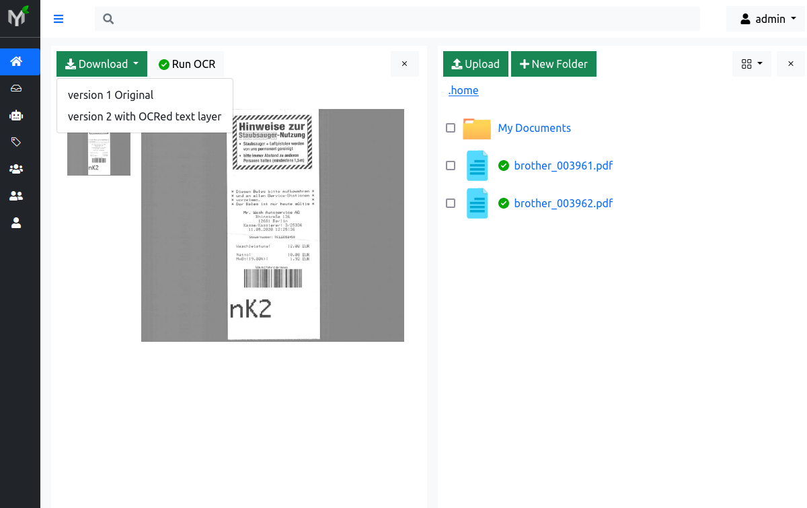

# Docker Compose

This section describes how to setup Papermerge and
related services using docker compose.

Each docker compose file is used here in combination with one `environment file` usually
named `.env`.

Make sure you have both `docker`.

This guide was tested with docker version 20.10.6 and
docker-compose version 1.29.2.


## Complete Stack in 2 minutes


This setup installs complete {{ extra.project }} stack with all required services.

Save following `docker-compose.yml` file on your local computer.


Next, create `.env` file with following content:

```console
  DB_USER=postgres
  DB_NAME=postgres
  DB_PASSWORD=postgres
  DB_HOST=db
  DB_PORT=5432

  REDIS_HOST=redis
  REDIS_PORT=6379

  SECRET_KEY=12345abcdxyz

  SUPERUSER_USERNAME=admin
  SUPERUSER_EMAIL=admin@example.com
  SUPERUSER_PASSWORD=admin
```

Start {{ extra.project }} using following docker compose command:

```console
    docker-compose -f docker-compose.yml --env-file .env up
```

You can access |project| user interface using a web browser like Firefox.
Open your web browser and point it to http://localhost:16000 address:


Sign in using credentials configured with ``SUPERUSER_USERNAME`` and
``SUPERUSER_PASSWORD`` options in ``.env`` file.




## Elastic Search

In previous section, {{ extra.project }} used xapian built in search engine. However, for
production environments, a full fledged search engine like Elasticsearch makes more sense.

Here is setup which uses Elasticsearch:

```yaml
  version: '3.7'
  x-backend: &common  # yaml anchor definition
    image: papermerge/papermerge:2.1.9
    volumes:
      - media_root:/app/media
    environment:
      - PAPERMERGE__MAIN__SECRET_KEY=12345SKK
      - DJANGO_SUPERUSER_PASSWORD=1234
      - PAPERMERGE__REDIS__HOST=redis
      - PAPERMERGE__REDIS__PORT=6379
      - PAPERMERGE__DATABASE__TYPE=postgres
      - PAPERMERGE__DATABASE__USER=postgres
      - PAPERMERGE__DATABASE__NAME=postgres
      - PAPERMERGE__DATABASE__PASSWORD=postgres
      - PAPERMERGE__DATABASE__HOST=db
      - PAPERMERGE__DATABASE__PORT=5432
      - PAPERMERGE__SEARCH__ENGINE=elastic7
      - PAPERMERGE__SEARCH__URL=http://es:9200
  services:
    backend:
      <<: *common
    worker:
      <<: *common
      command: worker
    redis:
      image: redis:6
      ports:
        - '6379:6379'
    db:
      image: postgres:14.4
      volumes:
        - postgres_data:/var/lib/postgresql/data/
      environment:
        - POSTGRES_USER=postgres
        - POSTGRES_DB=postgres
        - POSTGRES_PASSWORD=postgres
    es:
      image: docker.elastic.co/elasticsearch/elasticsearch:7.16.2
      environment:
        - discovery.type=single-node
        - "ES_JAVA_OPTS=-Xms512m -Xmx512m"
      ports:
        - 9200:9200
        - 9300:9300
  volumes:
    media_root:
    postgres_data:
```