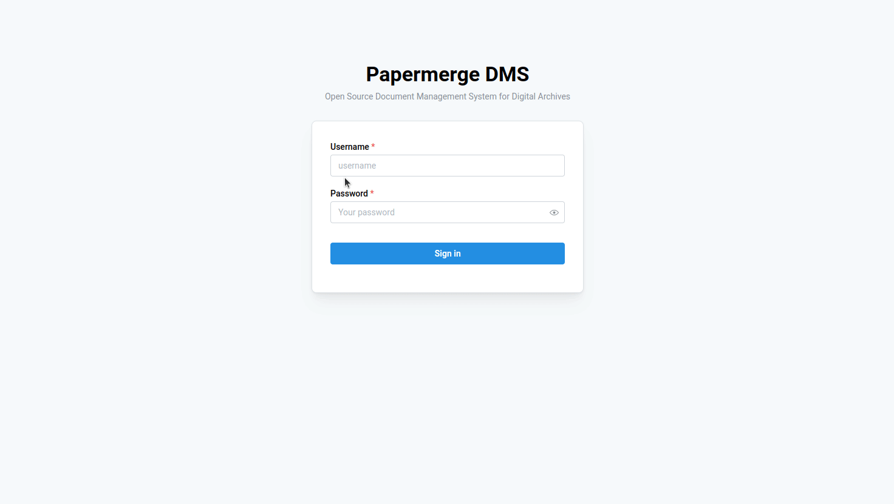

# Docker

## The Most Basic Setup

The only two required environment variables are
`PAPERMERGE__SECURITY__SECRET_KEY` and `PAPERMERGE__AUTH__PASSWORD`. To start
web app use following command:

```console
docker run -p 12000:80 \
    -e PAPERMERGE__SECURITY__SECRET_KEY=abc \
    -e PAPERMERGE__AUTH__PASSWORD=pass123 \
    papermerge/papermerge:{{ extra.docker_image_version }}
```

Point your web browser to `http://localhost:12000`:





Credentials are:

- username `admin`
- password `pass123`

Above setup, although incomplete, it is pretty good
start. It does not include features like search function or OCR, but
it serves well as quick demo to get a feeling of {{ extra.project }}.
Check docker compose section for more advanced setups.


## Apple M1 (M2...) Users

Apple M1 (M2...) users should include `--platform linux/amd64` option:

```console
docker pull --platform linux/amd64  papermerge/papermerge:{{ extra.docker_image_version }}
```

And then:

```console
docker run -p 12000:80 \
    -e PAPERMERGE__SECURITY__SECRET_KEY=abc \
    -e PAPERMERGE__AUTH__PASSWORD=pass123 \
    papermerge/papermerge:{{ extra.docker_image_version }}
```