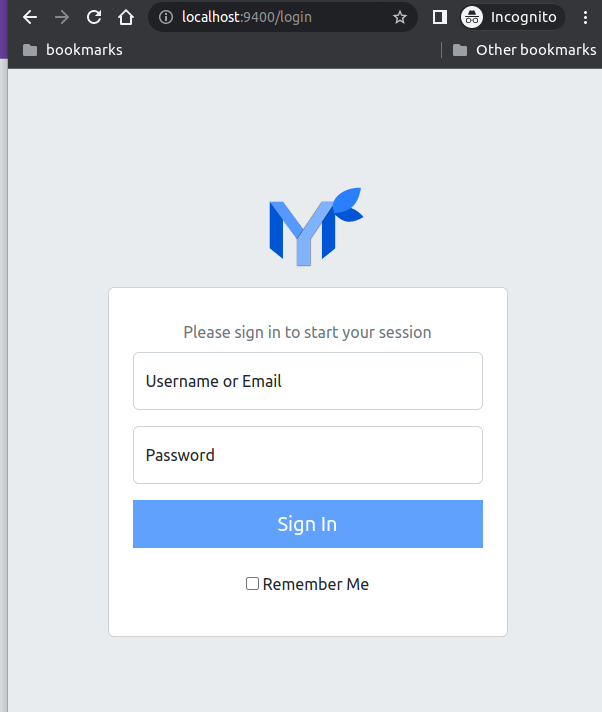

# Docker

## Web App

The only two required environment variables are
`PAPERMERGE__SECURITY__SECRET_KEY` and `PAPERMERGE__AUTH__PASSWORD`. To start
web ui part use following command:

```console
docker run -p 9400:80 \
    -e PAPERMERGE__SECURITY__SECRET_KEY=abc \
    -e PAPERMERGE__AUTH__PASSWORD=123 \
    papermerge/papermerge:{{ extra.docker_image_version }}
```

Point your web browser to `http://localhost:9400` and you will see login screen:





Credentials are:

- username `admin`
- password `123`

!!! Note

    The above `docker run` starts only web UI part. For complete setup you
    also need one or multiple workers.


## Official Docker Image

Official {{ extra.project  }} docker image is available on <a href="https://hub.docker.com/r/papermerge/papermerge" class="external-link" target="_blank">docker hub</a>.


## Get Docker Image

The recommended way to get the {{ extra.project }} docker image is via
docker pull command:

```console
docker pull papermerge/papermerge:{{ extra.docker_image_version }}
```


## Web App + Worker

For complete setup you need to start one or multiple workers.
Worker is the component which, among other things, performs OCR.

Here is minimal docker compose file with web ui and one worker:

```
  version: "3.9"

  x-backend: &common
    image: papermerge/papermerge:{{ extra.docker_image_version }}
    environment:
        PAPERMERGE__SECURITY__SECRET_KEY: 12345
        PAPERMERGE__AUTH__USERNAME: john
        PAPERMERGE__AUTH__PASSWORD: hohoho
        PAPERMERGE__REDIS__URL: redis://redis:6379/0
    volumes:
        - data:/db
        - index_db:/core_app/index_db
        - media:/core_app/media
  services:
    web:
      <<: *common
      ports:
       - "12000:80"
      depends_on:
        - redis
    worker:
      <<: *common
      command: worker
    redis:
      image: redis:6
  volumes:
      data:
      index_db:
      media:
```

With above setup, web app is accessible on  `http://localhost:12000`.
