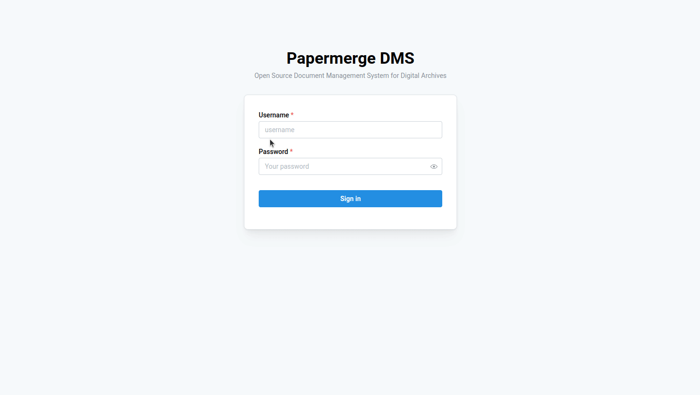

# Overview

{{ extra.project }} is build upon **microservice architecture**.
Microservice architecture means that there are different parts, called microservices,
which can be combined in different ways to match your needs.

The idea is to start with very simple setup and then add to it, step by step
only what you need.

The simplest possible setup it following:


```console
docker run -p 12000:80 \
    -e PAPERMERGE__SECURITY__SECRET_KEY=abc \
    -e PAPERMERGE__AUTH__PASSWORD=pass123 \
    papermerge/papermerge:{{ extra.docker_image_version }}
```

It starts the basic {{ extra.project }} microservice, the web app, with one
administrative user account, which has username `admin` and password
`pass123`. Instance is accessible on `http://localhost:12000`.





What you see in picture above is so called *web app* microservice. It is the
starting point of many setups. Although incomplete, it is pretty good
start. Other capabilities can be added as separate microservices. For example
in production environment it is better to use production ready database
like PostgreSQL (or MariaDB). Depending on your deployment environment you may consider to
add S3 storage.

!!! tip

	Always start with basic setup. Extend it gradually based on your needs.

	Starting with complex deployment may be overwhelming, especially if you
	don't understand the basics. {{ extra.project }}
	can have extremely complex deployment k8s cluster setups: with many stateless web app pods,
	with external authentication server, with S3 storage backend and CDN etc.


## Microservices

In following is the list of microservices which can be combined with {{ extra.project }}
to extend its capabilities:

- database (PostgreSQL, MariaDb)
- search engine (currently only Solr is supported)
- search indexer (syncs database with search engine)
- OCR worker - performs OCRs on the documents
- websockets service - use it if you want user to receive real time notifications about background events
- path template service - moves documents into target path based on the document metadata
- S3 service - syncs documents with S3 storage


In following sections you will find details of setup of each separate service.

Each service is deployed as docker image. As such, it can be deployed in any
dockerized environment. However, this documentation focuses on docker, docker
compose, ansible and kubernetes.
