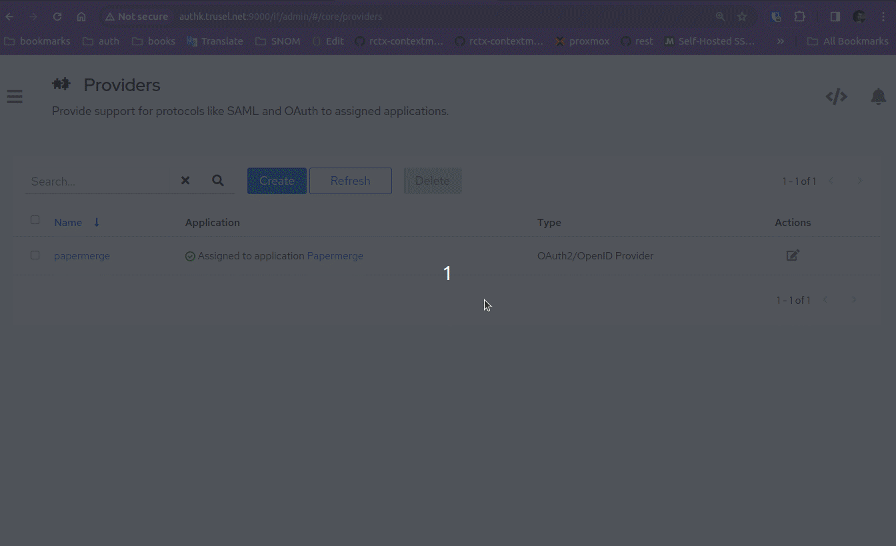
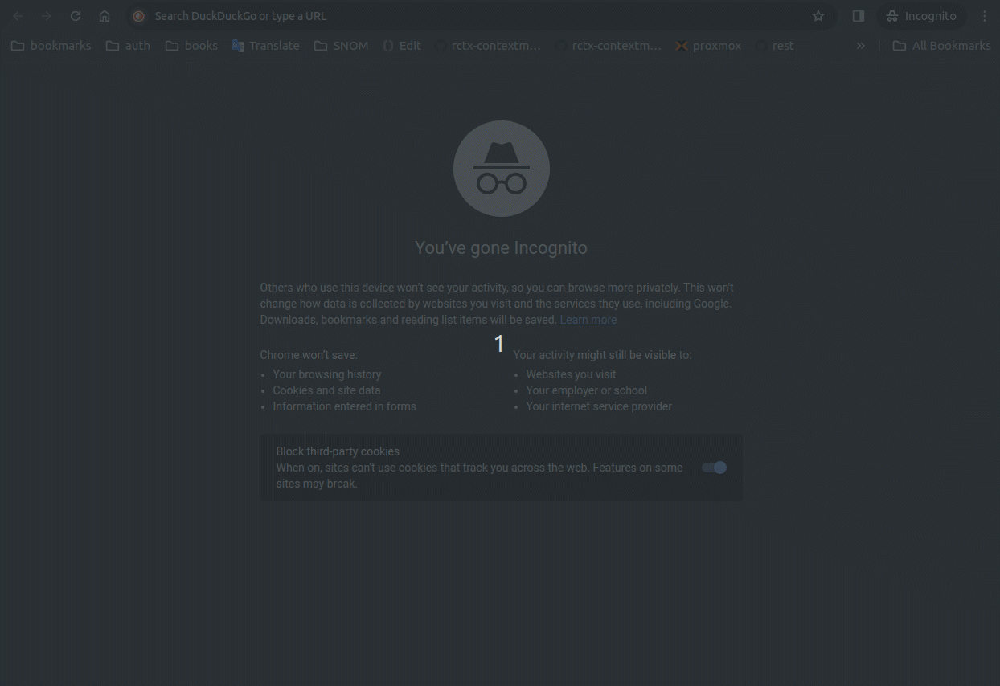
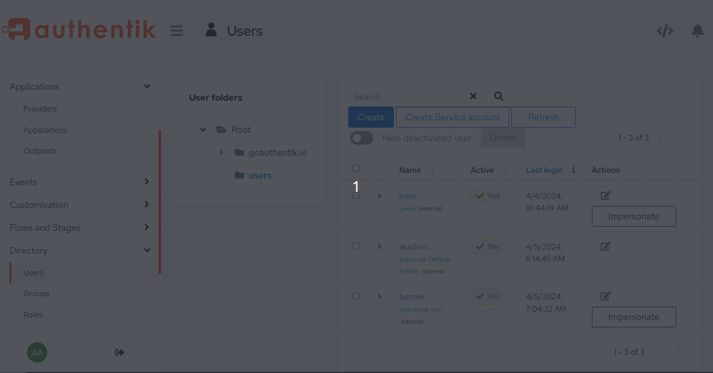
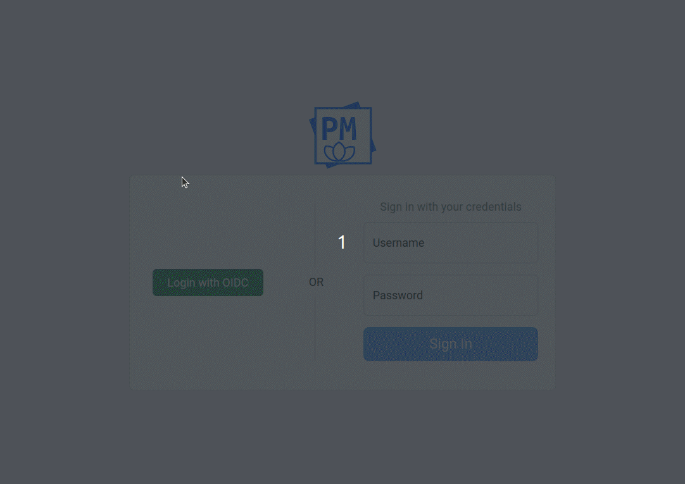

# Authentik

This guide shows how to setup {{ extra.project }} + [Authentik](https://goauthentik.io/) as OIDC identity provider.
It was tested with Authentik 2023.10.7

To follow this guide you need one {{ extra.project }} and one Authentik instance. For
this guide we have:

    http://authk.trusel.net:9000/ (Authentik instance)
    http://demo.trusel.net:12000/ ({{extra.project}} instance)

Of course for your specific deployment you'll want to serve both apps over
https, with valid certificates and without featuring ports in URLs, but for
our guide we will skip those parts.

In first part of the guide we will add administrative user
(superuser). Superuser has all permissions, in other words, superuser is the
most privileged user in {{ extra.project }}. In second part of the guide we will add
one non-superuser.


## Administrative User (Superuser)

### Step 1 - Create Application

Create new application.
Applications -> Create:

    Name: Papermerge
    Slug: papermerge
    Policy engine mode: any

Leave `Provider` field empty for this moment, we will fill it in later.

### Step 2 - Create Provider

Create OIDC provider.
Applications -> Providers -> Create:

    Choose OAuth2/OpenID Provider
    Name: papermerge
    Authentication flow: default-authentication-flow
    Authorization flow: default-provider-authorization-explicit-consent
    Client type: confidential
    Subject mode (in Advanced protocol settings): Based on User's UUID
    Scopes (in Advanced protocol settings): make sure email, openid, profile are selected

Last point is very important as it will setup `sub` claim to contain user's UUID.


### Step 3 - Associated Provider with Application

Applications -> Papermerge -> Edit.
Change `Provider` field to `papermerge`.
Update.


### Step 4 - Create User

Let's create a user **in Authentik**.

Directory -> Users -> Create.
Create user with following details:

    - username: bender
    - email: bender@mail.com
    - password: benderpass

User "bender" will be administrative user in {{ extra.project }}.

!!! Note

    User is created in Authentik. User password is set in Authentik as well.


### Step 5 - Start Papermerge

Get all OIDC related settings from Authentik's Providers -> papermerge.
There you will find client ID, client secret etc.

Start {{ extra.project }} with OIDC enabled, with following docker compose:

```yaml
version: "3.9"

x-backend: &common
  image: papermerge/papermerge:{{extra.docker_image_version}}
  environment:
    PAPERMERGE__SECURITY__SECRET_KEY: super-secret-12345
    PAPERMERGE__AUTH__USERNAME: bender
    PAPERMERGE__AUTH__EMAIL: bender@mail.com
    PAPERMERGE__AUTH__PASSWORD: 1234-not-relevant-but-still-needs-to-be-here
    PAPERMERGE__AUTH__OIDC_CLIENT_SECRET: cBqWCID8xt0fjpTFJwup32K8gaF4zufuUYVmUPoAUY90FxVpnPqL1Krl74viDaKzpLyhzBNWgstKztITpstBdvjEfzlA6jr3g2HL6tqwGW6W5Ax93xGzkTD2xw0WsVTu
    PAPERMERGE__AUTH__OIDC_CLIENT_ID: o2h90p8RuJe2GQT01LkNGlM3QuN8yxjQUdOE5Ylw
    PAPERMERGE__AUTH__OIDC_AUTHORIZE_URL: http://authk.trusel.net:9000/application/o/authorize/
    PAPERMERGE__AUTH__OIDC_ACCESS_TOKEN_URL: http://authk.trusel.net:9000/application/o/token/
    PAPERMERGE__AUTH__OIDC_INTROSPECT_URL: http://authk.trusel.net:9000/application/o/introspect/
    PAPERMERGE__AUTH__OIDC_USER_INFO_URL: http://authk.trusel.net:9000/application/o/userinfo/
    PAPERMERGE__AUTH__OIDC_LOGOUT_URL: http://authk.trusel.net:9000/application/o/papermerge/end-session/
    PAPERMERGE__AUTH__OIDC_SCOPE: "openid email profile"
    PAPERMERGE__AUTH__OIDC_REDIRECT_URL: http://demo.trusel.net:12000/oidc/callback
services:
  web:
    <<: *common
    ports:
     - "12000:80"
  worker:
    <<: *common
    command: worker
```

Note that `PAPERMERGE__AUTH__OIDC_CLIENT_SECRET`, `PAPERMERGE__AUTH__OIDC_CLIENT_ID` should match
their counterpart in "papermerge provider" created in Authentik.

`PAPERMERGE__AUTH__USERNAME` and `PAPERMERGE__AUTH__EMAIL` should match the user we created in step 4. As it was
mentioned, we will use "bender" as administrative user in {{extra.project}}.
Note that you need to specify `PAPERMERGE__AUTH__PASSWORD`, but whatever you put there is completely irrelevant
because administrative user will login with password managed in Authentik (in our example it is "benderpass").

`PAPERMERGE__AUTH__OIDC_REDIRECT_URL` should match "Valid redirect URIs" from Step 3 and it should be of
format: `[http|https]://<papermerge-instance-domain>/oidc/callback`.

`PAPERMERGE__AUTH__OIDC_SCOPE` must include "profile", otherwise JWT token won't contain `preferred_username` and `groups` claims

It may happen that not all OIDC endpoints are shown in Authentik UI.
To get all OIDC endpoints, use "OpenID Configuration URL" directly in your browser:




### Step 6 - Login as Superuser



!!! Warning

    There is a known issue that after successful login - "sign in" view is still shown.
    As workaround you need to hit browser's **refresh** button.


## Groups / Permissions

In this part we will add less privileged users. Users added in this part have
limited permissions - they won't be able to add/view/delete other groups and
users. User permissions are set via groups. Each group has a specific set of
permissions; if user belongs to a group - he or she has all permissions
assigned to respective group.

For this part to work, make sure you've completed the "superuser" part of this guide.

**All non-superusers (i.e. normal users) must belong to one or more groups.**

In this part we will create one user "leela". "leela" will have all permissions
but view/create/delete for users/groups.


### Step 1 - Create Group in Papermerge

First we need to create group, named "family", with desired set of
permissions. You do this in {{ extra.project }} with user "bender".


!!! Note

    Group names in Authentik and in {{ extra.project }} should match.

### Step 2 - Add User

Create user "leela" in Authentik.
Create "family" group in Authentik.
Add user "leela" to group "family" (in Authentik).
Of course you will set leela's password in Authentik as well.

The outcome should look like:



### Step 3 - Login as "leela"

Login with as leela in {{ extra.project }}. Notice that "users" and "groups" tabs on
the left side bar are not visible, as leela does not have permissions to
to manage users and groups.



