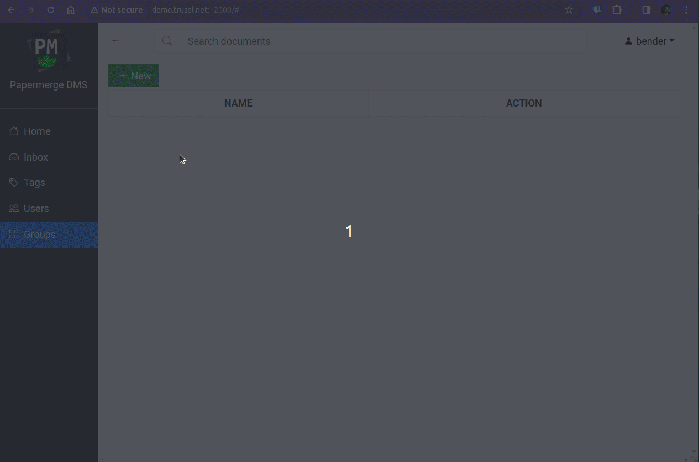

# Keycloak

This guide shows how to setup Papermerge + [Keyloak](https://keycloak.org) as
OIDC identity provider. It was tested with Keycloak 24.0.2.

To follow this guide you need one {{ extra.project }} and one Keycloak instance.
For this guide we have:

- http://keycloak.trusel.net:8080/ (Keycloak instance)
- http://demo.trusel.net:12000/  ({{extra.project}} instance)

Of course for your specific deployment you'll want to serve both apps over
https, with valid certificates and without featuring ports in URLs, but for
our guide we will skip those parts.

In first part of the guide we will add administrative user
(superuser). Superuser has all permissions, in other words, superuser is the
most privileged user in {{ extra.project }}. In second part of the guide we
will add one non-superuser.

## Administrative User (Superuser)

### Step 1 - Create Realm

Create a new realm in Keycloak as described [here](https://www.keycloak.org/getting-started/getting-started-docker#_create_a_realm). We will name it "myrealm".


### Step 2 - Create User

In "myrealm" create a user, as described [here](https://www.keycloak.org/getting-started/getting-started-docker#_create_a_user) with following details:

    - username: bender
    - email: bender@mail.com
    - password: benderpass

User "bender" will be administrative user in {{ extra.project }}.
Let's create OIDC client.

### Step 3 - Create OIDC Client

Make sure you are currently in "myrealm".
Click Clients -> Create client.
Choose:

    - Client type: OpenID Connect
    - Client ID: papermerge
    - Client authentication: "ON"
    - Home URL: http://demo.trusel.net:12000
    - Valid redirect URIs: http://demo.trusel.net:12000/oidc/callback

Click "Save"

Now, with OIDC Client saved, you can go to it's "Credentials" tab and
note its "Client Secret". You will need it in next step.
For this guide, the Client Secret is:

    - Client Secret: OHGMBgyAjcvDtn4PAu8w8vE9yf06aHn1


### Step 4 - Start Papermerge

Now, start {{ extra.project }} with OIDC enabled, with following docker compose:

```yaml
version: "3.9"

x-backend: &common
  image: papermerge/papermerge:{{extra.docker_image_version}}
  environment:
    PAPERMERGE__SECURITY__SECRET_KEY: super-secret-12345
    PAPERMERGE__AUTH__USERNAME: bender
    PAPERMERGE__AUTH__EMAIL: bender@mail.com
    PAPERMERGE__AUTH__PASSWORD: 1234-not-relevant-but-still-needs-to-be-here
    PAPERMERGE__AUTH__OIDC_CLIENT_SECRET: OHGMBgyAjcvDtn4PAu8w8vE9yf06aHn1
    PAPERMERGE__AUTH__OIDC_CLIENT_ID: papermerge
    PAPERMERGE__AUTH__OIDC_AUTHORIZE_URL: http://keycloak.trusel.net:8080/realms/myrealm/protocol/openid-connect/auth
    PAPERMERGE__AUTH__OIDC_ACCESS_TOKEN_URL: http://keycloak.trusel.net:8080/realms/myrealm/protocol/openid-connect/token
    PAPERMERGE__AUTH__OIDC_INTROSPECT_URL: http://keycloak.trusel.net:8080/realms/myrealm/protocol/openid-connect/token/introspect
    PAPERMERGE__AUTH__OIDC_USER_INFO_URL: http://keycloak.trusel.net:8080/realms/myrealm/protocol/openid-connect/userinfo
    PAPERMERGE__AUTH__OIDC_LOGOUT_URL: http://keycloak.trusel.net:8080/realms/myrealm/protocol/openid-connect/logout
    PAPERMERGE__AUTH__OIDC_REDIRECT_URL: http://demo.trusel.net:12000/oidc/callback
services:
  web:
    <<: *common
    ports:
     - "12000:80"
  worker:
    <<: *common
    command: worker
```

Note that `PAPERMERGE__AUTH__OIDC_CLIENT_SECRET`, `PAPERMERGE__AUTH__OIDC_CLIENT_ID` should match
their counterpart from step 3.

`PAPERMERGE__AUTH__USERNAME` and `PAPERMERGE__AUTH__EMAIL` should match the user we created in step 2. As it was
mentioned, we will use "bender" as administrative user in {{extra.project}}.
Note that you need to specify `PAPERMERGE__AUTH__PASSWORD`, but whatever you put there is completely irrelevant
because administrative user will login with password managed in Keycloak (in our example it is "benderpass").

`PAPERMERGE__AUTH__OIDC_REDIRECT_URL` should match "Valid redirect URIs" from Step 3 and it should be of
format: `[http|https]://<papermerge-instance-domain>/oidc/callback`.


### Step 5 - Login as Superuser


!!! Warning

    There is a known issue that after successful login - "sign in" view is still shown.
    As workaround you need to hit browser's **refresh** button.


## Groups / Permissions

In this part we will add less privileged users. Users added in this part have
limited permissions - they won't be able to add/view/delete other groups and
users. User permissions are set via groups. Each group has a specific set of
permissions; if user belongs to a group - he or she has all permissions
assigned to respective group.

For this part to work, make sure you've completed the "superuser" part from above.

**All non-superuser (i.e. normal users) must belong to one or more groups.**

In this part we will create one user "leela". "leela" will have all permissions
but view/create/delete for users/groups.


### Step 1 - Create Group in Papermerge

First we need to create group, named "family", with desired set of
permissions. You do this in {{ extra.project }} with user "bender".




!!! Note

    Group names in Keycloak and in {{ extra.project }} should match.


### Step 2 - Add User

Create user "leela" in Keycloak and add her to group "family".


### Step 3 - Configure "groups" Claim


By default Keycloak creates JWT token without "groups" claim.
We need to add "groups" claim to the JWT token. While adding it **make sure you uncheck "Full group path"**:
Clients -> papermerge -> Client Scopes -> papermerge-dedicated -> Add mapper -> By Configuration
-> Group Membership.

- Name: "groups"
- Token Claim Name: "groups"  (it must be plural!)
- Uncheck "Full group path"  (important!)


### Step 4 - Login as "leela"

Leela's password is managed by Keycloak. In Keycloak You can go to Users -> leela -> Credentials
to change her password.

Login with as leela in {{ extra.project }}. Notice that "users" and "groups" tabs on the left side bar are
not visible, as leela does not have permissions to manage users and groups.


## Troubleshooting

While troubleshooting you may want to see the actual JWT token. For that right
click -> Inspect -> Application -> Cookies
-> "access_token". Access token cookie is basically the JWT access token. Use
    [jwt.io](https://jwt.io) page to see decoded token.
