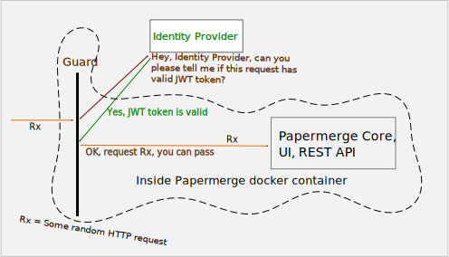
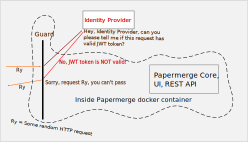
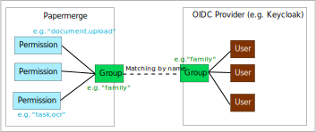

# Overview

## Protocol

OpenID Connect (OIDC) is an interoperable authentication protocol based on the OAuth
2.0 framework of specifications.

OIDC is a standardized protocol.

With OIDC, the accounts registration, authentication, accounts management
(e.g. password management), is offloaded from the shoulders of the app to
separate entity - **identity provider**.

!!! Note

    "Authenticate" means same as "sign in", "login".
    Verbs "authenticate", "sign in", "login" are used interchangeably

With OIDC, instead of authenticating in each individual app, user
authenticates with on identity provider (IP) side. To authenticate users,
identity provider can employ various schemes like 2FA (two factor
authentication). Once authentication is successful on the identity provider
side, IP sends {{ extra.project }} a digitally signed token. All the
subsequent requests to {{extra.project}} need to have that token, or otherwise
they will be denied as not authorized.

It may sounds abstract, because it is abstract.
I think couple of illustration will clear the waters.

First, in order to authenticate, OIDC enabled app ({{ extra.project }}) will
redirect user to OIDC provider sign in page. On successful authentication
{{ extra.project }} receives a token - so called jwt token.

In above illustration, for step 1 -> 2 to work `PAPERMERGE__AUTH__OIDC_AUTHORIZE_URL` setting
is employed. For step 2 -> 3 to work `PAPERMERGE__AUTH__OIDC_REDIRECT_URL` is used.

The trophy, which {{ extra.project }} receives from identity provider for
successful sign in, is so call called [JWT token](https://jwt.io/). Users
have no idea (and rightfully so) about JWT tokens, as all token business
happens behind the scenes.

!!! Note

    All processes described from here on, are not visible to the users. It all
    happens behind the scenes for them. Information which follows is
    meant for devs, DevOps, SREs.

Your OIDC application needs JWT token as prove of
successful authentication. As you may guess, JWt token will be carried inside
each subsequent http requsts as http header.

All incoming http requests are proved for validity of JWT token. If http request
has valid JWT token - request is permitted to reach app. If http request does not
contain valid JWT token - it is denied access to the app.

!!! Note

    By "valid JWT token" is usually meant that it contain valid digital signature,
    it is not expired and maybe some other checks specific to identity provider.

Following illustrations depict what happens with incoming requests:

Inside {{ extra.project }} there is a "guard" which, for every incoming
request, asks identity provider if respective HTTP request is valid or not.
If identity provider says that JWT token is valid - request is permitted to pass,
otherwise access is denied.
This step is possible due to `PAPERMERGE__AUTH__OIDC_INTROSPECT_URL` setting.
OIDC introspect endpoint is go to endpoint to inquiry for validity
of the JWT token.

The last technical detail to clarify, with high risk of diving in too many details,
is: what is this "guard" thingy?
"Guard" is nginx's
[authorization based on sub-request result](https://nginx.org/en/docs/http/ngx_http_auth_request_module.html).
In other words, there is nginx's "auth_request" for every incoming HTTP request and
depending on it's response's status code the request is allowed to pass or not.

## Users

When using OIDC provider, users are managed on OIDC provider side. You will
create, update, delete users on OIDC provider side. This means also
that you set users' passwords on provider side (Keycloak, Authentik).

The only exception from this rule is very first superuser account of the {{ extra.project }}.
Initial superuser account of {{ extra.project }} is created on both sides:
in {{ extra.project }} via `PAPERMERGE__AUTH__USERNAME`, `PAPERMERGE__AUTH__EMAIL`
`PAPERMERGE__AUTH__PASSWORD` environment variables and via OIDC provider.

Note however that even though you must supply `PAPERMERGE__AUTH__PASSWORD`, its value is
not used, as you will login using password configured in OIDC provider.

## Groups

Every user which will login into {{ extra.project }} via OIDC must belong to one
or more groups. The only exception from this rule is initial superuser account.

Groups must be created on both sides - on {{extra.project}} side and on OIDC
provider side. Groups are matches by their names. This means, in order to
match, on both sides group name must be same. Name matching is case
sensitive, this means for examples that "Family" and "family" are distinct
names.

## Permissions

When using OIDC provider, permissions are managed on {{ extra.project }} side only.
Group can be regarded as a set of permissions.
Group <-> Permissions association is accomplished on {{ extra.project }} side.

On the OIDC provider side, users are assigned to groups. By matching group on
the {{extra.project}} side, user gains all permissions of the groups they
were assigned.

Users, groups, permissions entities relations can be illustrated as in following picture:

