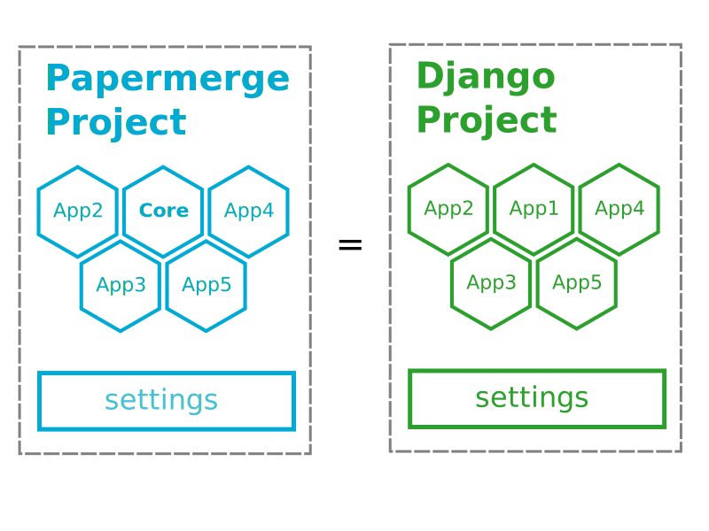

# Apps

From the very beginning of its existence, Papermerge started to receive
features requests. Many of those requests made perfect sense and were
implemented (or will be implemented). It is thanks to the  community's
feedback and contributions that Papermerge evolves naturally into a mature
archives management system.

However, a great number of features requests were subject to debate, or just
not suitable for majority of users. A very good example of such feature is
duplicates removal. First of all, how to define that a specific document is a
duplicate (of other document)?

There are at least three possibilities:

1. duplicate are documents with same file name
2. duplicates are documents with same digest value
3. duplicates are those documents where extracted text is >= 95% similar (i.e. very similar)

Each of points above has pros and cons. Each of them may be right under
specific circumstances and for specific user or company requirements. By
default, Papermerge does not implement any of those points. Event more, if you
upload same files (with same content and even same filename) it will gladly
accept them. In the end, whole this document duplicates thingy is just a
matter of preference.

Apps were introduced to address such issues. App (or plugin if you like) is a
way extend base Papermerge application. Continuing with above example with
document duplicates, by adding/removing specific Papermerge app you can
add/remove specific document duplicate detection criteria. This way, Papermerge
base application, which is called Papermerge Core will contain only essential
features.

## Papermerge Core

On the other hand, document management system are complex applications, with
rich set of requirements such as LDAP authentication, document electronic
signatures and even such fancy things as data retention policies. Not
everybody needs LDAP authentication though. Also, not everybody uses document
electronic signatures and data retention policies. These type of features are
very good candidates for Papermerge apps. All non essential features will be
implemented as apps which can be easily plugged or removed.


## Apps

Papermerge app is basically a Django app with few extras. You may wonder what
is Django app anyway? First of all, Papermerge is build with help of web
framework called <a href="https://www.djangoproject.com/" class="external-link" target="_blank">Django</a>. Secondly,
Papermerge project is a Django project which in turn is a loose collection of
Django apps plus (project) settings. Figure 1 illustrates this idea.



Notice that Papermerge Core app is part of every Papermerge project.

## Writing Basic App

The gory details of how to develop apps and include them into papermerge
project are explained in contributing guide. Here, in user manual, only high
level concepts are explained.

Let's consider an app which will detect file name duplicates i.e. an app which
if used, will issue an error when user tries to upload twice documents with same
file names. Keep in mind that here the goal is to familiarize with general
concepts.

Inside Papermerge project create a new django app:

```console
./manage.py startapp filebased_unique
```

To highlight that filebased_unique app is part of papermerge ecosystem, it will be moved into a namespace papermerge (which is just an extra folder):

```console
$ mkdir papermerge
$ mv filebased_unique papermerge/
```

Also, change `name` and `label` app attributes as shown below:

```py
from django.apps import AppConfig


class FilebasedUniqueConfig(AppConfig):
    name = 'papermerge.filebased_unique'
    label = 'filebased_unique'
```

The heart of papermerge.filebased_unique app is file
papermerge/filebased_unique/models.py where core document model is extended as
following:

```py
from django.core.exceptions import ValidationError
from papermerge.core.models import Document, AbstractDocument


class DocumentPart(AbstractDocument):

    def clean(self):

        file_name = self.get_file_name()

        if Document.objects.filter(file_name=file_name).count() > 1:
            raise ValidationError(
                "Document file_name duplicates detected"
            )
```

Here is link to <a href="https://github.com/papermerge/papermerge-filebased-unique" class="external-link" target="_blank">app code</a> on GitHub.


## Document Parts


Apps are there not just for adding extra validations, you can add extra fields
to the core document as well.

For example, in case you want to add a special UUID field to the document model, you can:

```python
import uuid
from django.db import models

from papermerge.core.models import AbstractDocument


class DocumentPart(AbstractDocument):

    special_uuid = models.UUIDField(
        default=uuid.uuid4,
        editable=False
    )
```

Those extra fields added by apps to core document model - are called *document
parts*. Papermerge application treats core document fields and those extra
fields added by apps as one whole:


This way, any user or company, can extend core document model with whatever
number of custom fields they wish without interfering with core application
code.


## Document Widgets

!!!note

    This feature is experimental.

Each document part (i.e all those extra fields) will be visualized as widgets on
the right side widget panel along with metadata widget and basic info widget.