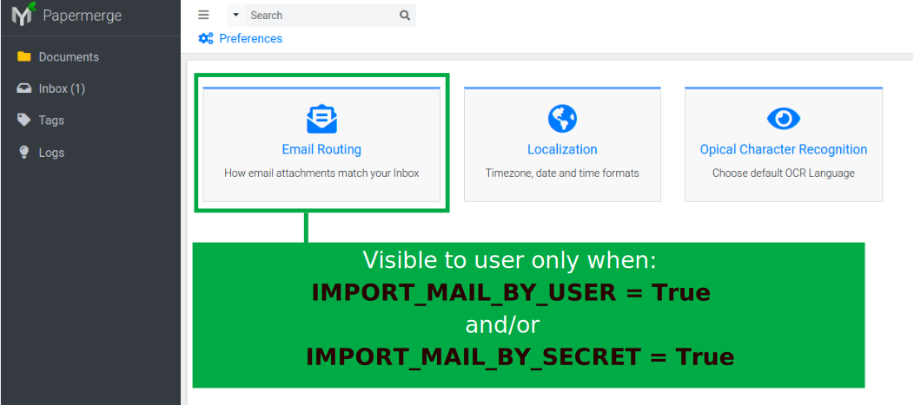

# Consumption

Once you’ve got Papermerge up and running, you need to start feeding documents
into it. Currently, there are four options: upload directly via web user
interface, the importer directory, IMAP (email), and the REST API.

Uploading document via web interface won't be explained here as it is very
obvious. Uploading via REST API along with how to register a token is
explained in [REST API](rest_api.md). Here we will focus on importing from
a local directory and importing documents from an email account (imap).


## The Importer Directory

You can point Papermerge to a specific directory on your local system and
`worker` script will import all documents from that
directory. Getting stuff into this directory is up to you. If you’re running
Papermerge on your local computer, you might just want to drag and drop files
there. Imported documents will land in your superuser's Inbox folder.

The configuration setting you are looking for is `IMPORTER_DIR`. It points to the directory where all documents will be imported from. Example:

```console
IMPORTER_DIR = "/mnt/media/importer_dir"
```

The `IMPORTER_DIR` directory pointed must be readable by the Papermerge application.

!!! note

    Notice that `IMPORTER_DIR` must be defined on the worker side. For single
    deployments worker and main app will share the same `papermerge.conf.py`
    configuration file, thus all configurations will be in same configuration file.
    In case of distributed deployment - or even in case when the main app and worker
    run within different docker images - this distinction becomes important.
    `IMPORTER_DIR` should be defined in `papermerge.conf.py` of the host (or docker
    image) where the worker runs.

All imported documents will land in superuser's Inbox.

!!! note

    Papermerge is a multi-user system. The very first system user is called
    superuser. Papermerge must have at least one superuser. Regardless of how many
    users there are in Papermerge DMS, imported documents will always end up in
    first superuser's inbox.


## IMAP (Email)

Papermerge can import documents from an email account. This feature is somehow
similar to importing documents from a local directory, but instead of a local
path you need to provide details about an email account (email account = IMAP
account). At very least you need to provide following email importing
settings:

1. `IMPORT_MAIL_HOST` - IMAP server hostname
2. `IMPORT_MAIL_USER` - IMAP username
3. `IMPORT_MAIL_PASS` - IMAP password

!!! note

    Email importing settings must be defined on the worker side.

with those three configurations worker will securely connect every 30 seconds
to provided IMAP account and check for newly arrived **email messages with
attachments**. By default email attachment's will end up in your superuser's
Inbox.


## One IMAP Account for Many Papermerge Users

Adding all email attachments to your superuser Inbox is absolutely fine when
superuser is the one and only user in Papermerge. However, if your Papermerge
instance has multiple users, then assigning documents for specific Papermerge
user's Inbox is little tricky. There are couple ways to match incoming emails to
specific Papermerge user:

1. matching by "From" or "To" fields (also called matching "by user")
2. matching by special "secret" in email's subject or email's body

The following configurations enable/disable respective matching features:

* `IMPORT_MAIL_BY_USER` = True | False
* `IMPORT_MAIL_BY_SECRET` = True | False

## Matching By User

`IMPORT_MAIL_BY_USER` allows user to send emails from their
user-configured email address and have them end up in their inbox. With this option enabled, Papermerge
looks up email's "From" and "To" fields to decide for who those documents are addressed. Document will end up in Papermerge user with same email address as either email's "From" or email's "To" field.

Following picture illustrates how matching by user works:


!!! note

    You configure Papermerge with only one IMAP/email account.


## Matching By Secret


`IMPORT_MAIL_BY_SECRET` is yet another way to route email's attachments to
correct Papermerge inbox. It this case a per-user secret in email body or
email subject is the decision factor. Secret can be any text. In your email
you need to surround it with `SECRET{ ... }` keyword. Note that keyword
`SECRET` must be all capital-case and there are no spaces between opening
curly brackets and word `SECRET`, however there may be spaces between secret
text and surrounding curly brackets. Papermerge looks for `SECRET{
... }` in emails subject or emails text body - but **NOT in the
attachment**!

Let's consider an example: Papermerge user *john* in preferences enables *Email routing
by secret* option and chooses as secret *the one who loves cats and documents*. Then any incoming
email (in configured IMAP account) with following text (either in subject or in its body):

    SECRET{ the one who loves cats and documents }

with be assigned to Papermerge user *john*.

!!! danger

    There are **no spaces between** keyword `SECRET` and `{`

Notice that email matching feature must be enabled:

1. system wide using `IMPORT_MAIL_BY_USER` and/or `IMPORT_MAIL_BY_SECRET` in `papermerge.conf.py` file
2. per user - in user preferences menu

If both configurations options `IMPORT_MAIL_BY_USER` and `IMPORT_MAIL_BY_SECRET` are set to `False` users won't see "Email Routing" configuration their preferences. If at lease one of above mentioned options is enabled users will see "Email Routing" preferences.




!!! note

    Note that secret text is always shown (unlike passwords which are hidden
    from user's eyes) to users. Also, unlike passwords, secret text for email
    routing is stored in database as clear text. It is so, because secret text
    used for email routing and is not used as user credentials of any kind
    i.e. it doesn't grant you any privilege; in other words you cannot open
    any account with that "secret text" information so to speak.

Finally if `IMPORT_MAIL_DELETE` is set to True then a processed email will be deleted from
the mail account.
