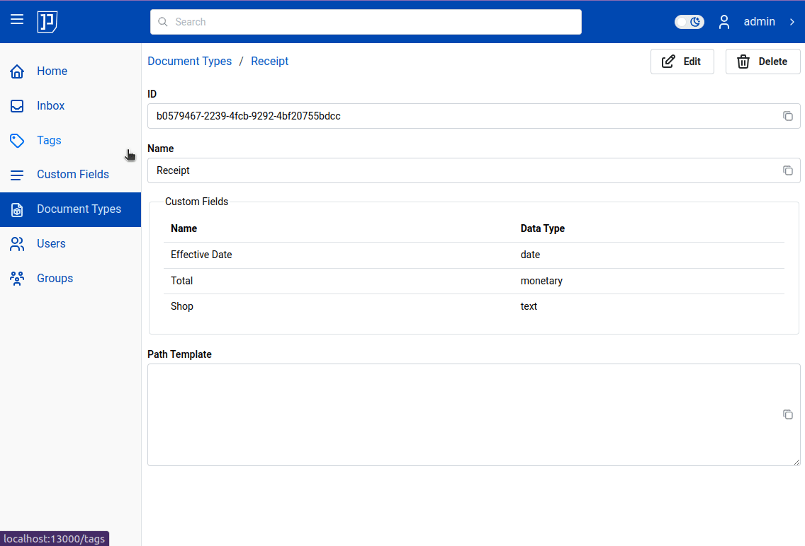
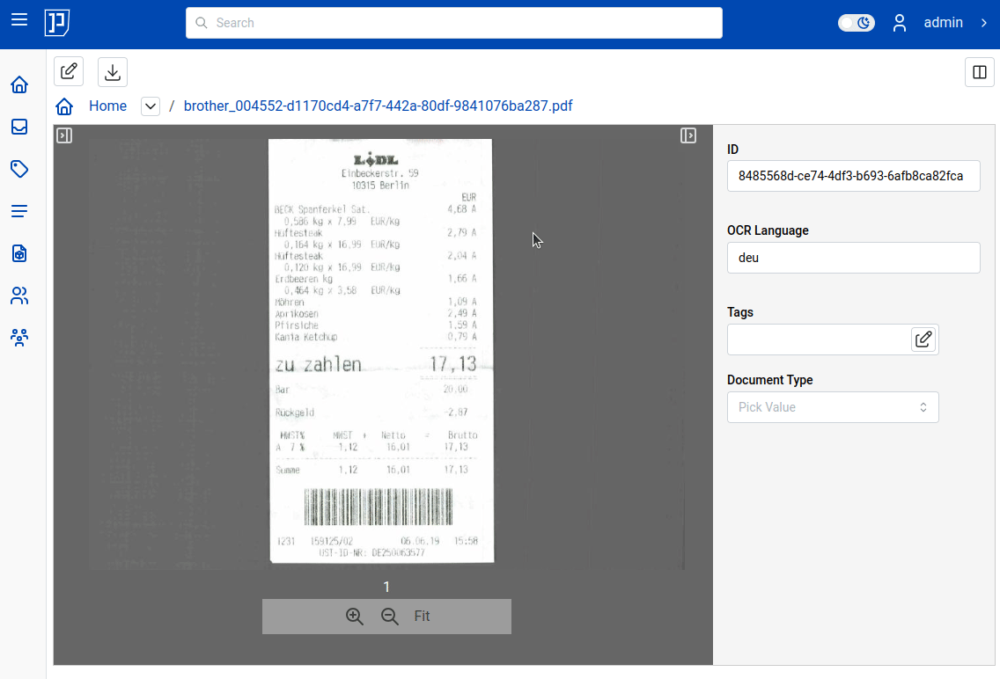
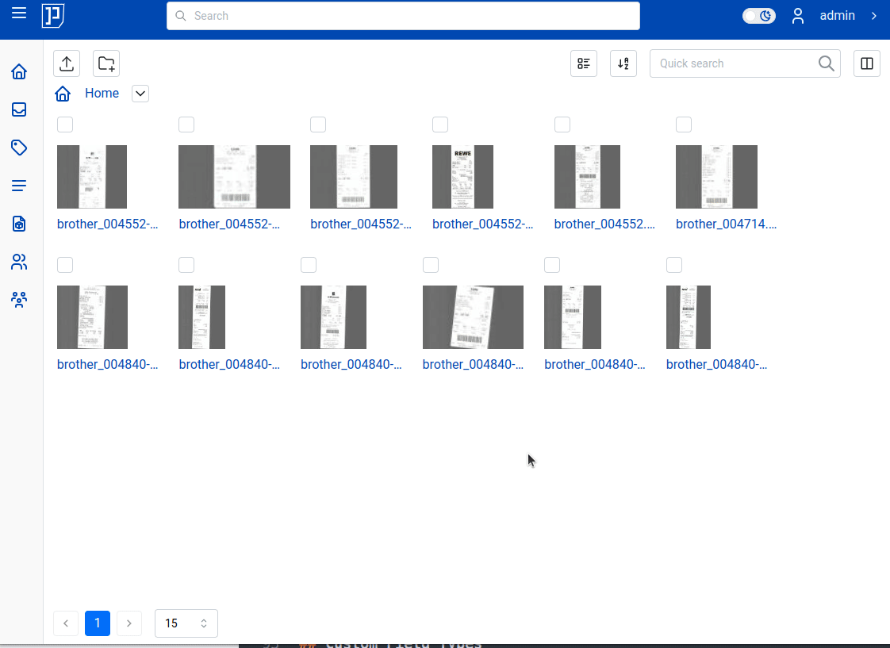

# Custom Fields

Custom fields (abbreviated - cf) are attributes attached to your document; they are basically user
defined data associated to the document. See the receipt in following illustration.
The information which may concern you about the receipt may be: when receipt was issued,
who issued the receipt and the amount (price, monetary value) on it.

!!! Note

    Custom fields are also known as "metadata". In following documentation
    we will use terms "custom fields" and "metadata" interchangeable

This information, date, shop, total amount, can be attached to the document.

In illustration above "amount = 17,96 EUR" - that is essentially a custom field with a value.
Custom fields have a name. Name of the field in last example is "amount".
Custom fields have a type. The "amount" field is of type "monetary".
To be precise, the type of field "amount" is "monetary (EUR)".
Custom fields have also a value associated.

Seeing these concepts in action will help.
Let's create three custom fields: one of type "date", one "monetary" type
and one of type "text":

With custom fields created, they can now be assigned to the documents. The
key point here, is that you never assign custom fields directly to the document.
Instead, you assign them via document types.
It is four step process:

1. Create custom fields
2. Create document type (in our example, we will name it "Receipts")
3. Assign custom fields to the document type
4. Assign document to the document type

We already did step 1. Let's quickly do 2. and 3:

Lastly, step 4: let's assign document to the document type "Receipt".
Because document type "Receipt" has custom fields associated, if you
assign any document to "Receipt" category - it will automatically
show "Receipt" custom fields. An animated gif show this in action:

## Custom Field Values

What is great about custom fields feature is that you can list all documents
along with their custom field values - this opens new insights
into the "structure" of all of your documents.
This is very powerful feature. But before we see it in action, let's
fill in values for couple of receipts:

You need to do that for all your receipts.

!!! Info

    Filling metadata for each of your document may look like boring :sleeping:.
    And indeed, boring task it is!
    Future versions of {{ extra.project }} will add ways to completely automate extraction
    of custom field values. Stay tuned! :saluting_face:

Do following:

- in commander switch view from "Tiles" to "Document Type".
- in drop down list choose which document type you want to view - in our example "Receipt"

If you want to preview documents while list "document type" view, then you need to **hold
"Ctrl" key pressed while clicking on document's titles**.

Following illustration shows how to switch back and forth between "document type" and "tiles" views:

## Custom Field Types

### Monetary

### Date

### Text

### Boolean (Yes/No)
