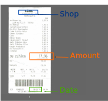
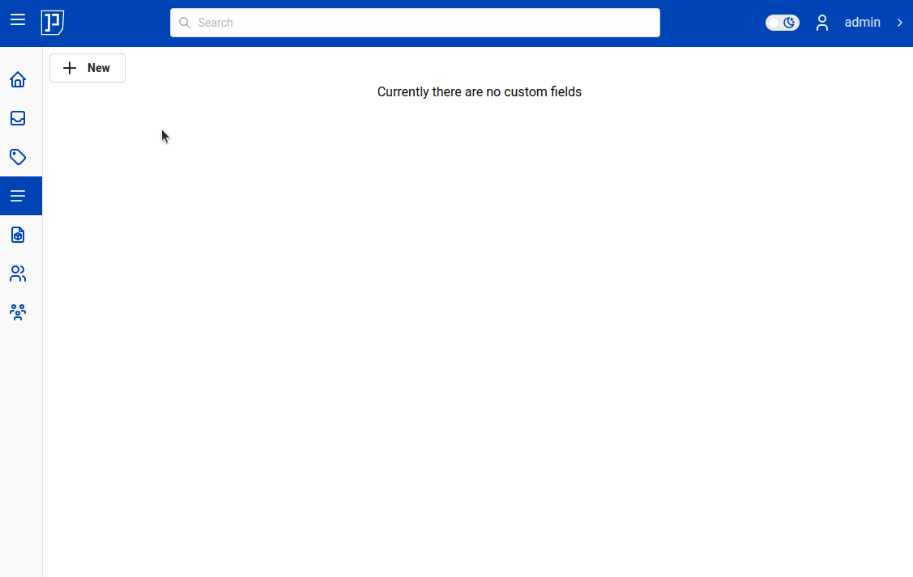
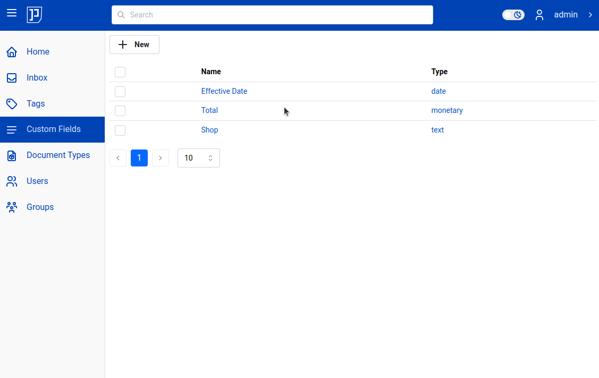

# Custom Fields

Custom fields (abbreviated - cf) are attributes attached to your document; they are basically user
defined data associated to the document. See the receipt in following illustration.
The information which may concern you about the receipt may be: when receipt was issued,
who issued the receipt and the amount (price, monetary value) on it.

This information, date, shop, total amount, can be attached to the document.

In illustration above "amount = 17,96 EUR" - that is essentially a custom field with a value.
Custom fields have a name. Name of the field in last example is "amount".
Custom fields have a type. The "amount" field is of type "monetary".
To be precise, the type of field "amount" is "monetary (EUR)".
Custom fields have also a value associated.

Seeing these concepts in action will help.
Let's create three custom fields: one of type "date", one "monetary" type
and one of type "text":

With custom fields created, they can now be assigned to the documents. The
key point here, is that you never assign custom fields directly to the document.
Instead, you assign them via document types.
It is four step process:

1. Create custom fields
2. Create document type (in our example, we will name it "Receipts")
3. Assign custom fields to the document type
4. Assign document to the document type

We already did step 1. Let's quickly do 2. and 3:

Now if you assign document to "Receipt" category - it will automatically show "Receipt"
custom fields. An animated gif show this in action:

## View All CF By Category

## Custom Field Types

### Monetary

### Date

### Text

### Boolean (Yes/No)
