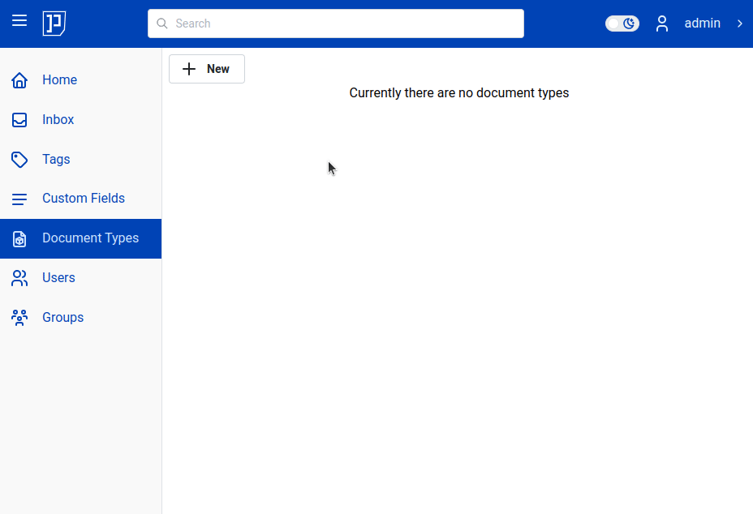
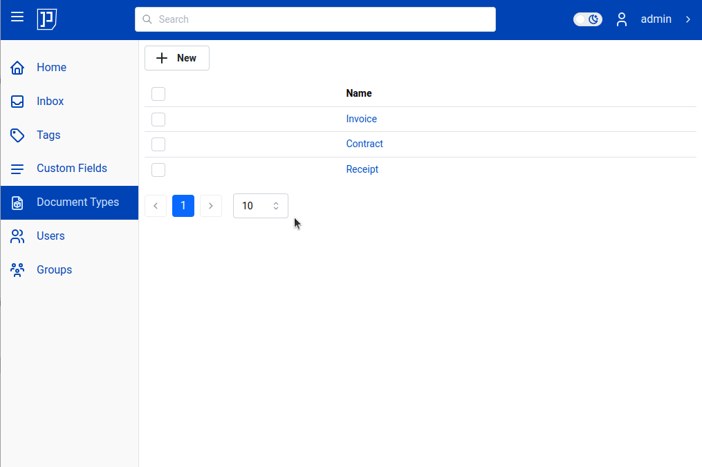

# Document Types / Categories

Document type is a fundamental concept which draws the line between
common file browser and document management system.

Document types enable you to categorize documents. You
can define types such as "Receipt", "Invoice", or "Contract".

!!! Note

	*Document type* is same as *category*, *document category* or *document class*.
	In following documentation we will you those terms interchangeable.

Types are optional in sense that you don't need to specify document type when
importing document(s), but you will definitely would like to assign them
to a specific category later along the way.

A document may or may not have a document type assigned. But if
it has a type - it can be only one type.

!!! Note

	Database people call this *one to one relation*: one document
	can be associated with only one document type.

Let's add some document types:

!!! Tip

	Although a document type represents an unlimited number of documents, when deciding on a name,
	use the singular form. Singular form improves clarity.

Notice in above animated picture that document type form, beside name, also
features [custom fields](custom-fields.md) and [path templates](path-templates.md).
That's where usefulness of documents types comes into
the fore! **You can assign custom fields and path templates to the documents
only via categories**.

Example: imagine you have 100 receipts documents e.g. receipt001.pdf,
receipt002, ..., receipt100.pdf. Now, you want to add "Total
(EUR)" and "Effective Date" custom fields to all 100 receipts. How should you
proceed? Should you add custom field to each individual document? What if
there are not 100 receipts, but maybe 10 millions? Assigning custom fields
one by one to 10 million documents is definitely not feasible. Instead, one
can assign "Total(EUR)" and "Effective Date" custom fields to the
category "Receipt", and then assign all documents, in one bulk operation to
that category.

!!! tip

	Use document types to assign same custom fields (or path templates)
	to specific category of documents.

In general, many parts of {{ extra.project }} will rely of the document types, because
it is much more custom to apply operations on group (class, or category)
of documents than to individual documents.
