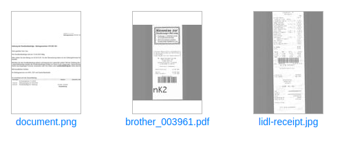
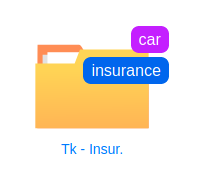

# Getting Started

In this part of the documentation we define important concepts used {{ extra.project }}
parlance. We highly recommend you to read and understand this section.

## Document

For {{ extra.project }} a document is anything which is a good candidate for
archiving - some piece of information which is not editable but you need to
store it for future reference. For example receipts - you don't need to edit
receipts or read them everyday, but eventually you will need them for your
tax declaration. In this sense - scanned documents, which are usually in PDF,
JPEG or TIFF format, are perfect match.

If you take a picture of a paper document with your mobile phone - you'll have
a file in jpeg format (or maybe png file format). In context of {{ extra.project }}
that picture of a document (though just a single jpeg
file) is a valid one page document.

On the other hand, if you take a picture of a flower and upload that jpeg
image to {{ extra.project }} - the 'document' will be processed. However,
that jpeg format flower image is not a document in {{ extra.project }}
sense.

Usually office formats with .docx (Microsoft Word), .odt (Libre Office), .txt
(plain text) are not good candidates for archiving - as by their nature they
are meant to be changed/edit regularly. However, once converted to PDF format
(for instance Contract_C2.docx to Contract_C2.pdf) they are full fledged
documents in {{ extra.project }} sense.

!!! info

	{{ extra.project }} works with four file formats: PDF, TIFF, JPEG and PNG.

## Document Version

One document has one or multiple versions. The original document version - is version number 1.
For every change applied to the document - a new document version is created with that change applied.

When we say "change applied to a document" - we mean things like [rotate pages](./page-management.md#rotate), [reorder pages](./page-management.md#reorder) or
[merge](./merge-documents.md) two documents.

The point of document versions is to keep track of changes applied to the document.

## Folder

Folder in {{ extra.project }} is counterpart of "folder" concept used in major
computer file manager applications (e.g. Finder in macOS). Folders in {{ extra.project }}
are, intuitively enough, hierarchical - in other words one
folder may contain other folders and/or documents.

## Node

Node is an abstraction of two concepts: document and folder.
Every time you read *node*, you can mentally replace that term
with either *document* or *folder* and the statement will still hold.

## Special Folder

## OCR

OCR (Optical Character Recognition) is a technique to extract **text** information from **binary image formats**.
This technique enables users to:

* **copy/paste  text** from the document's content
* **search documents** by document's actual text content

OCR is essential tool (or technique if you will) which helps basically to
extract textual information and thus derive useful work-flows
(based on document's actual content) with the documents.
Papermerge relies on external open source specialized tools like
[Google's Tesseract OCR](https://github.com/tesseract-ocr/tesseract)

## Tags

Organizing documents in folders is very common. Thus the idea of keeping your
documents in folders doesn't need further introduction. It may be worth
mentioning that Papermerge supports folders and that folders may be
hierarchical i.e. one folder can contain other folder(s) as well. This nesting
(folder in folder) ca be arbitrarily deep.

The idea of using tags to organize your documents
may be new for you though. Tags are kind of labels. You can associate
(add) tags to a document or to a folder. Tags have a color and a name. Once
tagged, documents can be searched by their tags. Conversely, is it also
possible to show all the documents tagged with a particular tag(s).

Both tags and folders complement each other and provide you with powerful
means to stay organized.

## Page Management

Many times scanning documents in bulk yields documents with blank pages; some
pages my be out of order or maybe part of totally different document. Even if
you notices these flaws immediately it is time consuming and frustrating to
redo scanning process. Papermerge helps you with your scanned documents like
no other tool. With Papermerge you can delete blank or erroneous pages, you
can move pages from one document into another (with cut and paste) and most
importantly you can reorder document pages in case you need to do so.

There is a separate chapter about [page management](page-management.md) where you can learn
details about this feature.
