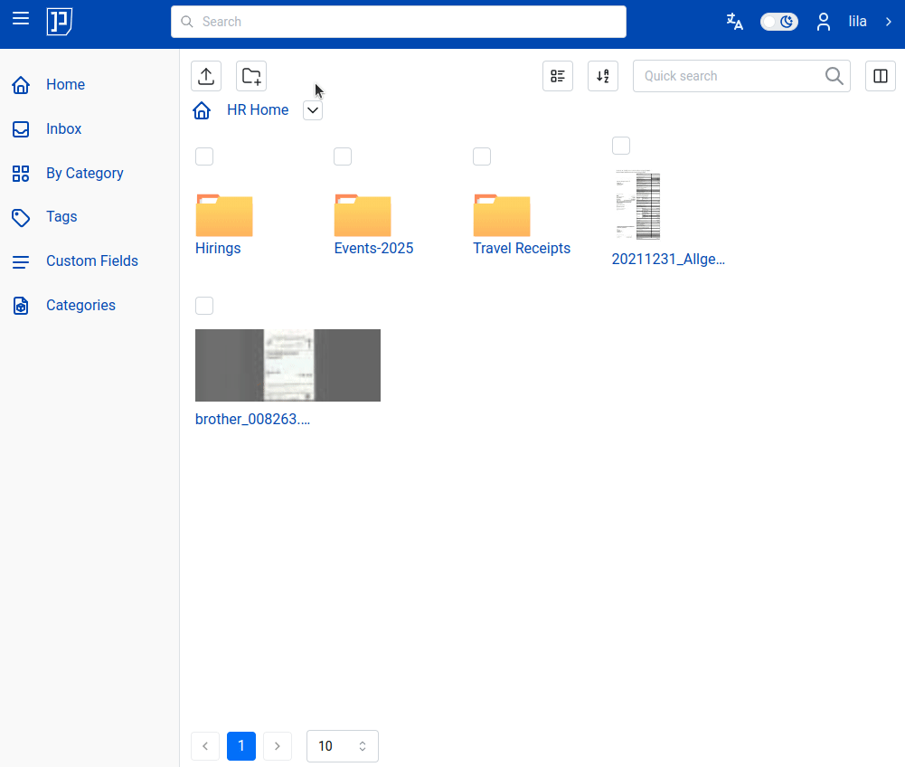
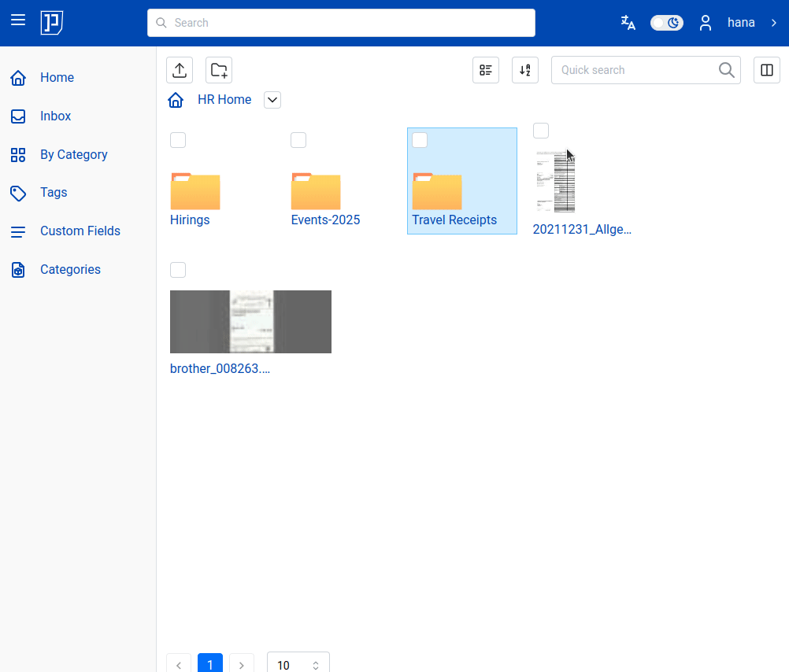
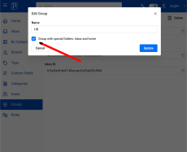
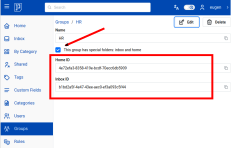

# Group Ownership

## Concept

Every document, folder, tag, category and custom field can be owned by user or
by a group. In case entity (document, folder, tag etc) is owned by a
group - all users in that group are considered owners for that entity
(document, folder etc).

Owners have all permissions on that particular
entity (folder, document etc), which means that owners can view, change,
and event delete it.

In the following parts of this section we will use as example
hypothetical organization - Acme Inc.
Acme Inc has five teams:

- Marketing (Merry, Mara, Jane)
- QA (Casper, Elizabeth)
- Development (Mark, Dora, David)
- HR (Lila, Hana, Luke)
- Managers (Mark, Jane, Luke)

Each team has its own separate set of documents. Each team member
has full access to the documents of his/her own team, in other
words each team member can view, change, and delete every document
of his/her own team. The first step in implementing described scenario
is to create {{ extra.project }} [group](groups.md) entity for each team: Marketing,
QA, Development and HR.
Then every user should be assigned to that group.

!!! Note

    Depending on your setup, it may be the case that assigning user to groups is accomplished
    outside {{extra.project}} e.g. in Keycloak instance which acts as authentication provider, or
    in LDAP service etc.

## Groups with Special Folders

Group entity may have special folders - `inbox` and `home`. Group's `home` folder
is folder where all documents and folder for that group reside. Thus HR team
will have its own `home` folder where all HR documents are. Each HR team member
is owner of all documents and folders in HR's `home` folder and thus they can access,
change, and delete them.

Users outside HR team don't have access to HR `home` folder: e.g. user Marry
from Marketing team does not have access to documents in HR's `home` folder.

Similarly story goes with group's `inbox` folder.

In animated picture below user `lila`, she is part of `HR` team, has two `home`
folders: her own and home folder of `HR` department. In her own private `home`
folder she has her private documents, among others a folder titled "Lila Hobby".
In `HR` home folder she can access, view, change, upload/download as well as delete at
her heart's will - `HR` department's documents.

User `hana` is also part of `HR` department. She also has full access to `HR` `home`
folder. `hana`'s private home folder is empty.

Both `hana` and `lila` are full owners of every document and folder found in `HR` home.

Both users see `HR` `home` folder in the drop-down menu because they are both
part of `HR` group and `HR` group was created with
"special folder" checked.

## Implicit Ownership Transfer

Everything placed in group's `home` or `inbox` folder will be automatically
owned by that group. For example if user `lila` uploads new document
from her local computer into `HR` `home` folder - uploaded document automatically
will be owned by `HR` group (not by `lila`). A less obvious example is following:
if `lila` moves her private document from her `home` into `HR` group `home`, then
ownership of that document will be implicitly transferred from `lila` to `HR`.
If she does it other way around i.e. moves document from `HR` `home` folder into
her own private `home`, then the ownership is transferred from `HR` department to
user `lila`.

!!! Note

    To transfer ownership of a document (or of a folder) from user to specific group,
    you need to move that document (or folder) from your private `home` or `inbox`
    to respective group `home` or `inbox` folder.

