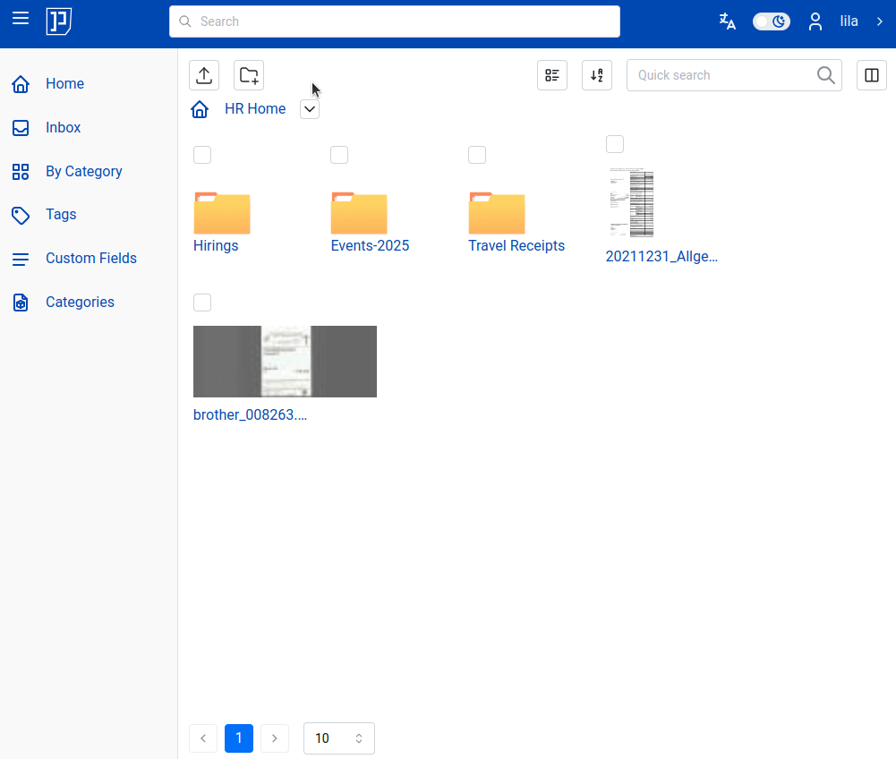
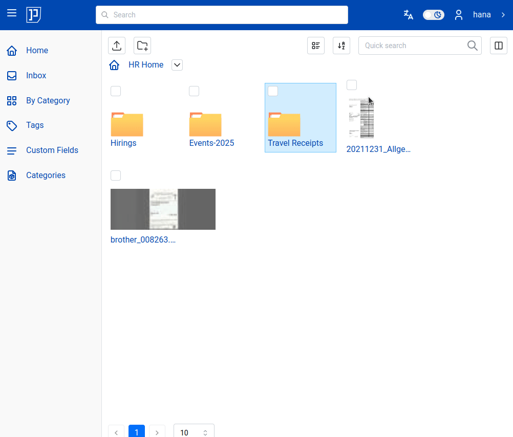
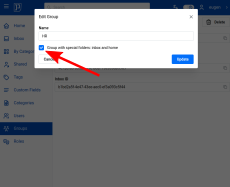
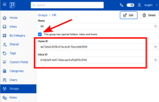
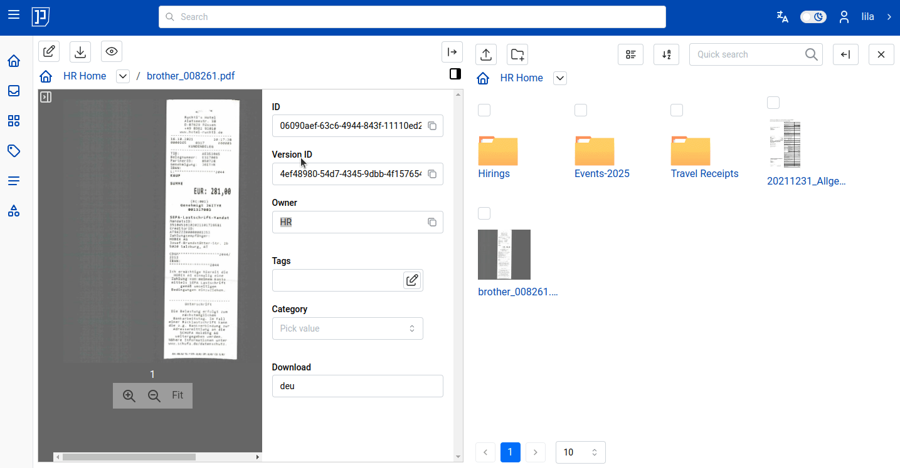
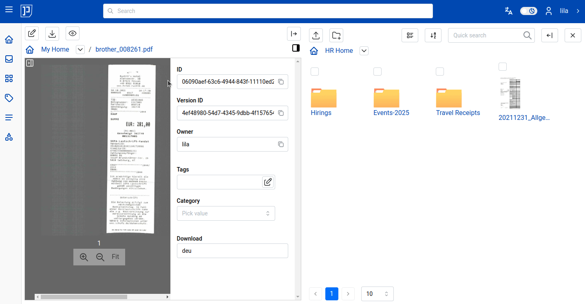
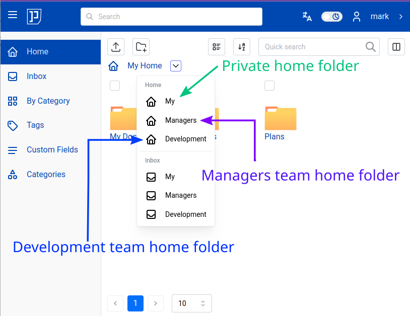
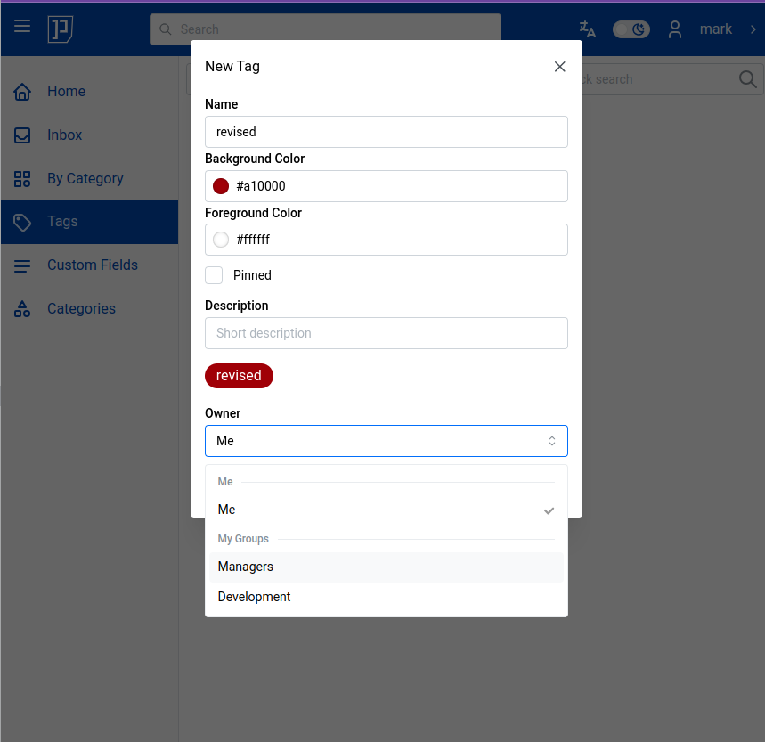
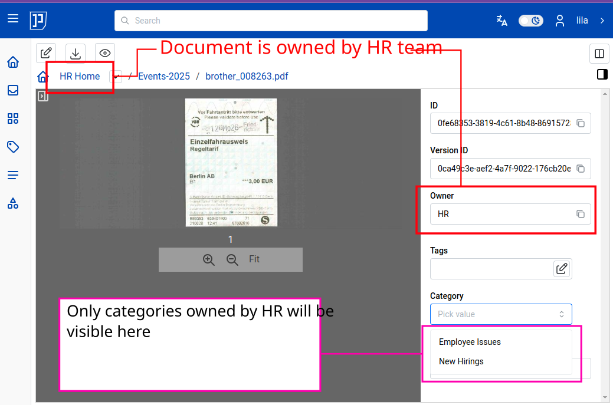

# Group Ownership

In a team or organizational environment documents are typically handled
collectively by multiple group members.

Group ownership feature enables groups to be defined as the owners of
documents. When a group is set as the owner, all members of that group
automatically inherit full permissions for the document, including the
ability to delete it.

This feature significantly simplifies permission management and eliminate the
need for special rules or workarounds, such as explicitly granting deletion
rights to group members. At the same time, it is better aligned with the
requirements of real-world organizational structures, where ownership is
often collective rather than individual.

Benefits of group ownership feature:

* Facilitates collaboration in team-based workflows
* Removes dependencies on individual users for document management
* Provides a clear and intuitive system that seamlessly integrates with
group-oriented work structures

## Concept

Every document, folder, tag, category and custom field can be owned by user or
by a group. In case entity (document, folder, tag etc) is owned by a
group - all users in that group are considered owners for that entity
(document, folder etc).

Owners have all permissions on that particular
entity (folder, document etc), which means that owners can view, change,
and event delete it.

In the following parts of this section we will use as example
hypothetical organization - Acme Inc.
Acme Inc has five teams:

- Marketing (Merry, Mara, Jane)
- QA (Casper, Elizabeth)
- Development (Mark, Dora, David)
- HR (Lila, Hana, Luke)
- Managers (Mark, Jane, Luke)

Each team has its own separate set of documents. Each team member
has full access to the documents of his/her own team, in other
words each team member can view, change, and delete every document
of his/her own team. The first step in implementing described scenario
is to create {{ extra.project }} [group](groups.md) entity for each team: Marketing,
QA, Development and HR.
Then every user should be assigned to that group.

!!! Note

    Depending on your setup, it may be the case that assigning user to groups is accomplished
    outside {{extra.project}} e.g. in Keycloak instance which acts as authentication provider, or
    in LDAP service etc.

## Groups with Special Folders

Group entity may have special folders - `inbox` and `home`. Group's `home` folder
is folder where all documents and folder for that group reside. Thus HR team
will have its own `home` folder where all HR documents are. Each HR team member
is owner of all documents and folders in HR's `home` folder and thus they can access,
change, and delete them.

Users outside HR team don't have access to HR `home` folder: e.g. user Marry
from Marketing team does not have access to documents in HR's `home` folder.

Similarly story goes with group's `inbox` folder.

In animated picture below user `lila`, she is part of `HR` team, has two `home`
folders: her own and home folder of `HR` department. In her own private `home`
folder she has her private documents, among others a folder titled "Lila Hobby".
In `HR` home folder she can access, view, change, upload/download as well as delete at
her heart's will - `HR` department's documents.

User `hana` is also part of `HR` department. She also has full access to `HR` `home`
folder. `hana`'s private home folder is empty.

Both `hana` and `lila` are full owners of every document and folder found in `HR` home.

Both users see `HR` `home` folder in the drop-down menu because they are both
part of `HR` group and `HR` group was created with
"special folder" checked.

## Implicit Ownership Transfer

Everything placed in group's `home` or `inbox` folder will be automatically
owned by that group. For example if user `lila` uploads new document
from her local computer into `HR` `home` folder - uploaded document automatically
will be owned by `HR` group (not by `lila`). A less obvious example is following:
if `lila` moves her private document from her `home` into `HR` group `home`, then
ownership of that document will be implicitly transferred from `lila` to `HR`.
If she does it other way around i.e. moves document from `HR` `home` folder into
her own private `home`, then the ownership is transferred from `HR` department to
user `lila`.

!!! Note

    To transfer ownership of a document (or of a folder) from user to specific
    group, you need to move that document (or folder) from your private
    `home` or `inbox` to respective group `home` or `inbox` folder.

Following animated images illustrates this idea.

In this example, `lila` is moving document initially belonging to `HR` team to
her private folder. You can see that `Owner` field automatically changes from
`HR` to `lila`.

In this example, it is other way around: `lila` is moving document initially
belonging to her to `HR` department folder. You can see that `Owner` field
automatically changes from `lila` to `HR`.

## Multiple Group Homes

If user belongs to multiple groups with special folders, then that user will
have multiple group folders in drop-down menu. For example user `mark`, who
belongs to Managers team as well as Development team. Both teams have their
own group with special folders.

!!! Remember

    Besides his/her own private home/inbox folder, user may multiple group home/inbox
    folders - one for each group he/her is part of. Precondition is that respective
    group has special folders.

## Custom Fields, Categories and Tags

Custom Fields, Categories and Tags also may be owned by group. In fact, when
you create a tag (Custom Field, Category) you will need to decide who is the
owner of that tag. In case of user `mark`, because he belongs multiple teams,
he needs to choose who is the owner of "revised" tag:

## Tags and Categories Visibility

Custom fields, categories and tags belonging to `HR` are visible only to
HR team. Group owned categories can be assigned only to documents
belonging to that group, which means that, for example, to a document
belonging to HR team can be assigned only categories which are owned
by HR team:

Same story is with tags: if document is owned by HR, then when trying
to assign a tag, user will see only tags belonging to HR department.
Same with custom fields: if category belongs to HR and you try to
assign it custom fields, then you can choose only from custom fields
belonging to HR team.