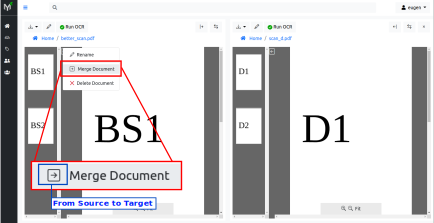
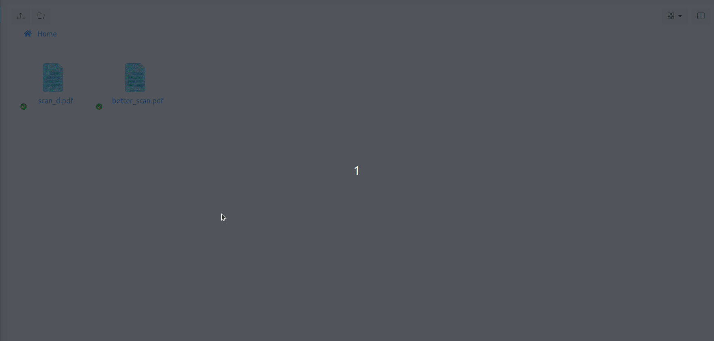

# Merge Documents

Let's first clarify what is meant by *documents merging*.
*Merging* is the process of combining two documents into one: all pages
from the source document are transferred into destination document and then
source document is deleted.

On the target document, transferred pages can:

1. entirely replace target pages
2. be appended to the target pages

The rest of this documentation chapter describes how to use {{ extra.project }} in case 1.
For how to use {{ extra.project }} in case 2, see :ref:`Page Moving <page_move>`.

## 1. Source pages replace target pages

Figure 1 illustrate this case. Both source (better_scan.pdf) and target
(scan_d.pdf) documents have only one version (v1). Both source and
target have two pages.

In this case merge result is that in scan_d.pdf document there is a new
version created (v2) and **new version contains only source pages** (BS1 and
BS2). Previous pages of scan_d.pdf document (D1, D2) are still available in
version 1 (v1 in figure) of the document.

This use case is useful when you scan same document twice and for some reason
you want to keep both copies around. Because both copies contain slightly
different versions of the same document, it is more practical to keep them as
two document versions in one single file. In such case you will avoid
duplicate results in search results.

## 2. Source pages are appended to the target pages

Figure 2 illustrate this case. Both source (better_scan.pdf) and target
(scan_d.pdf) documents have only one version (v1). Also, both source and
target have two pages.

In this case result is that in scan_d.pdf document there is a new
version created (v2) and new version contains now four pages: BS1, BS2, D1,
D2. Previous version of scan_d.pdf document (v1) has contains two pages: D1
and D2.

This scenario is special case of 'moving pages' between documents with all pages
selected on the source. How to use {{ extra.project }} in this scenario is
described in detail in [Moving Pages](page-management.md#move-document-to-document) section.

!!!important

    When merging two documents, one of them (source) is deleted.
    That's why, it is very important that when you merge two documents, you
    correctly choose which one is the source and which one is the target.

Now, that you understand what is meant exactly by "document merging", let's see
how you can merge document with {{ extra.project }}.

## Dual Panel

In order to merge two documents in {{ extra.project }} you need to open each of them in two
panels:

In one of the panels, the one which you want to be the source, right click the
mouse button to open the context menu.

!!!important

    *Merge Documents* context menu item will be displayed only if
    there are no selected pages.

In Figure 3, notice the direction of the arrow icon just before "Merge
Document". The arrow icon points from source to the target. In Figure 3,
context menu was opened in left panel, this means that document opened in
left panel (better_scan.pdf) is the source. On the other hand if we would
open context menu in right panel, then the arrow will point from right to
left - which also implies that in such case document opened in the right
panel would be the source.

Click the "Merge Document" context menu item. After you confirm the operation,
the source document (better_scan.pdf) will be merged with scan_d.pdf.

