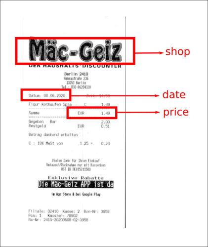
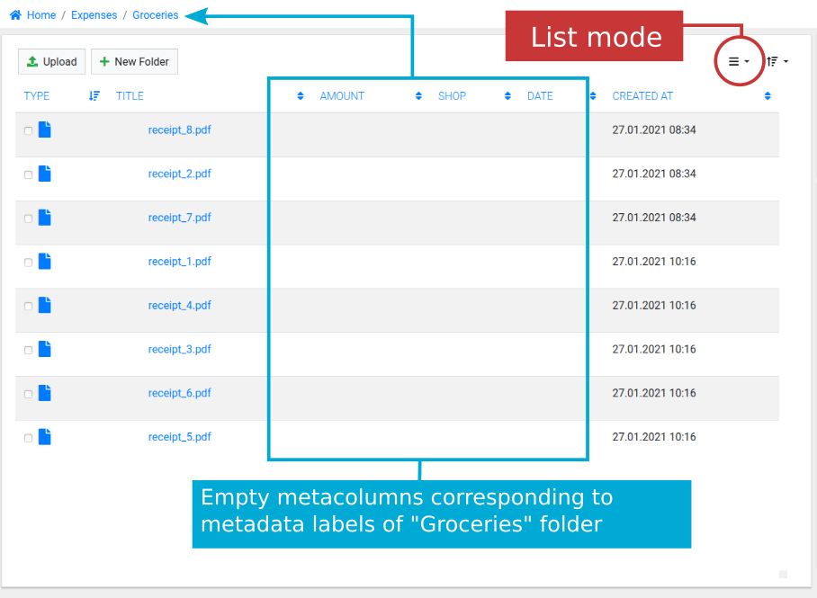
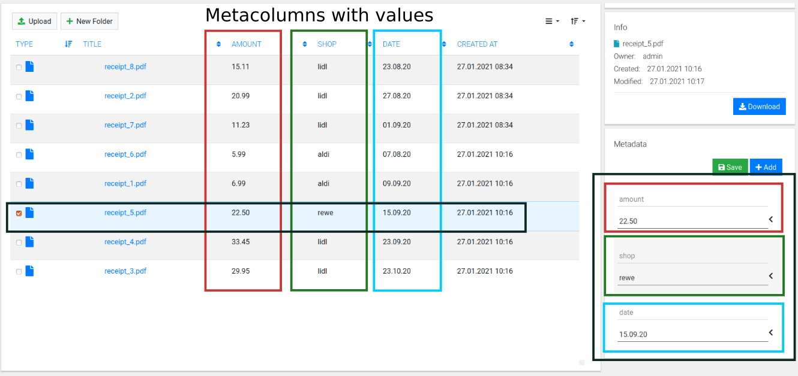

# Metadata

## Main Concepts

Metadata is extra information about your folders, documents and pages. In
other words - data about your data. Following picture is a (scanned document)
receipt with highlighted shop name, price and date on it.

This additional information - shop name, price and date is so called document's
**metadata**. It has two parts a label (in picture above `shop`, `date` and
`price` are all labels) and a value (in example above values are `Mäc-Geiz`,
`08.06.2020`, `1.49` for shop label, date label and price label
respectively). Many times instead of term *label* term *key* is used. Metadata
is extremely useful when you need to locate specific document among many other
very similar documents.

Imagine that you scanned 60 groceries receipts and organized them in a
folder named Groceries. If you would just store those receipts on an ordinary
file system, then only way to distinguish between files is by file names or
maybe by their text content (if your storage supports OCR) - finding, specific
file, say all receipts you got in June 2020, would be time consuming.

A more efficient and practical way to tackle this problem is by associating to
all scanned documents (receipts in this example) - metadata. Let's continue
with groceries receipts example. It would be very time consuming to go to each
document and add metadata to each file individually. A faster way to create
metadata and associated it to a group of files, is by a creating a folder -
add metadata to that folder - let's name it Groceries-2020 - and then just
copy all groceries related files into that folder.

!!! note

    Folder is nothing more than a group of related documents. Thus, folders
    are convenient way to perform group operations on documents. In particular,
    by assigning metadata attributes to a folder - you automatically create
    those metadata attributes on all documents in the folder.

## Metadata Inheritance

Nested folder is a folder stored within another folder. Folders can be nested
arbitrarily deep. Same way as documents inherit their metadata attributes from
their parent folder - child folders inherit their metadata attributes from their
parent folder. Let's consider following example:

In Figure 3 folders Groceries, Rent and Insurances are sub-folders of Expenses.
On topmost folder - Expenses - only one metadata label is defined, namely
`amount`. On folder Groceries two extra metadata labels are defined:
`shop` and `date`. On folder Rent metadata label `date` is defined. On
Insurances: `company`, `start date` and `end date`.

As explained above, metadata labels are inherited from parent folder to
descendant folders and documents. Because of metadata label inheritance, in
scenario described above, folder Groceries has  in total three metadata label:

1. `shop` - its own
2. `date` - its own
3. `amount` - inherited from parent

Similarly folder Insurances has in total four metadata labels, three of its
own and one inherited (metadata label `amount`) and folder Rent has in total
two metadata labels: one inherited (metadata label `amount`) and one of its
own (metadata label `date`).

All documents from folder Insurances will inherit metadata labels from their
parental folders. Thus, documents ins-1.pdf and ins-2.pdf from Figure 3 have
four metadata labels: `amount` inherited from topmost folder Expenses and
`company`, `start date`, `end date` inherited from their direct parental
folder - Insurances.

Metadata inheritance concept is very convenient because you don't need to
define all metadata labels on each individual document, instead you define
metadata only once on the folder containing documents.

Following illustrations show you how folder structure and metadata definition
described in Figure 3 look in practice.

## Metacolumns

If you open "Expenses" folder and change view to list mode, among Type, Title
and Created At columns you will see an extra column. That extra column is
called metacolumn. Metacolumns are there to display actual metadata values defined
on the documents. At this moment there still no metadata values to display, thus metacolumn
is empty.

If you select "Groceries" folder, on the right side, in metadata widgets panel
you will see three metadata label definitions - one of which is inherited.
Notice that inherited metadata labels is not editable while it is displayed in
the context of "Groceries" folder:

!!! important

    Metadata labels can be edited ONLY on the folder on which they were
    defined. Conversely, inherited metadata labels (i.e. defined on parent or
    ancestor folders) cannot be edited. For example, in Figure 6, metadata
    label `amount` cannot be edited in the context of folder "Groceries",
    because `amount` label was defined on parent folder - "Expenses".

If you enter now "Groceries" folder and switch to list mode (and assuming you
uploaded couple of documents to "Groceries" folder), you will see three
metacolumns `amount`, `shop` and `date` - all of which are empty now as
neither of the documents has metadata values yet:

Finally, in Figure 8 you see metacolumns with values. Note how convenient
it is to have data visualized this way: documents may be sorted and located by
metadata values.

!!! note

    At this point you need to fill in metadata values manually. However, in future versions
    of Papermerge it will be possible to extract metadata (and thus to fill in those metacolumns)
    automatically.

## Add and Edit Metadata

Metadata is added/editing via metadata widget located on the right bar. For
folders you can add/edit only metadata labels. For documents you can add/edit
both labels and values (metadata labels are sometimes called keys). Documents
metadata (both labels and values) can be edited in document browser as well as
in document viewer. In document browser you can see metadata corresponding to
specific document/folder either by selecting document/folder or by switching
list mode.

## Delete Metadata

!!! danger

    When you delete **metadata label on a folder**, all data associated with
    it i.e. all metadata values of respective label from all documents inside
    respective folder will be irreversibly lost.

## Metadata Types

Papermerge defines four different metadata types:

1. Free form text
2. Monetary
3. Numeric
4. Date
