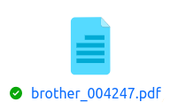
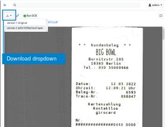

# OCR

OCR is the process which extracts text information from the scanned document
and makes them searchable.

By default, ocr process is triggered automatically on document file upload.
The OCR process status is indicated by little circle next to document's
title. When OCR process is completed new document version is created and
document becomes searchable.

## Automatic OCR

By default OCR is triggered automatically when document is uploaded. However,
you can disable automatic OCR triggering, in such case you can start OCR only
when you consider necessary.

!!! important

    Documents for which OCR was skipped - are not searchable!

In order to disable automatic OCR, go to User Menu -> Preferences -> OCR -> Trigger -> Manual

## Default OCR Language

In order to perform OCR on the document you need to indicate beforehand the
language of respective document. Choosing ocr language for each and every
document uploaded is tedious - instead, in preferences a default OCR Language
is set - and that language is applied for each uploaded document.

In order to set default OCR language, go to User Menu -> Preferences -> OCR -> Language

## Status Indicator

{{ extra.project }} features real time OCR status indicator - this means that you can
see document's OCR status updates as they happen (i.e. in real time).
The OCR status is displayed by a small circle next to the document's title.
The status indicates has following meanings:

* gray circle - status is unknown (figure 1)
* orange still circle - document was scheduled for OCR (figure 2)
* orange rotating circle - document's OCR process is in progress (figure 3)
* green check - document's OCR process completed successfully and document is now searchable (figure 4)
* red cross - document's OCR process failed.

## OCRed Text Layer

Once OCR process completed successfully a new document version is created -
version with OCRed text layer. This version is available for download from
the ``Download`` dropdown in document view.

!!! note

      Under the hood {{ extra.project }} uses awesome <a href="https://ocrmypdf.readthedocs.io/en/latest/" class="external-link" target="_blank">OCRmyPDF</a> utility to create
      OCRed text layer. Thus, in respect of OCRed text layer, {{ extra.project }} acts
      like a graphical user interface for OCRmyPDF.

## Document OCRed Text

You can view OCRed text of the entire document either from [commander](user-interface.md#commander) or from [viewer](user-interface.md#viewer),
in both cases choose "OCRed Text" from context menu:

If you want to see OCRed text of entire document (to be exact - all pages of the last document version) from
the viewer - just make sure that no pages are selected:

## Selected Pages OCRed Text

In case document has many pages and you are interested in OCRed text of one
(or multiple) very specific pages, then select pages first and then from
context menu choose "OCRed Text" item:

!!! note

      In case there are selected pages, OCRed Text menu item will show you OCRed
      text ONLY of the selected pages.

## OCR Languages Support

{{ extra.project }} uses <a href="https://github.com/tesseract-ocr/tesseract" class="external-link" target="_blank">Tesseract</a> to
extract text from scanned documents. Tesseract supports over 130 languages -
thus with {{ extra.project }} you can have documents in any of those languages.
