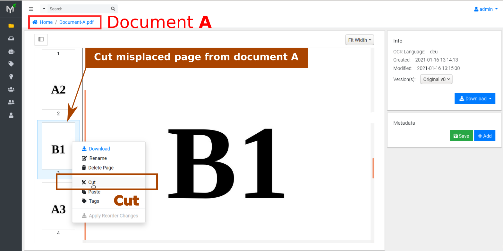
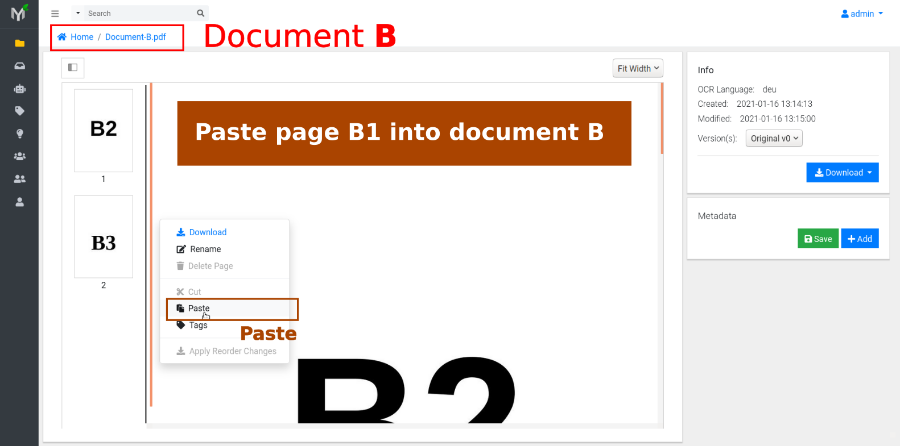

# Page Management

Many times scanning documents in bulk results in documents with blank pages;
some pages my be out of order or maybe part of totally different document.
Even if you notice these flaws immediately it is time consuming and
frustrating to redo scanning process.
Wouldn't it be nice to fix out of order pages with Papermerge?

Page management is set of features which helps to fix scanning process errors.
In other words you can delete, reorder, cut and paste pages within same
document even outside it.

!!! note

    In order perform any of operations described below (delete, reorder, cut and
    paste pages) you need to have **Change Permission** on respective document.
    You have automatically granted **Change Permission**
    on the documents you uploaded (because you own the documents uploaded by you).

## Delete Page(s)

You can delete specific pages (for instance blank pages) from the document.
Although many scanners have automatic "remove blank pages" feature, many times
they get confused of what is a blank page or what is not. In case
your scans end up with undesired blank pages you can easily remove those
pages. Obviously you can remove any page which you consider that should not be
part of current document.

In order to delete a page, you need to select desired page by clicking on it, then `Right Click ->  Delete Page`.

Every time you delete one or several pages, document version is advanced by
one. For instance if document Invoice-X56.pdf currently has 4 pages and the
document latest version is version 1, then, after deleting page 3 document's
latest version will be 2. Thus document's version 1 has all 4 pages or
original scan (with one blank) and document version 2 has 3 pages (without
blank page).

## Reorder Pages

Out of order pages occur very often during scanning process. Papermerge allows users
to change pages order within the document.

For instance, in figure below you can see that pages 2 and 4 are out of order.
When you hover over page's thumbnail, two green arrows will appear. Click
respective arrows to move page up or down.

For these changes to take effect you need to `Right Click --> Apply Reorder Changes`.

!!! warning

    Document pages reorder will only be saved when you :menuselection:`Right Click--> Apply Reorder Changes`. You can reorder pages all day around, but if you close the document (by browsing away to a different view for example) without ``Apply Reorder Changes`` - your hard work progress will be lost.

Similarly to deleting pages, every time you save new pages order document
version will be incremented (i.e. advanced by one).

## Cut & Paste

You can move document pages around from one document to another. Once you cut
one or several pages from a document, you can paste them either inside another
document - pages will become part of new document or you can paste pages in
file browser, this will create entirely new document from cut pages.

In example illustrated in pictures below there are two documents:

* document A - with pages marked as A1, A2, B1, A3
* document B - with pages B2, B3

During scan page B1 wrongly ended up in document A, although it belongs to document B.

In order to fix this scanning issue, you need to cut page from document A as illustrated in figure below.

Then, open document B and `Right Click --> Paste`

!!! note

    In order to see results you will need to click refresh button of your web browser

After browser refresh you will see that document has all 3 pages B1, B2, B3.
Document A on the other contains now only correct pages: A1, A2 and A3.