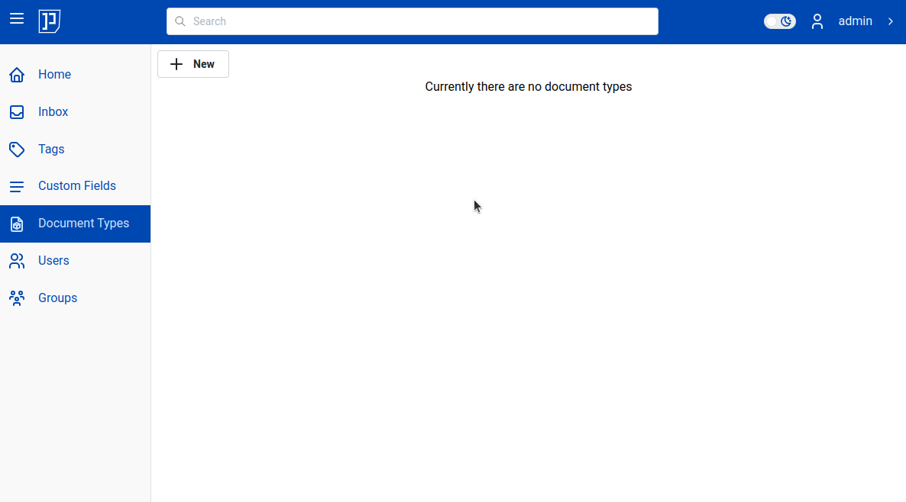
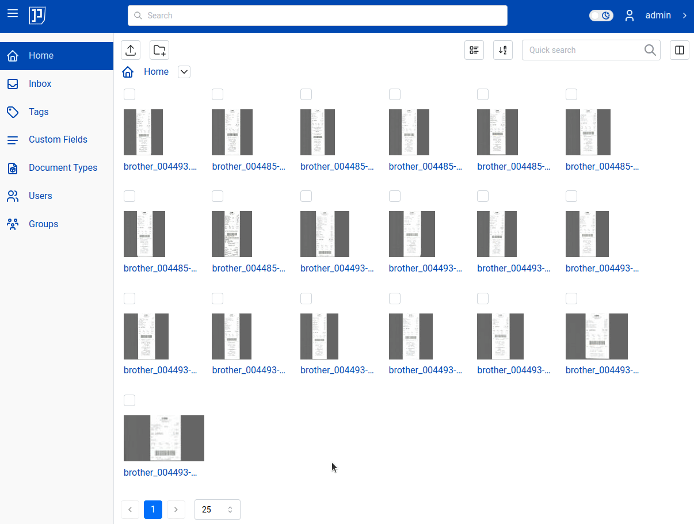

# Path Templates

Imagine you've got couple of receipts from your customer in the inbox.
They are in your inbox. But inbox is just temporary location, so you'll need to move
documents to their "final destination" - target folder.

Or may you just want to upload couple of documents yourself. Still you need to decide
where to place them.

Regardless which way documents end up in {{ extra.project }} - every time you need
to decide where you place them: which folder?

## Target Folder

The question "what is the target folder for document X" may not seem like a big deal.
And indeed - if you just do it for very first folder, only one time it is simple.
But more your document base grows, more complex folder layout you have more vexed
the question becomes. Especially if you do it say, onece a week.

More realistic scenario would be this: you work on your lovely project,
you are fully focused on your project. You receive an invoice from your customer
(we will refer to this customer - Coco). Now you decide to upload Coco's invoice
into {{ extra.project }}.

And... where should you place it?
Is it in `/home/Customers/2024/coco/invoice-2024-01.pdf`?
Or in `/home/Invoices/2024/Customers/coco-2024-01.pdf`?
Or maybe in `/home/My Documents/invoices`?

You see, we humans tend to forget. The question of the target folder is vexed
one. It distracts you from your real tasks.

## Path Templates

Meet *path templates*. The idea is simple: you need to decide where to place
your receipts only once. Once you decide where you put to them - you write it
down as "path template" and then all your receipts will automatically be
placed to that path. Of course you can do that for any document type.

Basically, for each document type you create a "template" of
the place where documents of that type will be stored. And then {{extra.project}}
will use that information to move the document to the
target folder automatically :magic_wand:!

!!! Info

    Path templates are per document type. They create a "template"
    of where documents of that type will be placed. The path includes
    both target folder and file name.

Let's see couple of examples.

In first example, let's create document type "Receipt" and set its path
template to `/home/My Documents/Receipts/`:

Notice that path template ends with "/". If path ends with "/", it means that
the last part is a folder. We will come back to this point later.
Also please remark that there no `My Documents` folder; neither
`Receipts` folder is not there; both of them will be automatically created.

From now on, any document of type Receipt will be moved into `/home/My Documents/Receipts/`.
Let's see it in action. In video below initially document `brother_004485.pdf` is in `inbox`
and it has no document type assigned yet. Also, notice that in `home` there is no folder `My Documents` yet.
However, once `brother_004485` is changed to type "Receipt" it is automatically moved from `inbox`
into its target folder designed by Receipt's path template: `/home/My Documents/Receipts/`.

It is very important that template path `/home/My Documents/Receipts/` ends
with "/". It tells {{extra.project}} that target is a folder. If we would
change it to `/home/My Documents/coco`, then {{extra.project}} would move
`brother_004485.pdf` into target folder `My Documents` and rename file from
`brother_004485.pdf` to `coco`.

!!! Info

    Path templates ending in "/" designates a folder. Any other ending means last part of the
    path is document name.

    Examples:

    * /home/coco - target folder is `home` and file will be renamed to `coco`
    * /home/Clients/CocoInc/invoice.pdf - target folder is `CocoInc` and file will be renamed to `invoice.pdf`
    * /home/Clients/CocoInc/ - target `CocoInc` - a folder. Documents will be moved into `/home/Clients/CocoInc/` folder

## Target Root

In all examples above, path template, started with `/home`. Actually you can omit `/home` part as it is
always implicit. Thus following paths are equivalent:

* /home/Invoices/Clients/
* /Invoices/Clients/
* Invoices/Clients/

!!! Info

    Template path root folder is always assumed to be user's home folder

Thus, if you set template path as `Toto/` - it will move documents of respective type into `/home/Toto/` folder.
If you set template path to `/inbox/Toto/` - it will move documents of respective type into `/home/inbox/Toto/` folder.

!!! Tip

    Always start you path templates target folders with `/home/`

Following table is a summary of cases described so far:

| Path Template           | Document Title                       | Evaluation Outcome             |
| ------------------------| ------------------------------------ |--------------------------------|
| /home/Clients/Invoices/ | bon.pdf                              | /home/Clients/Invoices/bon.pdf |
| /home/Clients/Invoices  | bon.pdf                              | /home/Clients/Invoices         |
| /Letters/Misc/          | zdf-love.pdf                         | /home/Letters/Misc/zdf-love.pdf|
| Letters/Misc/           | zdf-love.pdf                         | /home/Letters/Misc/zdf-love.pdf|
| /inbox/Taxes/           | 2021.pdf                             | /home/inbox/Taxes/2021.pdf     |

## Jinja2 Syntax

Path templates use so called <a href="https://jinja.palletsprojects.com/en/stable/templates/" class="external-link" target="_blank">jinja templates</a> syntax. Using jinja syntax you can mix into template different attributes known
at evaluation time (when template is evaluated for that specific document).
An example:

