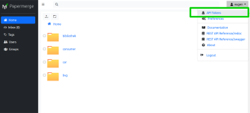

# REST API Token

In order to use REST API you will need so called REST API token.

## Get It

* Click User Menu (top right corner) -> API Tokens
* Click "New" button
* Enter number of hours the token will be valid. The default value is 1 (one) hour
* Click Save button

After you click Save button token will be displayed. Write down your token as
{== the token will never be displayed again ==}.

!!! important

      For security reasons the REST API token is displayed only one time. The values
      that you see in the table are first 16 characters of the "token digests".
      Token "digest" is a fancy way of identifying specific token. Don't confuse
      digest value with the token value - they are different things.
