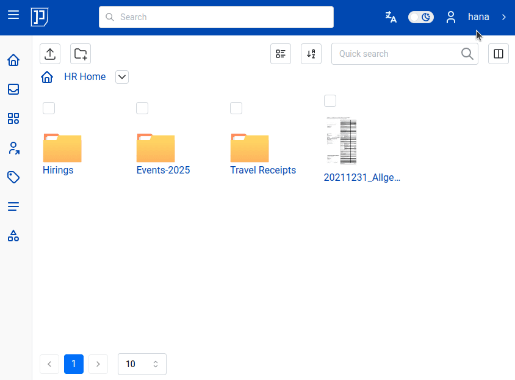
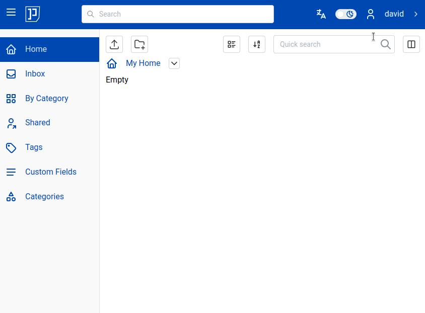

# Sharing Documents and Folders

In the following parts of this section we will use as example
hypothetical organization - Acme Inc.
Acme Inc has five teams:

- Marketing (Merry, Mara, Jane)
- QA (Casper, Elizabeth)
- Development (Mark, Dora, David)
- HR (Lila, Hana, Luke)
- Managers (Mark, Jane, Luke)

In order to be able to share documents and folders, user needs to have following
permissions:

* `Shared Node` - `Create`
* `Shared Node` - `Update`
* `Shared Node` - `Delete`
* `Users` - `Select`
* `Groups` - `Select`
* `Roles` - `Select`

Thus, if `hana` from `HR` want to share a folder with user `david` from `Development` team
she needs to have permissions mentioned above.
But `hana` want to give `david` just read only permissions, i.e david can only view document
and do nothing else with it.

For that, system administrator needs to create in advance a role named, e.g. "Read Only Documents and Folders"
with following permissions:

    - Nodes View
    - Pages View

To grant access to e.g. one of documents of the `HR` department `hana` needs
to select respective folder and click "Share Documents and Folders" button. Then
in "Users" dropdown she needs to pick `david` and then in "Roles" dropdown she needs
to pick role "Read Only Documents and Folders". Then click "Save":

Now `david` has access to shared "Events-2025" folder:

In order to revoke access permissions to shared folder, `hana` needs to select respective
shared folder, click "Manage Access" button, then select permissions she wants to revoke
then click "Trash" button. Then click "Save":

!!! Note

    Role "Read Only Documents and Folders" needs to be created in advance by
    privileged user. For accessing
    documents and folders in read-only mode it is sufficient that associated
    role these two permissions:

        - Nodes View
        - Pages View

!!! Note

    Role is just a set of permissions
