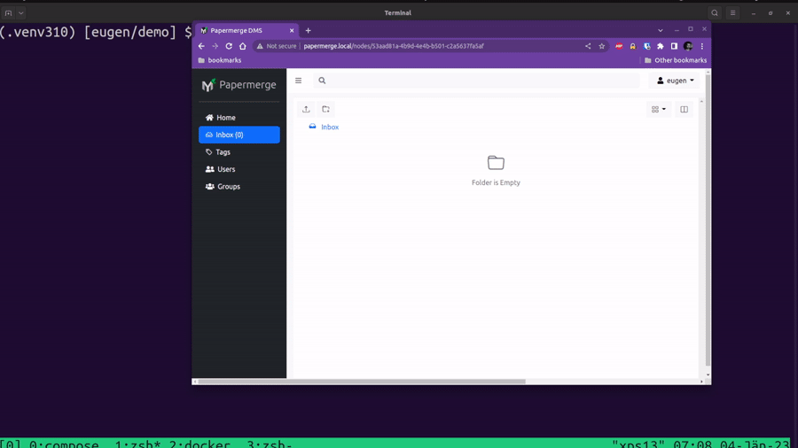

# Upload Documents

There are multiple ways to upload documents to your {{ extra.project }} instance:
web UI, command line utilities, REST API.

The obvious way is via web UI. After briefly explaining how to upload documents
from web user interface, this page will dive into more interesting parts:
command line utilities and REST API.

## Web UI

Uploading documents via user interface is the most straightforward method, just click
`upload` button:

Documents will be uploaded into your current folder. Current folder is
considered the one which you currently see as opened in web UI:

Also, instead of using upload button, you can drag'n drop documents from your desktop
file manager into {{ extra.project }}'s web ui.

!!! warning

    Currently drag 'n drop feature does not work for folders, in other words
    you can drag 'n drop only documents. If you want to import an folders with entire content
    preserved - use `papermerge-cli` described in next paragraph.

## Command Line

You can upload documents and folders from your local filesystem using [papermerge-cli](../cli/cli.md) command line utility:

    papermerge-cli import /path/to/local/folder/

Note that `papermerge-cli` will import all content of /path/to/local/folder/ directory
recursively i.e. it will preserve the structure of local folder in {{ extra.project }} as well.

You can upload one single document by providing path to the document:

    papermerge-cli import /path/to/document.pdf

!!! note

    By default all imported documents and folders will end up inside user's Inbox folder.

For more information about `papermerge-cli` check `papermerge-cli` section.

## REST API