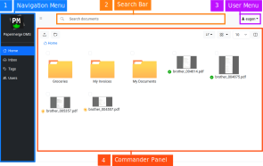

# User Interface

{{ extra.project }} comes with intuitive user interface (UI) layout. The UI
is divided into four areas:

1. Navigation Menu - contains different views like tags, users, inbox
2. Search Bar - quick search of any document
3. User Menu - contains user preferences, API tokens and other menu items.
4. Commander Panel - or Commander - area for browsing documents and folders

## Dual Panel Mode

Commander (in figure 1. marked with number 4.) is designed to have
similar look and feel of modern desktop file browsers. This is the place
where you browse your documents and folders.

In order to assist you to quickly move around documents, folders and pages -
there is a special mode - *dual panel model*. In dual panel mode there
are two panels displayed side by side. Between two panels documents (as well
as folders and pages) can be moved with one simple drag'n drop. Figure
below shows how dual panel mode looks like:

In order to switch to dual panel mode, use Commander's upper right button:

To switch back to single panel mode, use close button - which is in the upper right
corner of one of the panels:

!!! note

        Close button will be displayed only on one of the panels.
        Although both panels look and feel exactly the same, internally
        application still distinguishes them as main and secondary one. Main panel
        is the one which is always visible and secondary panel is the on which
        opens and closes i.e. the one with "close button" in upper right corner.

## Commander

Commander or Commander Panel is one of the two available panels. Commander is
the panel which shows documents and folders - modern web based file browser if
you will.

## Viewer

Viewer or Viewer Panel or Document Viewer is one of the two available panels.
Viewer is the panel in which document is opened.

There can be two Viewers opened side by side. This mode (i.e. dual panel mode
with a Viewer in each panel) is very handy when it comes to moving
pages between documents.

## Thumbnails Panel

Document viewer features a thumbnails panel which can be toggles on and off.
Pages can be selected only inside thumbnails panel; also pages can be
dragged/dropped only from thumbnails panel.

