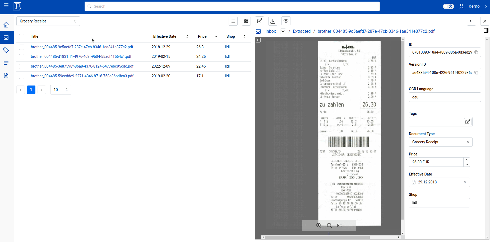
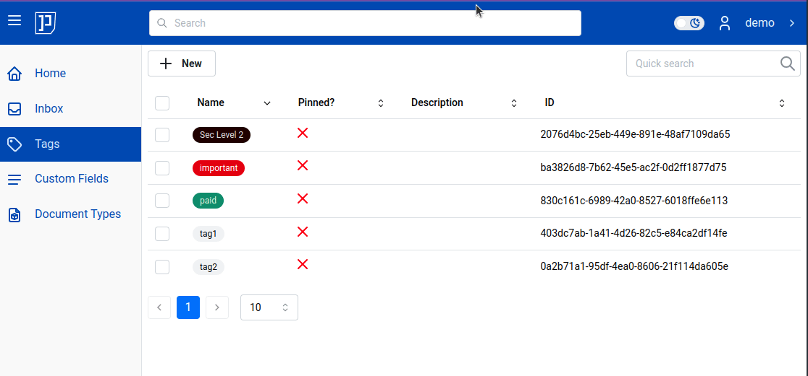
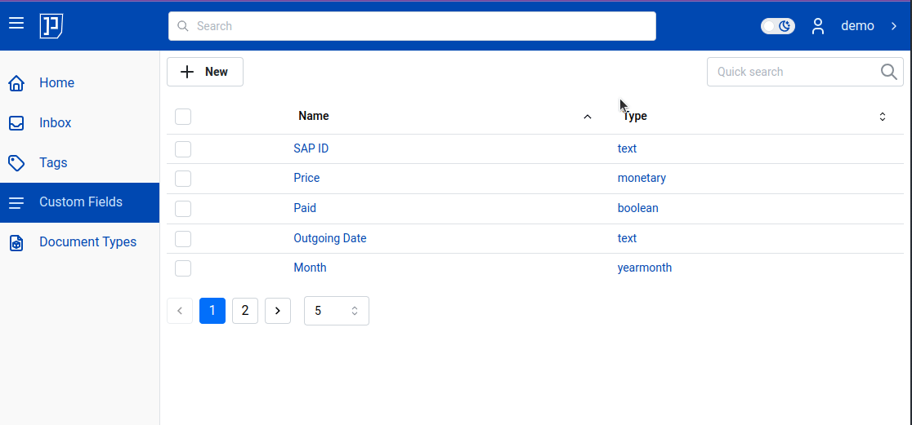
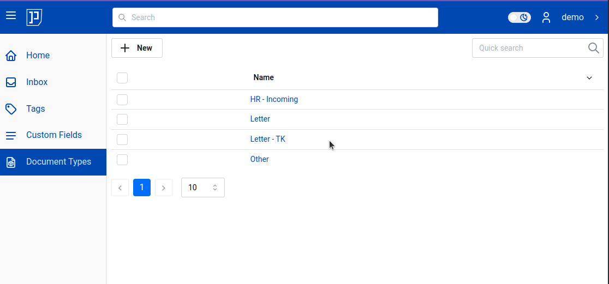

# What's new?

This document briefly describes what's new in each major and minor versions.
For detailed changelog, which includes patch versions (e.g. 3.5), see <a href="https://github.com/papermerge/papermerge-core/blob/master/changelog.md" class="external-link" target="_blank">changelog.md on github</a>.

## 3.5 (to be released)

!!! Note

    Implemented in 3.5. Will be released soon.

It introduces following new features:

- Group ownership
- Sharing of folders and documents
- i18n - internationalization -  user interface is now available in multiple languages

## 3.4

Version 3.4 was released 2nd of February, 2025.

It introduces column sorting and filtering in following views:

- document type list view
- custom fields list view
- tags list view

Another important addition is that now Macintosh users now can conveniently open
document in second panel while browsing custom fields. On Mac, users
can open document in second panel (while in document type view) by pressing
**Alt** and clicking on the document title. For PC users the key to press
is **Ctrl**.

### Tags List

Here is how tags list view column sorting and quick filters look like:

### Custom Fields

Here is how custom fields list view column sorting and quick filters look like:

### Document Types

Here is how document types list view column sorting and quick filters look like:

## 3.3

Version 3.3 introduces following new major features:

- Document types
- Custom fields
- Path templates
- S3 storage backend

### Document Types

Document types enable you to categorize documents. You
can define types such as "Receipt", "Invoice", or "Contract".

Read more about [document type in user manual](user/document-types.md)

### Custom Fields

New, extremely powerful, flexible and easy to use feature. Before version 2.1
custom fields were named "metadata", however, we introduced a significant
twist in the concept: instead of being assigned directly to the document,
custom fields are now assigned via document types.

Read more about [custom fields in user manual](user/custom-fields.md)

### Path Templates

You need to decide where to place the document only once.
Once decided - you never need to worry in which folder does
the document X or Y belong - it will be handled automatically.
Path templates are per document category.

Read more about it in [Path Templates](user/path-templates.md)

### S3 Storage Backend

You can configure S3 compatible storage for you documents. It means that you
may configure {{ extra.project }} to store documents on S3 storage.

