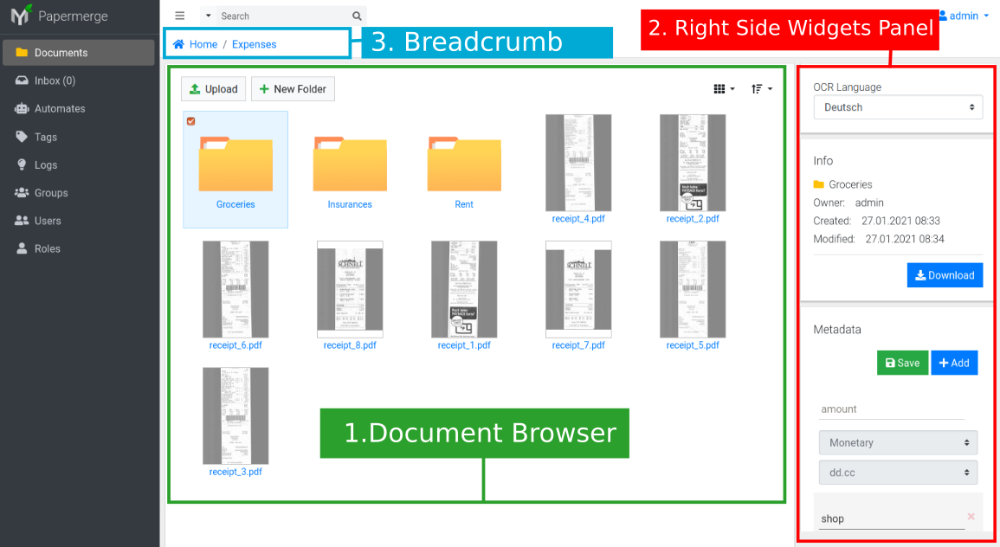

User Interface
===============

Papermerge user interface is designed to be very intuitive. However, it is a
good idea to know major interface areas by their name because they are
referenced many times in this manual.

    Figure 1. Main user interface elements

.. _ui_document_browser:

Document Browser
~~~~~~~~~~~~~~~~~~

Document browser (marked with number 1, green rectangle, in Figure 1) is
designed to have similar look and feel of modern desktop file browsers. This
is the place where you browse your documents and folders.

.. _ui_right_side_widgets_panel_in_doc_browser:

Right Side Widgets Panel
~~~~~~~~~~~~~~~~~~~~~~~~~

In Figure 1. marked with number 2. Details of selected folder or document appear in so called Right Side Widgets Panel or simply
Widgets Panel. There may be many different widgets, but three most important ones are:

* OCR Language Selector Widget
* Basic Info Widget
* Metadata Widget

OCR language selector will always be displayed (when in Document Browser). OCR
language indicates in which language your documents will be :ref:`OCRed <ocr>`.

Basic Info Widget displays basic information about currently selected document or folder. Among basic information like title, owner and creation date, it will display folder or document's associated tags.

Metadata Widget will display metadata of the currently selected folder or document.

.. _ui_left_side_nav_menu:

Left Side Navigation Menu
~~~~~~~~~~~~~~~~~~~~~~~~~~

In Figure 1 marked with number 3. This is main navigation menu. Immediately
after sign in you will land in *Documents* menu which will display
:ref:`ui_document_browser`. Depending on your role and permissions you may or
may not see some menu items visible on Left Side Navigation Menu illustrated in Figure 1.
For example if you don't have permissions to view/change other users, roles
and groups - menu items user, roles and groups won't be displayed.