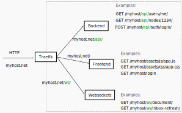
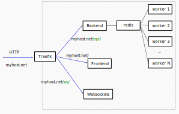

.. _docker_compose:

Docker Compose
==============

This section describes how to setup Papermerge and
related services using `docker compose`_.

There are many different setups possible, for example you may want to run only
REST API backend with PostgreSQL database. Another, possibility would be to
start a REST API backend, workers, frontend, websockets server with
PostgreSQL database.

In following sections most common setups are described. Each setup consists of
two files - one yml file (compose file) and one `environment file`_ usually
named ``.env``.

Make sure you have both `docker`_ and `docker compose`_ installed.

This guide was tested with docker version 20.10.6 and
docker-compose version 1.29.2.

Docker Compose is NOT for Production!
-------------------------------------

.. danger:: Docker compose setup is **NOT meant for production**! Docker compose
  is **NOT meant to be deployed on remote host** even if that
  remote host is within your home network!

Sure, you can ride on a bicycle from Berlin to Seoul - however bicycles were
not invented for those distances. For 8000 km range it is strongly advised
to take an airplane. In any case, if you decide to use bicycle to cross
Eurasian continent - please don't insist on getting help!

The same way the airplane is a better choice for long distance
travel - the :doc:`kubernetes` is better choice when it comes to
production environments.

The same way bicycle is an excellent option for moving within the city -
docker compose is an excellent choice for quickly trying, playing, testing
|project| **on your local computer**.

.. note:: Docker compose is meant to quickly setup |project| on your local computer.

If you are an advanced user considering |project|, docker compose
is a great way to instantly start it locally and play bit with it.
For developer standpoint, docker compose is a priceless tool for quick setup
of relatively complex scenarios on development machine - for example to
reproduce a bug for a specific application version.

Complete Stack in 5 minutes
---------------------------

If you are in hurry and/or you don't feel like diving into all details, just follow instructions
in this section. It shouldn't take more than 5 minutes to bootstrap |project|.

This setup installs complete |project| stack with all required services. It uses `traefik`_ as edge router.

Save following `docker-compose.yml`_ file on your local computer.

.. note::

  Currently docker tag ``latest`` points to latest 2.1.0bX (2.1.0b1, 2.1.0b2, 2.1.0b3, ...) version
  which means that application is feature complete, but not yet production ready.
  See all available docker tags in `GitHub packages <https://github.com/orgs/papermerge/packages>`_

Next, create ``.env`` file with following content::

    APP_IMAGE=ghcr.io/papermerge/papermerge
    APP_TAG=latest
    PAPERMERGE_JS_IMAGE=ghcr.io/papermerge/papermerge.js
    PAPERMERGE_JS_TAG=latest

    DB_USER=postgres
    DB_NAME=postgres
    DB_PASSWORD=postgres
    DB_HOST=db
    DB_PORT=5432

    USE_HOSTNAME=papermerge.local

    REDIS_HOST=redis
    REDIS_PORT=6379

    ES_HOSTS=es
    ES_PORT=9200

    SECRET_KEY=12345abcdxyz

    SUPERUSER_USERNAME=admin
    SUPERUSER_EMAIL=admin@example.com
    SUPERUSER_PASSWORD=admin

Add to your ``/etc/hosts`` following content::

    127.0.0.1       papermerge.local

.. note::

  You can add whatever hostname you want e.g. papermerge.myhost
  just keep in mind that whatever you add in ``/etc/hosts`` should
  match ``USE_HOSTNAME`` value from ``.env`` file

.. note::

  Variable name to pass hostname is ``USE_HOSTNAME``. This variable
  used to be named "HOSTNAME" - which caused some problems when
  accessing Papermerge from remote host. See this
  `comment in github <https://github.com/papermerge/papermerge-core/issues/17#issuecomment-1145878439>`_
  for detailed explanation.

Start |project| using following docker compose command::

    docker compose -f docker-compose.yml --env-file .env up

You can access |project| user interface using a web browser like Firefox.
Open your web browser and point it to http://papermerge.local address:

.. figure:: ../img/papermerge-login.png

    Sign in screen available at http://papermerge.local

Sign in using credentials configured with ``SUPERUSER_USERNAME`` and
``SUPERUSER_PASSWORD`` options in ``.env`` file.

.. figure:: ../img/setup/installation/docker/papermerge-example.png

    Papermerge frontend example

Backend Only
------------

This stack installs only Papermerge REST API backend (without fancy user interface). This setup is suitable mostly to play, experiment and explore
Papermerge REST API.

Save `backend.yml`_
file on your local computer.

Next, create ``.env`` file with following content:

.. code-block::

    APP_IMAGE=ghcr.io/papermerge/papermerge
    APP_TAG=latest

    DB_USER=postgres
    DB_NAME=postgres
    DB_PASSWORD=postgres
    DB_HOST=db
    DB_PORT=5432

    REDIS_HOST=redis
    REDIS_PORT=6379

    ES_HOSTS=es
    ES_PORT=9200

    SECRET_KEY=12345abcdxyz

    SUPERUSER_USERNAME=admin
    SUPERUSER_EMAIL=admin@example.com
    SUPERUSER_PASSWORD=password

Start |project| using following docker compose command::

    docker compose -f docker-compose.yml --env-file .env up

The above command will start following services:

* REST API backend
* Worker
* Redis
* PostgreSQL database
* Elastic search

For REST API backend and the worker docker-compose will use
``ghcr.io/papermerge/papermerge`` docker image.

Now base url for REST API is ``http://localhost:8000/api/``.

External Services
------------------

|project| requires three external services:

* database
* redis
* elasticsearch

If you want to play with |project| outside of docker compose and you don't
want bother about database/redis/elasticsearch services - you can use
following `services.yml`_ file to quickly setup these external services.

Note ``networks`` uses ``driver: host``, this will start services in same host
as you local computer.

``.env`` file content::

    DB_USER=postgres
    DB_NAME=postgres
    DB_PASSWORD=postgres

Following command will start docker services in same network as host::

    docker compose -f services.yml --env-file .env up

Docker compose file will start following services in same host as you computer:

* PostgreSQL
* Redis
* Elasticsearch

At this point if you start let's say a development version of |project|, you
can use ``localhost:6379`` to connect to redis or ``localhost:9300`` use
elasticsearch.

Detailed Explanation
---------------------

This section dives into detailed explanation of microservice architecture of
|project|. We focus here on just enough details so that above mentioned docker
compose setups will make sense for you, and in case something goes wrong you
will be able to understand the problem and troubleshoot it.

Backend and Frontend
~~~~~~~~~~~~~~~~~~~~

First important point to understand is that |project| has two loosely coupled
parts:

- backend
- frontend

Backend is the REST API server, in other words HTTP REST API requests are
processed by backend component. Important characteristic of the backend is
that is does not have graphical user interface.

.. note:: Backend is entirely written in Python. Here is `backend repository`_.

Frontend is the graphical user interface of the application. A less intuitive thing
is that frontend is a separate application. Frontend interacts with backend
via REST API.

.. note:: Frontend is written in JavaScript, CSS and HTML. Frontend is executed
  in web browser. Here is `frontend repository`_.

Both backend and frontend receive an HTTP request, do something with it, and then
answer that HTTP request with an HTTP response.

Because both, backend and frontend, operate with HTTP requests, we need a way to
separate incoming (for |project|) requests: requests designated for backend (REST API calls)
should go to backend service and requests designated for frontend should go to
frontend application. How do we do that? Enter http routing!

HTTP Routing
~~~~~~~~~~~~

We use HTTP PATH in order to decide which requests is designated to which
service. If HTTP request's PATH contains ``/api/`` prefix, we route that HTTP
request to backend service, otherwise we route it the frontend.

If, say, there an incoming request of following path::

  GET /api/users/me/

The PATH contains ``/api/`` prefix - thus it is for backend.

If, say, incoming requests looks like::

  GET /assets/js/app.js

There is no ``/api/`` prefix - thus it is for frontend.

This simple logic, where we decide to what microservice http request goes, is
often called as "HTTP Routing".

We use `traefik`_ to route http requests between microservices

.. figure:: ./docker-compose/backend-frontend.svg

  Routing HTTP requests between frontend and backend
  microservices

Websockets
~~~~~~~~~~

  Routing HTTP requests between frontend, backend
  and websockets microservices

Message Broker and Workers
~~~~~~~~~~~~~~~~~~~~~~~~~~

  HTTP Routing, Workers and Redis (as message broker)

Complete Setup
~~~~~~~~~~~~~~

.. figure:: ./docker-compose/all-services.svg

  All microservices

.. _docker: https://www.docker.com/
.. _docker compose: https://docs.docker.com/compose/
.. _environment file: https://docs.docker.com/compose/env-file/
.. _cUrl: https://en.wikipedia.org/wiki/CURL
.. _traefik: https://doc.traefik.io/traefik/
.. _backend.yml: https://raw.githubusercontent.com/papermerge/papermerge-core/master/docker/backend.yml
.. _docker-compose.yml: https://raw.githubusercontent.com/papermerge/papermerge-core/master/docker/docker-compose.yml
.. _services.yml: https://raw.githubusercontent.com/papermerge/papermerge-core/master/docker/services.yml
.. _backend repository: https://github.com/papermerge/papermerge-core
.. _frontend repository: https://github.com/papermerge/papermerge.js