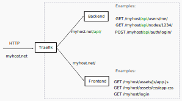
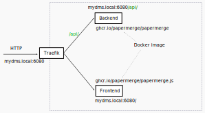
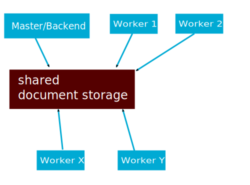

.. _docker_compose:

Docker Compose
==============

This section describes how to setup Papermerge and
related services using `docker compose`_.

There are many different setups possible, for example you may want to run only
REST API backend with PostgreSQL database. Another, possibility would be to
start a REST API backend, workers, frontend, websockets server with
PostgreSQL database.

In following sections most common setups are described. Each setup consists of
two files - one yml file (compose file) and one `environment file`_ usually
named ``.env``.

Make sure you have both `docker`_ and `docker compose`_ installed.

This guide was tested with docker version 20.10.6 and
docker-compose version 1.29.2.

Docker Compose is NOT for Production!
-------------------------------------

.. danger:: Docker compose setup is **NOT meant for production**! Docker compose
  is **NOT meant to be deployed on remote host** even if that
  remote host is within your home network!

Sure, you can ride on a bicycle from Berlin to Seoul - however bicycles were
not invented for those distances. For 8000 km range it is strongly advised
to take an airplane. In any case, if you decide to use bicycle to cross
Eurasian continent - please don't insist on getting help!

The same way the airplane is a better choice for long distance
travel - the :doc:`kubernetes` is better choice when it comes to
production environments.

The same way bicycle is an excellent option for moving within the city -
docker compose is an excellent choice for quickly trying, playing, testing
|project| **on your local computer**.

.. note:: Docker compose is meant to quickly setup |project| on your local computer.

If you are an advanced user considering |project|, docker compose
is a great way to instantly start it locally and play bit with it.
For developer standpoint, docker compose is a priceless tool for quick setup
of relatively complex scenarios on development machine - for example to
reproduce a bug for a specific application version.

Complete Stack in 5 minutes
---------------------------

If you are in hurry and/or you don't feel like diving into all details, just follow instructions
in this section. It shouldn't take more than 5 minutes to bootstrap |project|.

This setup installs complete |project| stack with all required services. It uses `traefik`_ as edge router.

Save following `docker-compose.yml`_ file on your local computer.

.. note::

  Currently docker tag ``latest`` points to latest 2.1.0bX (2.1.0b3, 2.1.0b4, 2.1.0b5, ...) version
  which means that application is feature complete, but not yet production ready.
  See all available docker tags for `Papermerge on DockerHub <https://hub.docker.com/r/papermerge/papermerge/tags>`_.
  Similarly, you can check latest `Papermerge_JS <https://hub.docker.com/r/papermerge/papermerge.js/tags>`_ tags.

Next, create ``.env`` file with following content::

  APP_IMAGE=papermerge/papermerge
  APP_TAG=2.1.0b23
  PAPERMERGE_JS_IMAGE=papermerge/papermerge.js
  PAPERMERGE_JS_TAG=2.1.0b10

  TIMEZONE=Europe/Berlin

  DB_USER=postgres
  DB_NAME=postgres
  DB_PASSWORD=postgres
  DB_HOST=db
  DB_PORT=5432

  USE_HOSTNAME=papermerge.local

  REDIS_HOST=redis
  REDIS_PORT=6379

  SECRET_KEY=12345abcdxyz

  SUPERUSER_USERNAME=admin
  SUPERUSER_EMAIL=admin@example.com
  SUPERUSER_PASSWORD=admin

Add to your ``/etc/hosts`` following content::

    127.0.0.1       papermerge.local

.. note::

  You can add whatever hostname you want e.g. papermerge.myhost
  just keep in mind that whatever you add in ``/etc/hosts`` should
  match ``USE_HOSTNAME`` value from ``.env`` file

.. note::

  Variable name to pass hostname is ``USE_HOSTNAME``. This variable
  used to be named "HOSTNAME" - which caused some problems when
  accessing Papermerge from remote host. See this
  `comment in github <https://github.com/papermerge/papermerge-core/issues/17#issuecomment-1145878439>`_
  for detailed explanation.

Start |project| using following docker compose command::

    docker compose -f docker-compose.yml --env-file .env up

You can access |project| user interface using a web browser like Firefox.
Open your web browser and point it to http://papermerge.local address:

.. figure:: ../img/papermerge-login.png

    Figure 1. Sign in screen available at http://papermerge.local

Sign in using credentials configured with ``SUPERUSER_USERNAME`` and
``SUPERUSER_PASSWORD`` options in ``.env`` file.

.. figure:: ../img/setup/installation/docker/papermerge-example.png

    Figure 2. Papermerge frontend example

Backend Only
------------

This stack installs only Papermerge REST API backend (without fancy user interface). This setup is suitable mostly to play, experiment and explore
Papermerge REST API.

Save `backend.yml`_, `db.yml`_ and `redis.yml`_
files on your local computer.

Next, create ``.env`` file with following content:

.. code-block::

    APP_IMAGE=papermerge/papermerge
    APP_TAG=latest

    DB_USER=postgres
    DB_NAME=postgres
    DB_PASSWORD=postgres
    DB_HOST=db
    DB_PORT=5432

    REDIS_HOST=redis
    REDIS_PORT=6379

    SECRET_KEY=12345abcdxyz

    SUPERUSER_USERNAME=admin
    SUPERUSER_EMAIL=admin@example.com
    SUPERUSER_PASSWORD=password

Start |project| using following docker compose command::

    docker compose -f backend.yml -f db.yml -f redis.yml --env-file .env up

The above command will start following services:

* REST API backend
* Worker
* Redis
* PostgreSQL database

For REST API backend and the worker docker-compose will use
``papermerge/papermerge`` docker image.

Now base url for REST API is ``http://localhost:8000/api/``.

External Services
------------------

|project| requires three external services:

* database
* redis

If you want to play with |project| outside of docker compose and you don't
want bother about database/redis services - you can use
following `services.yml`_ file to quickly setup these external services.

Note ``networks`` uses ``driver: host``, this will start services in same host
as you local computer.

``.env`` file content::

    DB_USER=postgres
    DB_NAME=postgres
    DB_PASSWORD=postgres

Following command will start docker services in same network as host::

    docker compose -f services.yml --env-file .env up

Docker compose file will start following services in same host as you computer:

* PostgreSQL
* Redis

At this point if you start let's say a development version of |project|, you
can use ``localhost:6379`` to connect to redis or ``localhost:9300`` use
elasticsearch.

.. _docker_compose_detailed_explanation:

Detailed Explanation
---------------------

This section dives into detailed explanation of microservice architecture of
|project|. We focus here on just enough details so that above mentioned docker
compose setups will make sense for you, and in case something goes wrong you
will be able to understand the problem and troubleshoot it.

Backend and Frontend
~~~~~~~~~~~~~~~~~~~~

First important point to understand is that |project| has two loosely coupled
parts:

- backend
- frontend

Backend is the REST API server, in other words HTTP REST API requests are
processed by backend component. Important characteristic of the backend is
that is does not have graphical user interface.

.. note:: Backend is entirely written in Python. Here is `backend repository`_.

Frontend is the graphical user interface of the application. A less intuitive thing
is that frontend is a separate application. Frontend interacts with backend
via REST API.

.. note:: Frontend is written in JavaScript, CSS and HTML. Frontend runs
  in web browser. Here is `frontend repository`_.

Both backend and frontend receive an HTTP request, do something with it, and then
answer that HTTP request with an HTTP response.

Because both, backend and frontend, operate with HTTP requests, we need a way to
separate incoming (for |project|) requests: requests designated for backend (REST API calls)
should go to backend service and requests designated for frontend should go to
frontend application. How do we do that? Enter http routing!

HTTP Routing
~~~~~~~~~~~~

We use HTTP PATH in order to decide which requests is designated to which
service. If HTTP request's PATH contains ``/api/`` prefix, we route that HTTP
request to backend service, otherwise we route it the frontend.

If, say, there an incoming request of following path::

  GET /api/users/me/

The PATH contains ``/api/`` prefix - thus it is for backend.

If, say, incoming requests looks like::

  GET /assets/js/app.js

There is no ``/api/`` prefix - thus it is for frontend.

This simple logic, where we decide to what microservice http request goes, is
often called as "HTTP Routing".

We use `traefik`_ to route http requests between microservices

  Figure 3. Routing HTTP requests between frontend and backend
  microservices

In illustration above, |project| services are isolated from outside access. In
other words, if you try to access backend service directly (via HTTP request)
you won't be able to. Instead, the only way to access services is via Traefik
which acts as a door that lets all http requests enter "the box".

.. note:: Traefik is referred as "the edge router" - from illustration above
  you probably understand why

Now, we arrived to one  extremely important point, where most of the people
get confused: both Frontend and Backend microservices have same base URL!

.. important:: Both Frontend and Backend **MUST have same base URL**! In other
  words if REST API Backend URL is http://mydocs:7070/api/, then Frontend
  application must be accessible from http://mydocs:7070/ - note that
  port number is same.

.. important:: **Base URL** is the part of the HTTP address between protocol name (``http://`` or ``https://``)
  and first slash ``/``. Note that is also includes port number. Base URLs
  where port number differs - are different! E.g. http://mydocs:7070 != http://mydocs:7060

Let me explain this in detail. Let's say that you run setup with Traefik (in front
of Backend and Frontend microservices) locally on port 6080 and you map in your
``/etc/hosts`` 127.0.0.1 to mydms.local. In other words you plan to access
|project| via http://mydms.local:6080. When you open your browser and point
it to http://mydms.local:6080/ address, Traefik receives the requests, see
that there is no ``/api/`` prefix and routes the request to Frontend
microservice. Frontend microservice will respond by returning couple of
javascript, css, and html files; JS, CSS, and HTML files will be loaded in
your browser Frontend application starts - in your browser!

You will see some fancy UI (login screen). Now, (Frontend) application running
in your browser, in order to perform authentication, show your documents,
folders, tags etc etc it needs to access the Backend server.

And here is the crucial moment: how does application running in your browser
know what is the URL for REST API server ?

Well, because (Frontend) application is running in your browser, it knows
its own URL (via browsers own ``window.location`` object). Frontend
application then concludes following: "OK, if I was accessed with
http://mydms.local:6080/, then REST API server URL which I need to work
with MUST be my own URL + /api/ i.e. http://mydms.local:6080/api/"

.. important:: In |project| if Frontend application is accessed with base URL
  ``<base_url>``, then REST API server URL is ``<base_url>/api/``.

Because frontend application does not have any configuration whatsoever,
the only way to know about REST API server URL is by deducing it from
its own URL - it just appends ``/api/`` prefix!

OK, now that we (hopefully) clarified the theory behind it, let's adjust
Figure 3 to specific values:

  Figure 4

Here is docker equivalent compose file::

  version: '3.7'
  services:
    backend:
      image: papermerge/papermerge
      labels:
        - "traefik.enable=true"
        - "traefik.http.routers.backend.rule=Host(`mydms.local`) && PathPrefix(`/api/`)"
      environment:
        - PAPERMERGE__MAIN__SECRET_KEY=12345SKK
        - DJANGO_SUPERUSER_PASSWORD=1234
    traefik:
      image: "traefik:v2.6"
      command:
        - "--api.insecure=true"
        - "--providers.docker=true"
        - "--providers.docker.exposedbydefault=false"
        - "--entrypoints.web.address=:80"
      ports:
        - "6080:80"
      volumes:
        - "/var/run/docker.sock:/var/run/docker.sock:ro"
    frontend:
      image: papermerge/papermerge.js
      labels:
        - "traefik.enable=true"
        - "traefik.http.routers.traefik.rule=Host(`mydms.local`) && PathPrefix(`/`)"

  Figure 5 - content of docker-compose.yml

First couple of remarks regarding traefik configurations. When used with
docker compose traefik uses "labels" to configure routes for services it is
used in of. Note that neither Backend nor Frontend microservice do not map
any ports. Instead ports mapping is done only for traefik - external port
6080 is mapped to traefik's internal port 80 and traefik's internal port 80 is
configured as web entry point (line --entrypoints.web.address=:80). In other words
we expose to "outside world" only traefik on (external port) 6080.

Another important remark is that ``mydms.local`` should be mapped to ``127.0.0.1``;
you do that by adding an entry in your ``/etc/hosts`` file::

  $ cat /etc/hosts

  127.0.0.1  mydms.local

Notice that by default |project| create :ref:`superuser <glossary_superuser>` with username ``admin`` and with
password as per environment variable ``DJANGO_SUPERUSER_PASSWORD``, which in our
case is 1234.

Finally, if you save text from Figure 5 in file docker-compose.yml, then you can
start all (three) services with::

  $ docker compose -f docker-compose.yml up

Or simply, if you are in same folder as docker-compose.yml file::

  $ docker compose up

Now, open your browser and point it to address ``http://mydms.local:6080``.
Sign in using username admin (default) and password 1234 (provided in docker
compose file).
At this point you can sign in, create folders, create users, tags, groups,
upload documents, change preferences.
However, uploaded documents won't either be OCRed nor indexed. Even
the document status will not change. Why? well, we are not
ready with our setup. Read on.

Websockets
~~~~~~~~~~

What is this websockets thingy anyway and why |project| needs it? Websockets
service listens for background OCR events ( like OCR started for document X,
OCR complete for document Y) and sends notifications to your browsers, and it
does it via a technology called `WebSockets`_.

At this stage, even if you add websockes service, you won't be able to see it
in action - simply because we didn't add workers yet (thus no OCR is
performed -> thus no OCR events yet). Still, let's go on and add it now,
because, by this point, it should be trivial - we need just one more PATH
route, which will route all HTTP requests with ``/ws/`` prefix to websockets
microservice:

.. figure:: ./docker-compose/backend-frontend-websockets.svg

  Figure 6. Routing HTTP requests between frontend, backend
  and websockets microservices

And here is updated content for docker-compose.yml file::

  version: '3.7'
  services:
    backend:
      image: papermerge/papermerge
      labels:
        - "traefik.enable=true"
        - "traefik.http.routers.backend.rule=Host(`mydms.local`) && PathPrefix(`/api/`)"
      environment:
        - PAPERMERGE__MAIN__SECRET_KEY=12345SKK
        - DJANGO_SUPERUSER_PASSWORD=1234
    websockets:
      image: papermerge/papermerge
      command: ws_server
      labels:
        - "traefik.enable=true"
        - "traefik.http.routers.ws_server.rule=Host(`mydms.local`) && PathPrefix(`/ws/`)"
      environment:
        - PAPERMERGE__MAIN__SECRET_KEY=12345SKK
        - DJANGO_SUPERUSER_PASSWORD=1234
    traefik:
      image: "traefik:v2.6"
      command:
        - "--api.insecure=true"
        - "--providers.docker=true"
        - "--providers.docker.exposedbydefault=false"
        - "--entrypoints.web.address=:80"
      ports:
        - "6080:80"
      volumes:
        - "/var/run/docker.sock:/var/run/docker.sock:ro"
    frontend:
      image: papermerge/papermerge.js
      labels:
        - "traefik.enable=true"
        - "traefik.http.routers.traefik.rule=Host(`mydms.local`) && PathPrefix(`/`)"

Notice that ``websockets`` microservice uses same docker image as the ``backend`` i.e.
``papermerge/papermerge`` and same environment variables as the ``backend``.

What differs between ``websockets`` and ``backend`` microservices:

1. PathPrefix - for ``websockets`` microservice path prefix is ``/ws/``
2. docker command - for ``websockets`` microservice docker command is ``ws_server``

Go on and run docker compose command to start all services::

  $ docker compose -f docker-compose.yml up

By now, if you run ``docker ps`` command, you will see four microservices running:

* traefik
* backend
* frontend
* websockets

As mentioned before, by now you won't be able to see added value of
``websockets`` service. Once we include workers into the picture, I will show
you the effect of ``websockets`` microservice as well. Workers
is the topic of the next section.

Message Broker and Workers
~~~~~~~~~~~~~~~~~~~~~~~~~~

Web applications are build around HTTP request respond cycle. Application
receives an HTTP request, performs some computation like pull data from
database and then responds with HTTP response. Each request/respond cycle
take no more then 500 ms (milliseconds). If request/respond cycle take more
then 500 ms, we tend to say that web application is slow (or specifically
that request which take more then, say 500ms is slow).

The thing is, relatively speaking to request/response cycle - the OCR
processing is infinitely slow - OCR processing of one single A4 page can take
more then a minute! Thus processing of six A4 pages document can easily take
6 minutes - and that's normal.
In other words, OCR processing does not fit the web application request/response
paradigm.
That's why, OCR processing is "offloaded" to so called *worker* or *worker processes*.
Worker is just another instance of the same application, with two important twists:

1. worker runs in background
2. worker receives tasks, and no matter now long it will take - it executes them

From whom do workers receive tasks and most importantly how ?
In |project| workers receive tasks from Backend microservice.
But how?

Workers receive orders (tasks) via so called *messaging queue*.

  Figure 7.

It is more complex then just "workers receive" tasks - workers can
also notify master (via messaging queue) when task is ready, in case
task some workers are busy, there is an option to dispatch tasks
only to the workers which are idle. The point, is that there
is an entity who checks which workers are busy, how many workers are online,
who is willing to take more tasks etc etc. The entity who take care
of all this is called - *message broker*.

Long story short - |project| uses `Redis`_ as messaging broker and messaging queue.

Terms "message transport", "message queue", "message broker" are loosely
used in many documents to mean different things. It is very easy to get confused.
To avoid any confusion, think that `Redis`_ sort of connects all workers with Backend
and serves as communication channel for communication between workers and Backend

.. note:: `Redis`_ is used as channel of communication between Backend and workers

And finally, the most important part for |project|. Remember workers are used to OCR
documents. So, if ``Worker N`` receives a task to OCR document with given UUID how does
the workers "receives" the document ? And how does worker "sends" the results of its task?
Does worker receive document via messaging queue ?
Does worker sends resulted data via messaging queue ?

No, workers neither receive nor send documents/results via messaging queue.
Instead they read documents/write results from the same shared storage as the Backend.

.. important:: Workers "receive" documents to be OCRed and "send" their result
  via shared storage. In other words, Backend and all workers share
  the same document storage.

  Figure 8. Shared storage between Backend and Workers

Finally by this point you understood the theory behind. Here is
the diagram with the services included in docker compose:

.. figure:: ./docker-compose/backend-frontend-websockets-workers.svg

  Figure 9. HTTP Routing, Workers and Redis (as message broker)

And finally, where is docker compose file::

  version: '3.7'
  services:
    backend:
      image: papermerge/papermerge
      labels:
        - "traefik.enable=true"
        - "traefik.http.routers.backend.rule=Host(`mydms.local`) && PathPrefix(`/api/`)"
      volumes:
        - media_root:/app/media
      environment:
        - PAPERMERGE__MAIN__SECRET_KEY=12345SKK
        - DJANGO_SUPERUSER_PASSWORD=1234
        - PAPERMERGE__REDIS__HOST=redis
        - PAPERMERGE__REDIS__PORT=6379
    worker:
      image: papermerge/papermerge
      command: worker
      volumes:
        - media_root:/app/media
      environment:
        - PAPERMERGE__MAIN__SECRET_KEY=12345SKK
        - DJANGO_SUPERUSER_PASSWORD=1234
        - PAPERMERGE__REDIS__HOST=redis
        - PAPERMERGE__REDIS__PORT=6379
    ws_server:
      image: papermerge/papermerge
      command: ws_server
      labels:
        - "traefik.enable=true"
        - "traefik.http.routers.ws_server.rule=Host(`mydms.local`) && PathPrefix(`/ws/`)"
      environment:
        - PAPERMERGE__MAIN__SECRET_KEY=12345SKK
        - DJANGO_SUPERUSER_PASSWORD=1234
        - PAPERMERGE__REDIS__HOST=redis
        - PAPERMERGE__REDIS__PORT=6379
    traefik:
      image: "traefik:v2.6"
      command:
        - "--api.insecure=true"
        - "--providers.docker=true"
        - "--providers.docker.exposedbydefault=false"
        - "--entrypoints.web.address=:80"
      ports:
        - "6080:80"
      volumes:
        - "/var/run/docker.sock:/var/run/docker.sock:ro"
    frontend:
      image: papermerge/papermerge.js
      labels:
        - "traefik.enable=true"
        - "traefik.http.routers.traefik.rule=Host(`mydms.local`) && PathPrefix(`/`)"
    redis:
      image: redis:6
      ports:
        - '6379:6379'

  volumes:
    media_root:

You can start docker services with::

  $ docker compose up

However, if you will try to OCR a document, you will get **following error on the worker**::

  worker-1     | Traceback (most recent call last):
  worker-1     |   File "/venv/lib/python3.8/site-packages/celery/app/trace.py", line 451, in trace_task
  worker-1     |     R = retval = fun(*args, **kwargs)
  worker-1     |   File "/venv/lib/python3.8/site-packages/celery/app/trace.py", line 734, in __protected_call__
  worker-1     |     return self.run(*args, **kwargs)
  worker-1     |   File "/app/papermerge/core/tasks.py", line 39, in ocr_document_task
  worker-1     |     doc = Document.objects.get(pk=document_id)
  worker-1     |   File "/venv/lib/python3.8/site-packages/django/db/models/manager.py", line 85, in manager_method
  worker-1     |     return getattr(self.get_queryset(), name)(*args, **kwargs)
  worker-1     |   File "/venv/lib/python3.8/site-packages/django/db/models/query.py", line 496, in get
  worker-1     |     raise self.model.DoesNotExist(
  worker-1     | papermerge.core.models.document.Document.DoesNotExist: Document matching query does not exist.

Try to answer - why?
Why worker cannot find document when looking up in database?

.. tip:: Answer is in following section :P

Almost Complete Setup
~~~~~~~~~~~~~~~~~~~~~~

Keyword is *database*. Do you remember any database configuration in docker
compose ?
I also don't remember configuring any database. Probably it is because we didn't configure
any database!

Because there is no database configuration, |project| uses SQLite as default
database. SQLite is basically "a database in one single file". That "single database file"
is created - as is different - for each docker container separately; in other words -
workers and backend use different databases!

  .. important:: When no database configurations are present, |project| uses
    SQLite as default database.

That's easy to fix, we add one more service.
Enter PostgreSQL.

  Figure 10. Almost all services.

Here is our almost final docker-compose.yml file::

  version: '3.7'
  services:
    backend:
      image: papermerge/papermerge
      labels:
        - "traefik.enable=true"
        - "traefik.http.routers.backend.rule=Host(`mydms.local`) && PathPrefix(`/api/`)"
      volumes:
        - media_root:/app/media
      environment:
        - PAPERMERGE__MAIN__SECRET_KEY=12345SKK
        - DJANGO_SUPERUSER_PASSWORD=1234
        - PAPERMERGE__REDIS__HOST=redis
        - PAPERMERGE__REDIS__PORT=6379
        - PAPERMERGE__DATABASE__TYPE=postgres
        - PAPERMERGE__DATABASE__USER=postgres
        - PAPERMERGE__DATABASE__NAME=postgres
        - PAPERMERGE__DATABASE__PASSWORD=postgres
        - PAPERMERGE__DATABASE__HOST=db
        - PAPERMERGE__DATABASE__PORT=5432
    worker:
      image: papermerge/papermerge
      command: worker
      volumes:
        - media_root:/app/media
      environment:
        - PAPERMERGE__MAIN__SECRET_KEY=12345SKK
        - DJANGO_SUPERUSER_PASSWORD=1234
        - PAPERMERGE__REDIS__HOST=redis
        - PAPERMERGE__REDIS__PORT=6379
        - PAPERMERGE__DATABASE__TYPE=postgres
        - PAPERMERGE__DATABASE__USER=postgres
        - PAPERMERGE__DATABASE__NAME=postgres
        - PAPERMERGE__DATABASE__PASSWORD=postgres
        - PAPERMERGE__DATABASE__HOST=db
        - PAPERMERGE__DATABASE__PORT=5432
    ws_server:
      image: papermerge/papermerge
      command: ws_server
      labels:
        - "traefik.enable=true"
        - "traefik.http.routers.ws_server.rule=Host(`mydms.local`) && PathPrefix(`/ws/`)"
      environment:
        - PAPERMERGE__MAIN__SECRET_KEY=12345SKK
        - DJANGO_SUPERUSER_PASSWORD=1234
        - PAPERMERGE__REDIS__HOST=redis
        - PAPERMERGE__REDIS__PORT=6379
        - PAPERMERGE__DATABASE__TYPE=postgres
        - PAPERMERGE__DATABASE__USER=postgres
        - PAPERMERGE__DATABASE__NAME=postgres
        - PAPERMERGE__DATABASE__PASSWORD=postgres
        - PAPERMERGE__DATABASE__HOST=db
        - PAPERMERGE__DATABASE__PORT=5432
    traefik:
      image: "traefik:v2.6"
      command:
        - "--api.insecure=true"
        - "--providers.docker=true"
        - "--providers.docker.exposedbydefault=false"
        - "--entrypoints.web.address=:80"
      ports:
        - "6080:80"
      volumes:
        - "/var/run/docker.sock:/var/run/docker.sock:ro"
    frontend:
      image: papermerge/papermerge.js
      labels:
        - "traefik.enable=true"
        - "traefik.http.routers.traefik.rule=Host(`mydms.local`) && PathPrefix(`/`)"
    redis:
      image: redis:6
      ports:
        - '6379:6379'
    db:
      image: postgres:14.4
      volumes:
        - postgres_data:/var/lib/postgresql/data/
      environment:
        - POSTGRES_USER=postgres
        - POSTGRES_DB=postgres
        - POSTGRES_PASSWORD=postgres
  volumes:
    media_root:
    postgres_data:

As you can see, there is a lots of repetitions: backend, worker and websockets service,
use same environment variables, docker image and mount same volume.

Here is an improved version of docker compose file which re-uses common parts::

  version: '3.7'
  # Any top-level key starting with x- in a Docker Compose file will be
  # ignored
  x-backend: &common  # yaml anchor definition
    image: papermerge/papermerge
    volumes:
      - media_root:/app/media
    environment:
      - PAPERMERGE__MAIN__SECRET_KEY=12345SKK
      - DJANGO_SUPERUSER_PASSWORD=1234
      - PAPERMERGE__REDIS__HOST=redis
      - PAPERMERGE__REDIS__PORT=6379
      - PAPERMERGE__DATABASE__TYPE=postgres
      - PAPERMERGE__DATABASE__USER=postgres
      - PAPERMERGE__DATABASE__NAME=postgres
      - PAPERMERGE__DATABASE__PASSWORD=postgres
      - PAPERMERGE__DATABASE__HOST=db
      - PAPERMERGE__DATABASE__PORT=5432
  services:
    backend:
      <<: *common
      labels:
        - "traefik.enable=true"
        - "traefik.http.routers.backend.rule=Host(`mydms.local`) && PathPrefix(`/api/`)"
    ws_server:
      <<: *common
      command: ws_server
      labels:
        - "traefik.enable=true"
        - "traefik.http.routers.ws_server.rule=Host(`mydms.local`) && PathPrefix(`/ws/`)"
    worker:
      <<: *common
      command: worker
    traefik:
      image: "traefik:v2.6"
      command:
        - "--api.insecure=true"
        - "--providers.docker=true"
        - "--providers.docker.exposedbydefault=false"
        - "--entrypoints.web.address=:80"
      ports:
        - "6080:80"
      volumes:
        - "/var/run/docker.sock:/var/run/docker.sock:ro"
    frontend:
      image: papermerge/papermerge.js
      labels:
        - "traefik.enable=true"
        - "traefik.http.routers.traefik.rule=Host(`mydms.local`) && PathPrefix(`/`)"
    redis:
      image: redis:6
      ports:
        - '6379:6379'
    db:
      image: postgres:14.4
      volumes:
        - postgres_data:/var/lib/postgresql/data/
      environment:
        - POSTGRES_USER=postgres
        - POSTGRES_DB=postgres
        - POSTGRES_PASSWORD=postgres
  volumes:
    media_root:
    postgres_data:

The above docker compose file uses so called "yaml achors" in order to avoid repetitive
patterns in yaml file.

Now you can start all services with::

  $ docker compose up

If you want to start multiple workers::

  $ docker compose up --scale worker=3

above command will start all services as usual, but instead of one worker instance it will start 3.

Complete Setup
~~~~~~~~~~~~~~

There is one detail left - search engine.

|project| supports multiple search engine backends.
By default it uses Xapian search engine - which is a full text search library
integrated into |project| backend. This means that you don't need to
explicitely configure Xapian search engine. What we'll do however - we'll
specify the path where Xapian index is stored and we'll make sure
Workers and |project| Backend will use same index path for Xapian.

.. figure:: ./docker-compose/all-services.svg

  Figure 11. All microservices. Xapian search engine is part of "Backend" microservices and thus not visible in the illustration.

Basically we will just add ``PAPERMERGE__SEARCH__PATH`` environment variable
and ``xapian_path`` volume::

  version: '3.7'
  # Any top-level key starting with x- in a Docker Compose file will be
  # ignored
  x-backend: &common  # yaml anchor definition
    image: papermerge/papermerge:latest
    volumes:
      - media_root:/app/media
      - xapian_index:/app/xapian_index  # <- NEW
    environment:
      - PAPERMERGE__MAIN__SECRET_KEY=12345SKK
      - DJANGO_SUPERUSER_PASSWORD=1234
      - PAPERMERGE__REDIS__HOST=redis
      - PAPERMERGE__REDIS__PORT=6379
      - PAPERMERGE__DATABASE__TYPE=postgres
      - PAPERMERGE__DATABASE__USER=postgres
      - PAPERMERGE__DATABASE__NAME=postgres
      - PAPERMERGE__DATABASE__PASSWORD=postgres
      - PAPERMERGE__DATABASE__HOST=db
      - PAPERMERGE__DATABASE__PORT=5432
      - PAPERMERGE__SEARCH__ENGINE=xapian  # this is default value anyway
      - PAPERMERGE__SEARCH__PATH=/app/xapian_index  # <- NEW
  services:
    backend:
      <<: *common
      labels:
        - "traefik.enable=true"
        - "traefik.http.routers.backend.rule=Host(`mydms.local`) && PathPrefix(`/api/`)"
    ws_server:
      <<: *common
      command: ws_server
      labels:
        - "traefik.enable=true"
        - "traefik.http.routers.ws_server.rule=Host(`mydms.local`) && PathPrefix(`/ws/`)"
    worker:
      <<: *common
      command: worker
    traefik:
      image: "traefik:v2.6"
      command:
        - "--api.insecure=true"
        - "--providers.docker=true"
        - "--providers.docker.exposedbydefault=false"
        - "--entrypoints.web.address=:80"
      ports:
        - "6080:80"
      volumes:
        - "/var/run/docker.sock:/var/run/docker.sock:ro"
    frontend:
      image: papermerge/papermerge.js:latest
      labels:
        - "traefik.enable=true"
        - "traefik.http.routers.traefik.rule=Host(`mydms.local`) && PathPrefix(`/`)"
    redis:
      image: redis:6
      ports:
        - '6379:6379'
    db:
      image: postgres:14.4
      volumes:
        - postgres_data:/var/lib/postgresql/data/
      environment:
        - POSTGRES_USER=postgres
        - POSTGRES_DB=postgres
        - POSTGRES_PASSWORD=postgres
  volumes:
    media_root:
    postgres_data:
    xapian_index:  # <- NEW

Finally, for sake of completeness, here is setup which uses Elasticsearch
instead of Xapian::

  version: '3.7'
  # Any top-level key starting with x- in a Docker Compose file will be
  # ignored
  x-backend: &common  # yaml anchor definition
    image: papermerge/papermerge:latest
    volumes:
      - media_root:/app/media
    environment:
      - PAPERMERGE__MAIN__SECRET_KEY=12345SKK
      - DJANGO_SUPERUSER_PASSWORD=1234
      - PAPERMERGE__REDIS__HOST=redis
      - PAPERMERGE__REDIS__PORT=6379
      - PAPERMERGE__DATABASE__TYPE=postgres
      - PAPERMERGE__DATABASE__USER=postgres
      - PAPERMERGE__DATABASE__NAME=postgres
      - PAPERMERGE__DATABASE__PASSWORD=postgres
      - PAPERMERGE__DATABASE__HOST=db
      - PAPERMERGE__DATABASE__PORT=5432
      - PAPERMERGE__SEARCH__ENGINE=elastic7
      - PAPERMERGE__SEARCH__URL=http://es:9200
  services:
    backend:
      <<: *common
      labels:
        - "traefik.enable=true"
        - "traefik.http.routers.backend.rule=Host(`mydms.local`) && PathPrefix(`/api/`)"
    ws_server:
      <<: *common
      command: ws_server
      labels:
        - "traefik.enable=true"
        - "traefik.http.routers.ws_server.rule=Host(`mydms.local`) && PathPrefix(`/ws/`)"
    worker:
      <<: *common
      command: worker
    traefik:
      image: "traefik:v2.6"
      command:
        - "--api.insecure=true"
        - "--providers.docker=true"
        - "--providers.docker.exposedbydefault=false"
        - "--entrypoints.web.address=:80"
      ports:
        - "6080:80"
      volumes:
        - "/var/run/docker.sock:/var/run/docker.sock:ro"
    frontend:
      image: papermerge/papermerge.js:2.1.0b1
      labels:
        - "traefik.enable=true"
        - "traefik.http.routers.traefik.rule=Host(`mydms.local`) && PathPrefix(`/`)"
    redis:
      image: redis:6
      ports:
        - '6379:6379'
    db:
      image: postgres:14.4
      volumes:
        - postgres_data:/var/lib/postgresql/data/
      environment:
        - POSTGRES_USER=postgres
        - POSTGRES_DB=postgres
        - POSTGRES_PASSWORD=postgres
    es:
      image: docker.elastic.co/elasticsearch/elasticsearch:7.16.2
      environment:
        - discovery.type=single-node
        - "ES_JAVA_OPTS=-Xms512m -Xmx512m"
      ports:
        - 9200:9200
        - 9300:9300
  volumes:
    media_root:
    postgres_data:

  Figure 12. All microservices. Elasticsearch (version 7) is used as search engine backend.

Troubleshooting
---------------

To be added...

.. _docker: https://www.docker.com/
.. _docker compose: https://docs.docker.com/compose/
.. _environment file: https://docs.docker.com/compose/env-file/
.. _cUrl: https://en.wikipedia.org/wiki/CURL
.. _traefik: https://doc.traefik.io/traefik/
.. _backend.yml: https://raw.githubusercontent.com/papermerge/papermerge-core/master/docker/backend.yml
.. _db.yml: https://raw.githubusercontent.com/papermerge/papermerge-core/master/docker/db.yml
.. _redis.yml: https://raw.githubusercontent.com/papermerge/papermerge-core/master/docker/redis.yml
.. _docker-compose.yml: https://raw.githubusercontent.com/papermerge/papermerge-core/master/docker/docker-compose.yml
.. _services.yml: https://raw.githubusercontent.com/papermerge/papermerge-core/master/docker/services.yml
.. _backend repository: https://github.com/papermerge/papermerge-core
.. _frontend repository: https://github.com/papermerge/papermerge.js
.. _host header: https://developer.mozilla.org/en-US/docs/Web/HTTP/Headers/Host
.. _WebSockets: https://developer.mozilla.org/en-US/docs/Web/API/WebSockets_API
.. _Redis: https://redis.io/