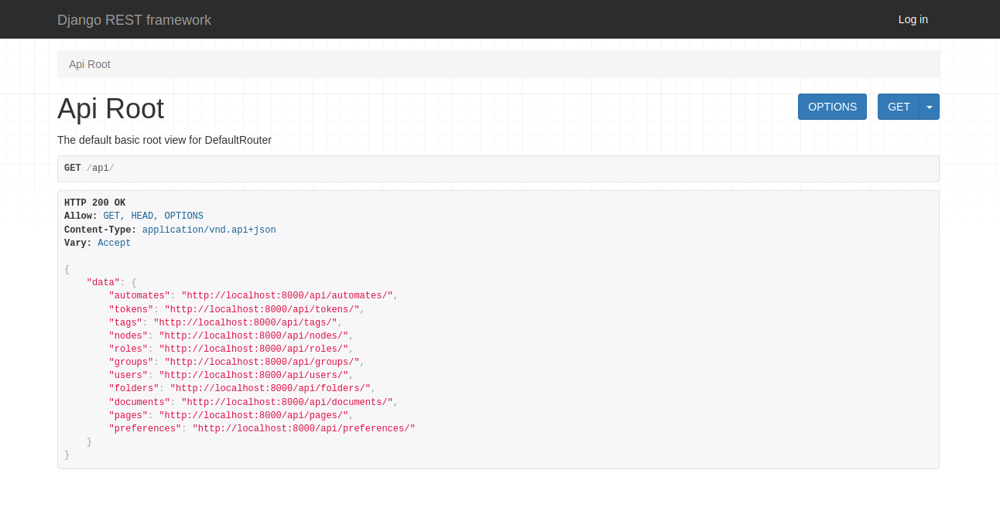
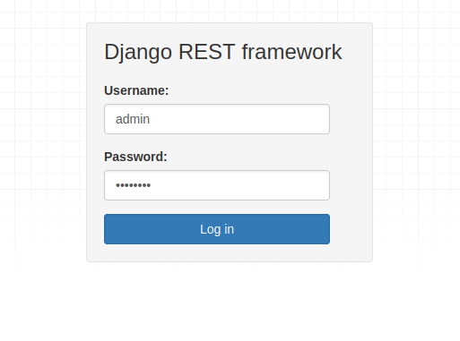
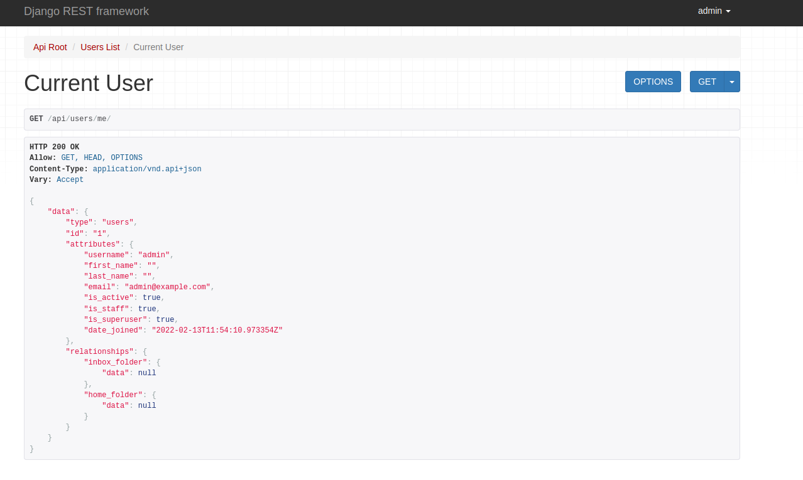

.. _docker_compose:

Docker Compose
****************

In this section you will find instructions on how to setup Papermerge and
related services using `docker compose`_.

There are many different setups possible, for example you may want to run
only REST API backend with PostgreSQL database. Another, possibility would be to start a REST API backend, workers, frontend, websockets server with PostgreSQL database.

In following sections most common setups are described. Each setup consists of two files - one yml file (compose file) and one `environment file`_ usually named ``.env``.

Make sure you have both `docker`_ and `docker compose`_ installed.

This guide was tested with docker version 20.10.6 and
docker-compose version 1.29.2.

Backend + Workers
------------------

This setup is focused on REST API backend and as such it does not start
frontend part. This setup is suitable mostly to play, expiriment and exlore
Papermerge REST API.

Save `this docker-compose.yml
<https://raw.githubusercontent.com/papermerge/papermerge-core/master/docker/prod-backend-only.yml>`_
file on your local computer.

Next, create ``.env`` file with following content:

.. code-block::

    APP_IMAGE=papermerge/papermerge
    APP_TAG=2.1.0-alpha2

    DB_USER=postgres
    DB_NAME=postgres
    DB_PASSWORD=postgres
    DB_HOST=db
    DB_PORT=5432

    REDIS_HOST=redis
    REDIS_PORT=6379

    ES_HOSTS=es
    ES_PORT=9200

    SECRET_KEY=12345abcdxyz

    SUPERUSER_USERNAME=admin
    SUPERUSER_EMAIL=admin@example.com
    SUPERUSER_PASSWORD=password

Start Papermerge using following docker compose command::

    docker-compose -f docker-compose.yml --env-file .env up

The above command will start following services:

* REST API backend
* Worker
* Redis
* PostgreSQL database
* Elastic search

For REST API backend and the worker docker-compose will use
``papermerge/papermerge:2.1.0-alpha2`` docker image.

Now base url for REST API is ``http://localhost:8000/api/``. You can open your
browser and point it to ``http://localhost:8000/api/`` or maybe use another
http client like for example `cUrl`_.

    Convinient browsable REST API

You can click on ``Log in`` located in upper right corder and enter credentials configured with ``SUPERUSER_USERNAME`` and ``SUPERUSER_PASSWORD`` options in ``.env`` file:

    Login view where you can authenticate using credentials from
    environment file

Once authenticated you will be able to experiment, play and explore with any REST API as described in `REST API documentation`_.

    Example of using browsable REST API to see the output of GET /users/me/ endpoint.

.. _docker: https://www.docker.com/
.. _docker compose: https://docs.docker.com/compose/
.. _environment file: https://docs.docker.com/compose/env-file/
.. _cUrl: https://en.wikipedia.org/wiki/CURL
.. _REST API documentation: https://docs.papermerge.io/REST%20API/index.html