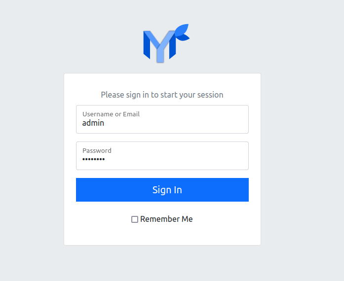

.. _docker_compose:

Docker Compose
==============

This section describes how to setup Papermerge and
related services using `docker compose`_.

There are many different setups possible, for example you may want to run only
REST API backend with PostgreSQL database. Another, possibility would be to
start a REST API backend, workers, frontend, websockets server with
PostgreSQL database.

In following sections most common setups are described. Each setup consists of
two files - one yml file (compose file) and one `environment file`_ usually
named ``.env``.

Make sure you have both `docker`_ and `docker compose`_ installed.

This guide was tested with docker version 20.10.6 and
docker-compose version 1.29.2.

Complete Stack
--------------

This setup installs complete Papermerge stack with all required services. It uses `traefik`_ as edge router.

Save `this docker-compose.yml
<https://raw.githubusercontent.com/papermerge/papermerge-core/master/docker/docker-compose.yml>`_
file on your local computer.

Next, create ``.env`` file with following content::

    APP_IMAGE=ghcr.io/papermerge/papermerge
    APP_TAG=2.1.0-alpha-latest
    PAPERMERGE_JS_IMAGE=ghcr.io/papermerge/papermerge.js
    PAPERMERGE_JS_TAG=2.1.0-alpha-latest

    DB_USER=postgres
    DB_NAME=postgres
    DB_PASSWORD=postgres
    DB_HOST=db
    DB_PORT=5432

    REDIS_HOST=redis
    REDIS_PORT=6379

    ES_HOSTS=es
    ES_PORT=9200

    SECRET_KEY=12345abcdxyz

    SUPERUSER_USERNAME=admin
    SUPERUSER_EMAIL=admin@example.com
    SUPERUSER_PASSWORD=admin

Add to your ``/etc/hosts`` following content::

    127.0.0.1       papermerge.local

Start Papermerge using following docker compose command::

    docker-compose -f docker-compose.yml --env-file .env up

You can access Papermerge user interface using a web browser like Firefox.
Open your web browser and point it to http://papermerge.local address:

    Sign in screen available at http://papermerge.local

Sign in using credentials configured with ``SUPERUSER_USERNAME`` and
``SUPERUSER_PASSWORD`` options in ``.env`` file.

.. figure:: ../img/setup/installation/docker/papermerge-example.png

    Papermerge frontend example

Docker compose started following services:

* REST API backend (available at http://papermege.local/api/)
* Worker
* Redis
* PostgreSQL database
* Elastic search
* Frontend (available at http://papermege.local/)
* Websocket server
* Traefik (available at http://localhost:8080)

Backend Only
------------

This stack installs only Papermerge REST API backend (without fancy user interface). This setup is suitable mostly to play, experiment and explore
Papermerge REST API.

Save `following docker-compose.yml
<https://raw.githubusercontent.com/papermerge/papermerge-core/master/docker/backend-only.yml>`_
file on your local computer.

Next, create ``.env`` file with following content:

.. code-block::

    APP_IMAGE=ghcr.io/papermerge/papermerge
    APP_TAG=2.1.0-alpha-latest

    DB_USER=postgres
    DB_NAME=postgres
    DB_PASSWORD=postgres
    DB_HOST=db
    DB_PORT=5432

    REDIS_HOST=redis
    REDIS_PORT=6379

    ES_HOSTS=es
    ES_PORT=9200

    SECRET_KEY=12345abcdxyz

    SUPERUSER_USERNAME=admin
    SUPERUSER_EMAIL=admin@example.com
    SUPERUSER_PASSWORD=password

Start Papermerge using following docker compose command::

    docker-compose -f docker-compose.yml --env-file .env up

The above command will start following services:

* REST API backend
* Worker
* Redis
* PostgreSQL database
* Elastic search

For REST API backend and the worker docker-compose will use
``ghcr.io/papermerge/papermerge:2.1.0-alpha-latest`` docker image.

Now base url for REST API is ``http://localhost:8000/api/``.

External Services
------------------

Papermerge requires three external services:

* database
* redis
* elasticsearch

If you want to play with Papermerge outside of docker compose and you don't
want bother about database/redis/elasticsearch services - you can use
following compose file to quickly setup these external services::

    version: '3.7'
    services:
      db:
        image: postgres:13
        volumes:
          - postgres_data2:/var/lib/postgresql/data/
        environment:
          - POSTGRES_USER=${DB_USER}
          - POSTGRES_DB=${DB_NAME}
          - POSTGRES_PASSWORD=${DB_PASSWORD}
        ports:
          - 5432:5432
      redis:
        image: redis:6
        ports:
          - 6379:6379
        volumes:
          - redisdata:/data
      es:
        image: docker.elastic.co/elasticsearch/elasticsearch:7.16.2
        environment:
          - discovery.type=single-node
          - "ES_JAVA_OPTS=-Xms512m -Xmx512m"
        ports:
          - 9200:9200
          - 9300:9300
    volumes:
      postgres_data2:
      redisdata:

    networks:
      my_local:
        driver: host

Note ``networks`` uses ``driver: host``, this will start services in same host
as you local computer.

``.env`` file content::

    DB_USER=postgres
    DB_NAME=postgres
    DB_PASSWORD=postgres

Following command will start docker services in same network as host::

    docker-compose -f services.yml --env-file .env up

Docker compose file will start following services in same host as you computer:

* PostgreSQL
* Redis
* Elasticsearch

At this point if you start let's say a development version of Papermerge, you
can use ``localhost:6379`` to connect to redis or ``localhost:9300`` use
elasticsearch.

.. _docker: https://www.docker.com/
.. _docker compose: https://docs.docker.com/compose/
.. _environment file: https://docs.docker.com/compose/env-file/
.. _cUrl: https://en.wikipedia.org/wiki/CURL
.. _traefik: https://doc.traefik.io/traefik/
