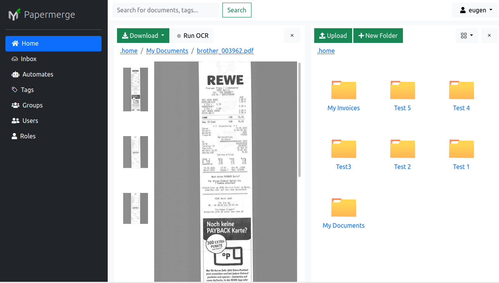

Overview
==========

Papermerge is a distributed system with many moving parts. "Distributed
system" - means that different components (parts) may run on different
computers. While this increases the complexity of the system, it also brings
many benefits like scalability, flexibility and ease of maintenance.

Components
************

Papermerge consists of the following components:

* RESTful backend server
* Worker (there may be one or multiple workers)
* Frontend (optional)
* Websockets server (optional).

The essential parts of Papermerge deployment are RESTful backend server and
one or multiple workers. The frontend and websockets server are optional.
They provide so called *official graphical user interface of Papermerge*. If
you don't plan to use Papermerge via web GUI, you can safely skip frontend
and websockets parts.

RESTful Backend Server
------------------------

or REST API backend server (backend server for short) this is the main
piece, the heart of the system so to speak. It is the web application
which serves REST API. A typical deployment will have one backend server.

.. note:: REST API Backend has its own, separate  `RESTful Backend GitHub repository`_.

Worker
--------

This part performs "laborious tasks" like for example OCR of the documents.

In order to understand why worker is required at all, a little more background
is necessary: the typical web server consists of a series of requests and
responses. A well behaved web server for each request it will send a response
in less than 100 milliseconds. However, the OCR processing of a single page
of the document can easily take several seconds, maybe minutes or even hours
(!). This is why OCR processing, relative to typical request/response cycle
of the web server, is considered a "laborious task". And this is why OCR
processing must run in a separate component, outside of web server's
request/response cycles.

In a typical Papermerge deployment **there can be many workers**. Number of
workers depends on the number of incoming documents and how quick you want to
process all of them.

.. note:: For best results each worker should run on a separate computer. In
   case of docker based deployment - each worker should run in separate
   docker container.

.. note:: From source code point of view, worker and REST API web server use
  same codebase. REST API backend server communicates with workers via `Celery`_/`Redis`_.

Frontend
----------

Generally speaking you don't need graphical user interface to successfully use
Papermerge. However, it is always awesome to have a nice UI (user interface).
This is what *frontend* part is all about - it is the official user interface
of Papermerge.

In order to accomplish its job, frontend uses backend's REST API - in this
regard, frontend is an http client which consumes backend's REST API. Almost
any feature of the frontend can be replicated with any http client via REST
API.

.. note:: Some of the features of the frontend are tricky to do with REST API
   only, this is because some parts of the frontend, like for example
   reporting in real time the status of OCR processing, use websockets.

.. note:: Frontend is a standalone (means separate) part and as such it has
   separate `Frontend GitHub repository`_.

.. _RESTful Backend GitHub repository: https://github.com/papermerge/papermerge-core
.. _Celery: https://docs.celeryproject.org/en/stable/index.html
.. _Redis: https://redis.io
.. _Frontend GitHub repository: https://github.com/papermerge/papermerge.js

Websockets Server
------------------

This component is used to get real time status of OCR processing and it
strongly coupled with frontend part. In general if you don't plan to use
frontend, you don't need to deploy websockets server neither.

Installation Options
**********************

You can go multiple routes to setup and run Papermerge:

* Use the docker compose
* Kubernetes
* Bare metal installation

Docker Compose
---------------

Docker is a widespread containerization technology. With docker you can start
in almost no time pretty complex configuration setups. Docker ships with
docker-compose which helps you to easily configure and start all services
(like database, redis and elastic search for example) required to operate
Papermerge.

For more details read :ref:`docker_compose` section.

Kubernetes
-----------

TODO...

Bare Metal Installation
------------------------

This method is suitable if you plan to learn all ins and outs of Papermerge.
In particular it is for developers. There are two major parts of Papermerge development:

* backend development
* frontend development

For the backend part is you need to be familiar with Python/Django/Celery
ecosystem. For the frontend part familiarity with JavaScript/Nodejs/EmberJS is
necessary.

For more details read :ref:`bare_metal_installation` section.