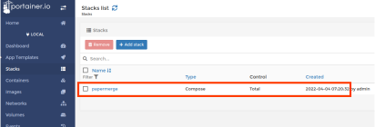
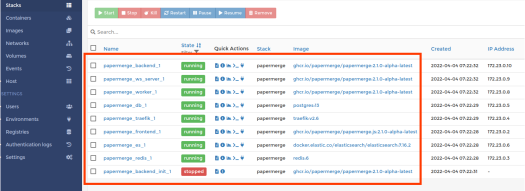

.. _install_with_portainer:

Portainer
=========

This section describes how to setup Papermerge using `Portainer`_.

Step 1 - Update /etc/hosts file
--------------------------------

Add to your ``/etc/hosts`` following content::

  127.0.0.1       papermerge.local

Step 2 - Add Stack
-------------------

Click on 'Add stack' as illustrated in picture below:

.. figure:: ../img/setup/installation/portainer/step-2.svg

.. _Portainer: https://portainer.io

Step 3 - Fill in repository details
-----------------------------------

Fill in *Name* field (e.g. papermerge), select ``git Repository`` for *Build method*. Set following values for *Repository URL* and *Compose path*:

1. Repository URL with ``https://github.com/papermerge/papermerge-core``
2. Compose path: ``docker/docker-compose.yml``

.. figure:: ../img/setup/installation/portainer/step-3.svg

Step 4 - Add environment variables
-----------------------------------

In environment variables section can either:

1. insert variables one by one (simple mode)
2. paste all variables as one single text file (advanced mode)

.. warning::

  Currently docker tag ``latest`` points to latest 2.1.0a<N> version
  which is not yet production ready.

.. note::

  See all available docker tags in `GitHub packages <https://github.com/orgs/papermerge/packages>`_

For this guide we use option 2.
Paste following text in environment variables section::

  APP_IMAGE=papermerge/papermerge
  APP_TAG=latest
  PAPERMERGE_JS_IMAGE=papermerge/papermerge.js
  PAPERMERGE_JS_TAG=latest

  USE_HOSTNAME=papermerge.local

  DB_USER=postgres
  DB_NAME=postgres
  DB_PASSWORD=postgres
  DB_HOST=db
  DB_PORT=5432

  REDIS_HOST=redis
  REDIS_PORT=6379

  ES_HOSTS=es
  ES_PORT=9200

  SECRET_KEY=alsdkalsdjlaksdj90823423!KLKJLkjkjlkjlKLPOgrwqna

  SUPERUSER_USERNAME=admin
  SUPERUSER_EMAIL=admin@mail.com
  SUPERUSER_PASSWORD=admin

.. figure:: ../img/setup/installation/portainer/step-4.svg

``APP_IMAGE``
is docker image for Papermerge REST API backend

``APP_TAG``
is Papermerge REST API backend docker image version. As of writing this documentation Papermerge latest version 2.1 is in early alpha version. To
see if there are newer version check `papermerge package`_ on github.

``PAPERMERGE_JS``
is docker image for Papermerge frontend i.e. fancy user
interface (written in javascript)

``PAPERMERGE_JS_TAG``
is Papermerge frontend docker image version. As of writing this documentation Papermerge latest version 2.1 is in early alpha version. To
see if there are newer version check `papermerge js package`_ on github.

``ES_HOSTS`` and ``ES_PORT``
are hosts and port for elasticsearch service

``SECRET_KEY`` A secret text for a particular Papermerge installation. This is
used to provide cryptographic signing, and should be set to a unique,
unpredictable value

.. note:: Papermerge docker images are published on `Github's Package section
   for Papermerge <https://github.com/orgs/papermerge/packages>`_

Step 5 - Deploy the stack
-------------------------

Click on 'Deploy the stack' button at the very bottom of the screen:

.. figure:: ../img/setup/installation/portainer/step-5.svg

Now you can see Papermerge stack in the list and if you click you will see all Papermerge services running:

  Papermerge stack as seen in stack list

  Papermerge services up and running

Now you can access your Papermerge instance by opening your web browser and
pointing it to address ``http://papermerge.local``:

.. figure:: ../img/papermerge-login.png

    Sign in screen available at http://papermerge.local

Sign in using following credentials:

* username: admin
* password: admin

.. note:: username/password were provided by variables ``SUPERUSER_USERNAME``
   and ``SUPERUSER_PASSWORD`` respectively.

Enjoy!

.. _papermerge package: https://github.com/orgs/papermerge/packages/container/package/papermerge
.. _papermerge js package: https://github.com/orgs/papermerge/packages/container/package/papermerge.js