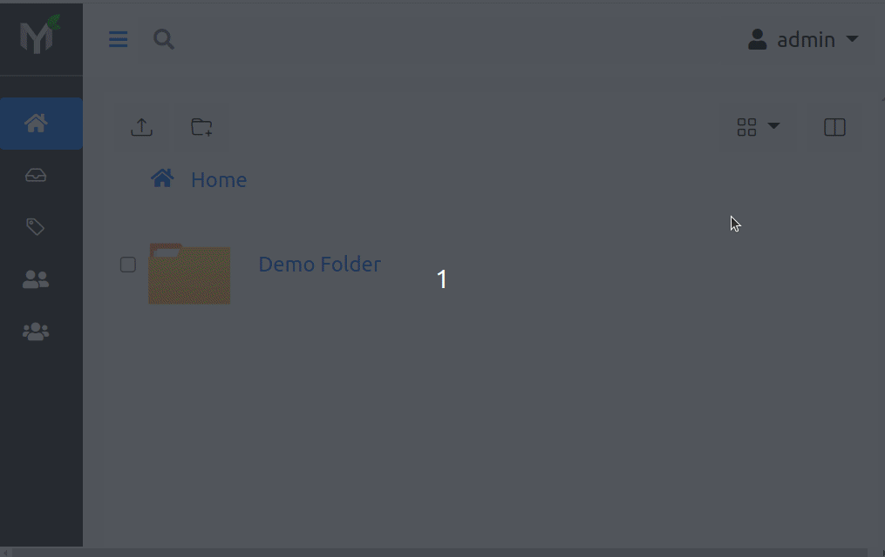
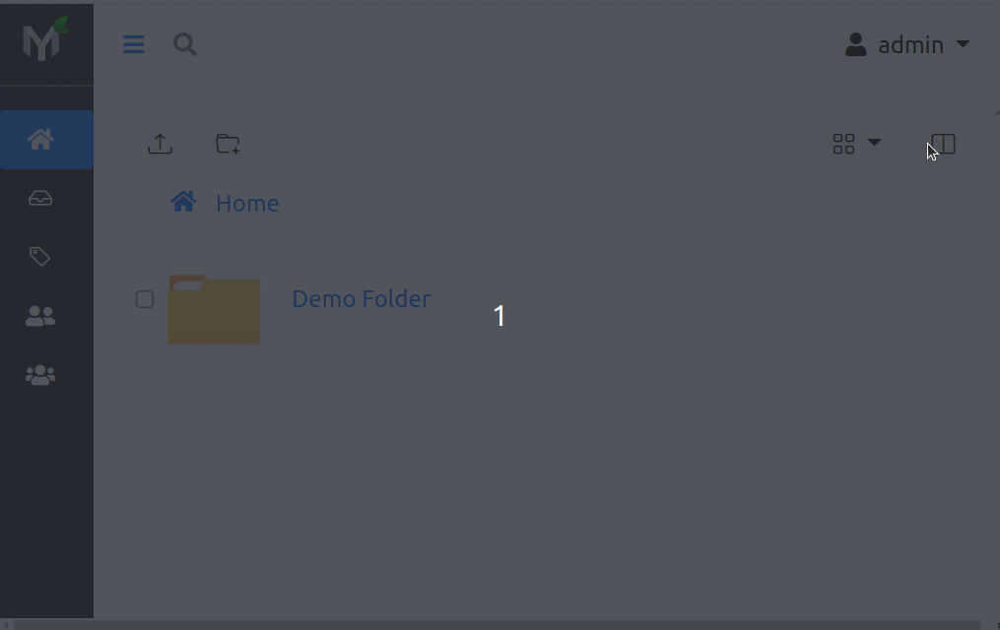

.. _rest_api_reference:

Reference
=========

Papermerge REST API is exposed via `Open API`_ standard, which means that
there is one `openapi-schema.yml`_ file that can be rendered by various 3rd
party visualizers. `openapi-schema.yml`_ file is generated directly from
application code and thus (at the time of generation) it matches actual
implementation.

|project| ships with two "REST API visualizers" - redoc and swagger ui. Both
of these "visualizers" read from same openapi schema file and thus convey same
information - just formatted differently.

Online vs Own Instance Reference
--------------------------------

As you will see, there are two ways of accessing REST API reference - one is
from your own instance and another from online documentation website.
Accessing REST API reference from your own |project| instance's **guarantees
that the reference will match implementation**, because in this case REST API
reference is generated on the fly!

On the other hand, online version of the REST API (i.e. `redoc ui`_ and
`swagger ui`_) reference uses `openapi-schema.yml`_ file generated beforehand
which means that it may slightly differ from your own |project| instance.
Online REST API reference is there only for convenience.

.. _redoc:

Redoc
-----

Papermerge REST API online reference is available via `redoc ui`_.

Same reference can be accessed from your own |project| instance using
following URL::

    <server-url>/api/schema/redoc/

In case when you run |project| locally using default REST API server port
use http://localhost:8000/api/schema/redoc/.

Also, when you run your own instance of |project| you can access
redoc based REST API reference from user menu:

.. _swagger:

Swagger UI
----------

Papermerge REST API online reference is available via `swagger ui`_.

Same reference can be accessed from your own |project| instance using
following URL::

    <server-url>/api/schema/swagger-ui/

In case when you run |project| locally using default REST API server port
use http://localhost:8000/api/schema/swagger-ui/.

Also, when you run your own instance of |project| you can access
swagger based REST API reference from user menu:

.. _swagger ui: https://docs.papermerge.io/swagger-ui/
.. _redoc ui: https://docs.papermerge.io/redoc/
.. _Open API: https://www.openapis.org/
.. _openapi-schema.yml: https://github.com/papermerge/papermerge-core/blob/master/docker/openapi-schema.yml