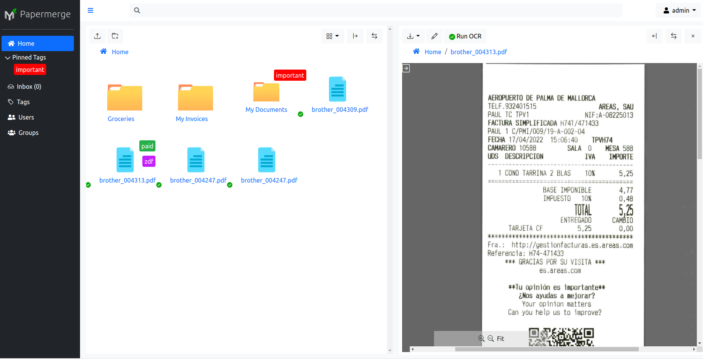

User's Manual
=============

|project| is designed to be very intuitive. Because its user interface
resembles a typical desktop file browser, you will be able to use |project|
for basic document management tasks with minimal training. However, don't be
mislead by easy to use interface, underneath simplicity, there is a powerful
tool which will bring your paperwork to the new level. |project| is a full
fledged document management system, not just a file browser, and to use it
efficiently you need to understand few high-level concepts.

   |project| screenshot

This user manual starts by introducing you to general document management
concepts and some concepts specific to |project|. Subsequent sections will detail
on each of the topic.

We highly recommend you to read at least :ref:`getting_started` section. As
you use |project| more and more, get back at each separate topic section for more
detailed information.

.. toctree::
   :maxdepth: 4

   getting_started
   user_interface
   upload_documents
   tags_and_folders
   page_management
   versions
   ocr
   file_formats
