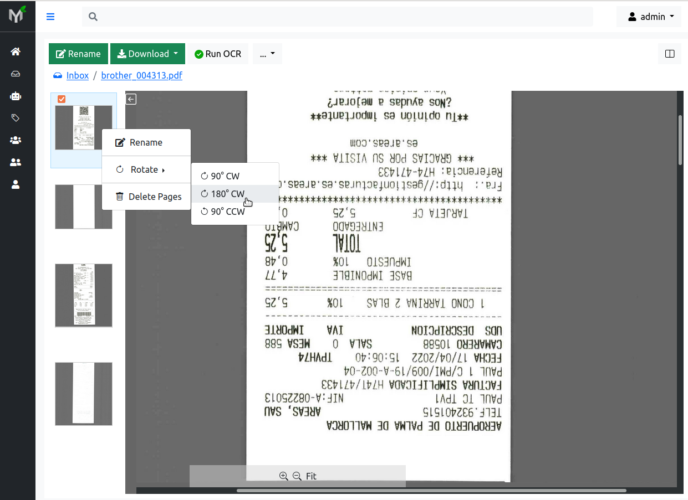

.. _page_management:

Page Management
===============

Many times scanning documents in bulk results in documents with blank pages;
some pages maybe out of order or maybe part of totally different document (:ref:`strayed pages <strayed_page>`).
Even if you notice these flaws immediately it is time consuming and
frustrating to redo scanning process.
Wouldn't it be nice to fix out of order pages withing rescanning?

Page management is set of features which helps to fix scanning process errors.
In other words you can delete, reorder, rotate, and extract pages within
document(s).

Every time one of the operations described in this section is applied - a new
document version with that specific change in effect is created. Because of
this document versioning system changes you apply on the document i.e rotate,
delete, extract, reorder do not destroy the document in any shape of form in other
words **page management is non-destructive for the document**.

.. note::

    In order perform any of operations described below (delete, reorder,
    rotate or extract) you need to have **Change Permission** on respective
    document. You have automatically granted **Change Permission** on the
    documents you uploaded (because you own the documents uploaded by you).

Delete
------

You can delete specific pages (for instance blank pages) from the document.
Although many scanners have automatic "remove blank pages" feature, many
times they get confused of what a blank page is. In case your scans end up
with undesired blank pages you can easily remove those pages.

.. figure:: ../img/user-manual/page-management/delete-page.png

    Delete page

In order to delete a page, you need to select desired page by clicking on it,
then :menuselection:`Right Click--> Delete Page`.

Every time you delete one or several pages, document version is incremented by
one. For instance if document Invoice-X56.pdf currently has four pages and
the document latest version is version 1, then, after deleting one page -
document latest version will be 2. Thus document's version 1 has all four
pages and document version 2 has three pages:

.. figure:: ../img/user-manual/page-management/delete-page-versioning.svg

    Delete operation creates new document version. Actual deleted page (marked with red in illustration) remains intact in version 1. Document version 2 does not contain
    page marked with red.

Reorder
-------

Out of order pages occur very often during scanning process. Papermerge
empowers users to change pages order within the document.

For instance, in figure below you can see that pages 2 and 4 are out of place.
To correct pages' order use drag 'n drop. For example grab page 2 and drop it
in correct position, and then do same thing with page 3:

    Change order of the document pages

For these changes to take effect you need to click 'Apply Changes' button.

.. warning::

    Document pages reorder will only be saved when you click 'Apply Changes'

.. figure:: ../img/user-manual/page-management/apply-changes-button.svg

    Save new pages order

Similarly to deleting pages, every time you save new pages order, document
version will be incremented (i.e. advanced by one).

.. figure:: ../img/user-manual/page-management/order-page-versioning.svg

    Re-order pages operation creates new document version. Old page order
    stays preserved in version 1. Document version 2 has new page order in effect.

Rotate
------

Often scanned pages are upside down or maybe rotated 90° (degrees). In order to
quickly fix that, select one or multiple pages you want to rotate and then
:menuselection:`Right Click --> Rotate --> 180° CCW` (or 90°
CW, 90° CCW depending on your specific case):

    Rotate page 180° CCW (180 degrees counter-clockwise)

.. note::

    CW stand for *clockwise*. CCW stands for *counter-clockwise*.

Similarly to page deletion and page ordering, every time you rotate a page,
document version will be incremented (i.e. advanced by one).

.. warning:: **After page rotation you have to re-run OCR for the document**. It
   is because if page was upside down when ingested in Papermerge, the OCR
   operation won't make sense of it and thus won't be able to extract text
   (and then index) from that page. After you have manually fixed the page
   (by correctly rotating it) - OCR will be able to extract and index page's
   contented.

.. _page_move:

Move (Document to Document)
---------------------------

You can move one, multiple or even all :ref:`strayed pages <strayed_page>` from one document (source) to another (target). If you choose to move all documents from
the source - the source will be deleted, because it does not make sense
to have "document with zero pages".

When moving pages between documents you will be prompted to choose between two different
move strategies:

1. Replace target
2. Append to target

The outcome between replace vs append strategies is illustrated below:

.. figure:: ./page_management/move_replace.svg

    Moving pages between documents with "replace target" strategy

.. figure:: ./page_management/move_append.svg

    Moving pages between documents with "append target" strategy

The difference is outcome of the B.pdf (target). With replace strategy, the
document B.pdf ended up having two pages (which replaced previous ones),
while with append strategy the document B.pdf ended up with four pages as
source pages were appened to the existing ones.

.. note:: What happens if you select **all source pages**, i.e. when you
   select A1, B1, B2, A2? In such case - source document (A.pdf) will be
   deleted, because it does not make any sense to have a document with zero
   pages. For the target document (B.pdf) this case does not make any
   difference, as the outcome is always the same.

.. note:: Use case when you select all pages and chose "replace strategy"
    has same outcome as :ref:`Merging Documents <document_merge_figure_1>`.

Now, that theory is clear, let's move on to the practical part and see |project| in action.
First of all, note that in |project| you can move pages between documents either
using context menu or by using drag 'n drop.

.. tip:: You can also move pages between documents by using :ref:`REST API<rest_api>`

Context Menu
~~~~~~~~~~~~

Drag 'n Drop
~~~~~~~~~~~~

In example illustrated in pictures below there are two documents:

* document A - with pages marked as A1, A2, B1, A3
* document B - with pages B2, B3

During scan page B1 wrongly ended up in document A, although it belongs to document B.

.. note:: A page that during the scan ended up in wrong document is called *strayed page*.
    In example above, page B1 is strayed page.

In order to fix this scanning issue, you need open documents in two panels and
then drag 'n drop page B1 from document A (source) to document B (target):

.. figure:: ../img/user-manual/page-management/move-pages-demo.gif

    Move strayed page B1 from document A to document B

.. note:: Pages are moved immediately after 'mouse drop' i.e. there
    is no need to 'click apply button' as in re-order operation

.. note:: Both documents' (source and target) version will be incremented
    by one

.. _page_extract:

Extract (Document to Folder)
----------------------------

Page extraction is moving page out of the document as completely new document.
It differs from :ref:`page moving <page_move>` because the destination is a
folder, not another document.

You can extract one or multiple pages at once. Pages can be
extracted:

1. as one document; in this case one document will be created in the target folder, new document will contain all extracted pages
2. as multiple documents; in this case multiple documents will be created in the target folder, each new document will have one page

Context Menu
~~~~~~~~~~~~

Drag 'n Drop
~~~~~~~~~~~~

Let's show how page extraction works by example. Say we have one document -
document A - with following pages: A1, A2, B1, B2, A3. What we want to do is
to extract pages B1 and B2 into a new document. As mentioned above there are two
cases:

1. Both pages B1 and B2 are extracted into one single new document (two page document)
2. Both pages B1 and B2 are extracted into multiple (new) single page documents.

.. figure:: ../img/user-manual/page-management/extract-pages-as-multi-doc-demo.gif

    Extract pages B1 and B2 as multiple new documents (each new document has one page)

In order to extract pages B1 and B2 into one single new document you need to uncheck
'Extract each page into separate document' checkbox in modal dialog:

    Extract pages B1 and B2 as (one single) new document

Similarly to other operations document A's (source document) version is
incremented by one.

OCR Data
--------

Do you need re-run OCR after document's page was moved/rotated/extracted/deleted ?

In short - no, you don't need to re-run OCR. The only exception is page
rotation. Every time you rotate a page in the document, you need to re-run
OCR for that document. It actually makes sense, because if page was upside
down when document was ingested, the OCR operation won't make much sense of
it and thus won't be able to extract any text data from the page. Once you
correct that part manually (rotate page), you re-run OCR so that correct text
will be extracted and then indexed.

.. note::

    Generally speaking you don't need to re-run OCR after performing
    page management operations. The only exception from this rule
    is page rotation.

For longer answer, let's clarify first what *OCR data* is. OCR data is: text
information extracted from the document by OCR and associated with that
document. That text information is stored in both database and on
filesystem.

When one page is moved from one document into another (or when page is
deleted), the text associated with source (or target) document changes as
well. For example, say document fruits.pdf has three pages: apples, oranges
and bananas, i.e each page has only one word page 1 has work apples etc. You
can find document fruits.pdf by searching 'apples' (will match first
page), 'orages' (will match second page) or bananas (will match last page).

After you extract first page (apples) from document fruits.pdf into another
document, searching by term 'apples' should not reveal
document 'fruits.pdf' - because term/page 'apples' is not part of it anymore.

In order to keep text information associated with document fruits.pdf up to
date, there are at least two possibilities:

1. re-run OCR after each extract/delete/move/rotate operation
2. re-use existing OCR and move it/delete it according to the operation

From technical point of view 1. is very easy to implement but very inefficient
in terms of computing power. Think that you have 100 pages document and you
delete one blank page - what a waste of CPU resources to re-OCR entire
document when OCR data is already available!

The second possibility (point 2.) is very challenging to implement, but
extremely efficient - you need to run OCR on the document only once
(maybe twice, in case you decide to fix couple of pages by rotating them).

Papermerge decided on 2. in other words, Papermerge reuses already extracted
OCR data and updates it accordingly every time you re-order/move/extract/delete pages.

The result is that whatever page management operation you perform the search
results are always up-to-date without the need to re-OCR the document!
As mentioned above the only exception are page rotations.

Below is illustrated the case of three page fruits.pdf document with
apples/oranges/bananas content. Initially search term 'apples' will reveal
fruits.pdf document (from Inbox). After 'apples' page was extracted into
separate document (found in Home/My Documents folder) search term 'apples'
correctly reveals new document! Notice here that search index is updated
instantaneously:

.. figure:: ../img/user-manual/page-management/ocr-data-up-to-date.gif

    Behind the scene, Papermerge reuses OCR data of the document. This approach results in instantaneous search index updates.
