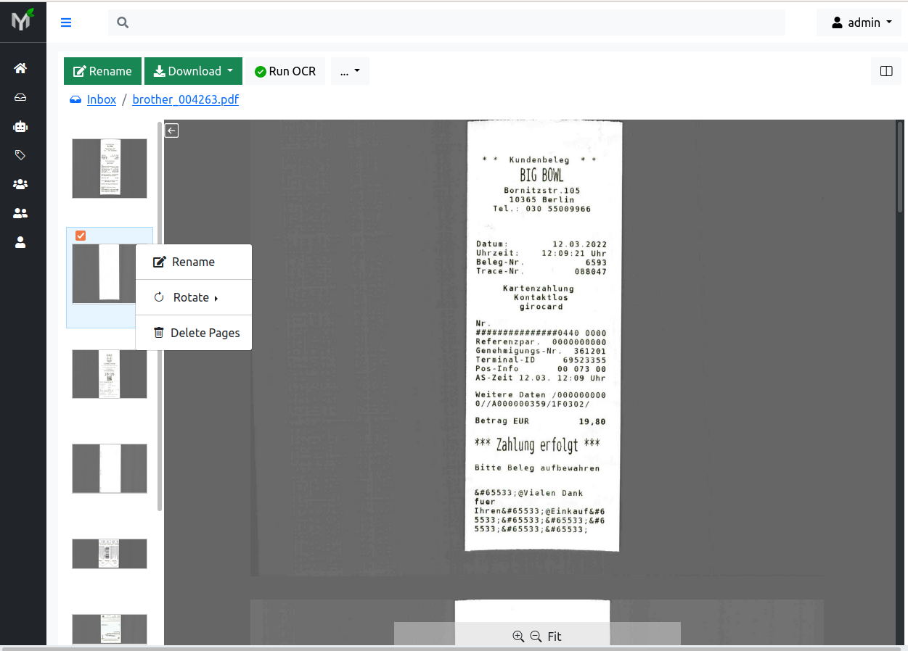

.. _page_management:

Page Management
===============

Many times scanning documents in bulk results in documents with blank pages;
some pages maybe out of order or maybe part of totally different document.
Even if you notice these flaws immediately it is time consuming and
frustrating to redo scanning process.
Wouldn't it be nice to fix out of order pages withing rescanning?

Page management is set of features which helps to fix scanning process errors.
In other words you can delete, reorder, rotate, and extract pages within
document(s).

Every time one of the operations described in this section is applied - a new
document version with that specific change in effect is created. Because of
this document versioning system changes you apply on the document i.e rotate,
delete, extract, reorder do not destroy the document in any shape of form in other
words **page management is non-destructive for the document**.

.. note::

    In order perform any of operations described below (delete, reorder,
    rotate or extract) you need to have **Change Permission** on respective
    document. You have automatically granted **Change Permission** on the
    documents you uploaded (because you own the documents uploaded by you).

Delete
------

You can delete specific pages (for instance blank pages) from the document.
Although many scanners have automatic "remove blank pages" feature, many
times they get confused of what a blank page is. In case your scans end up
with undesired blank pages you can easily remove those pages.

    Delete page

In order to delete a page, you need to select desired page by clicking on it,
then :menuselection:`Right Click--> Delete Page`.

Every time you delete one or several pages, document version is incremented by
one. For instance if document Invoice-X56.pdf currently has four pages and
the document latest version is version 1, then, after deleting one page -
document latest version will be 2. Thus document's version 1 has all four
pages and document version 2 has three pages:

    Delete operation creates new document version. Actual deleted page (marked with red in illustration) remains intact in version 1. Document version 2 does not contain
    page marked with red.

Reorder
-------

Out of order pages occur very often during scanning process. Papermerge
empowers users to change pages order within the document.

For instance, in figure below you can see that pages 2 and 4 are out of place.
To correct pages' order use drag 'n drop. For example grab page 2 and drop it
in correct position, and then do same thing with page 3:

.. figure:: ../img/user-manual/page-management/page-ordering-demo.gif

    Change order of the document pages

For these changes to take effect you need to click 'Apply Changes' button.

.. warning::

    Document pages reorder will only be saved when you click 'Apply Changes'

    Save new pages order

Similarly to deleting pages, every time you save new pages order, document
version will be incremented (i.e. advanced by one).

    Re-order pages operation creates new document version. Old page order
    stays preserved in version 1. Document version 2 has new page order in effect.

Rotate
------

Often scanned pages are upside down or maybe rotated 90° (degrees). In order to
quickly fix that, select one or multiple pages you want to rotate and then
:menuselection:`Right Click --> Rotate --> 180° CCW` (or 90°
CW, 90° CCW depending on your specific case):

.. figure:: ../img/user-manual/page-management/rotate-page.png

    Rotate page 180° CCW (180 degrees counter-clockwise)

.. note::

    CW stand for *clockwise*. CCW stands for *counter-clockwise*.

Similarly to page deletion and page ordering, every time you rotate a page,
document version will be incremented (i.e. advanced by one).

Extract
-------

You can move document pages from one document to another. Also you can
extract pages into completely new document.

In example illustrated in pictures below there are two documents:

* document A - with pages marked as A1, A2, B1, A3
* document B - with pages B2, B3

During scan page B1 wrongly ended up in document A, although it belongs to document B.

In order to fix this scanning issue, you need to cut page from document A as illustrated in figure below.

.. figure:: ../img/user-manual/page-management/cut-page-from-document-A-v2.png

    Cut misplaced page, marked in picture with B1, from document A

Then, open document B and :menuselection:`Right Click--> Paste`

.. figure:: ../img/user-manual/page-management/paste-in-document-B-v2.png

    Paste page B1, from document A to document B

.. note::

    In order to see results you will need to click refresh button of your web browser

.. figure:: ../img/user-manual/page-management/pasted-page.png

    Result. Document B now contains all its 3 pages: B1, B2, B3

After browser refresh you will see that document has all 3 pages B1, B2, B3.
Document A on the other contains now only correct pages: A1, A2 and A3.
