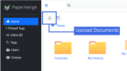

Upload Documents
================

|project| is used to store documents. Documents can originate from any source
i.e. you can upload documents from your local hard drive, from remote email
account, S3 object storage etc.

Actually |project| does not care where documents are coming from. All |project| does,
it exposes a REST API for :ref:`ingesting documents <ingesting_documents>`. Thus, from application
point of view, the is one and only point of ingesting documents - it is the REST API.

From user's point of view though, there are two ways to upload documents:

- User Interface
- REST API

User Interface
--------------

Uploading documents via user interface is straightforward:

.. note:: Actually "user interface" is yet another REST API client, in other
    words, "user interface" is a separate application, also called frontend
    application, which uses REST API for uploading documents. If you are curious
    for more details have a look at `papermerge.js`_ which is repository of the
    frontend application.

REST API
--------

|project| exposes a well defined HTTP interface with HTTP body (payload) being in
json format. This means that you can use any http client (e.g. `curl`_) to interact with
|project| e.g. upload documents, create folders, assign tags, move documents to specific
folder, trigger OCR.

For detailed REST API overview see :ref:`REST API <rest_api>`.
For detailed reference see :ref:`REST API Reference <rest_api_reference>`.  

In particular :ref:`rest_api_overview_nodes_folders_documents`
section explains how to use REST API to upload documents (also it goes into details of all necessary concepts like nodes, special folders etc).

.. _papermerge.js: https://github.com/papermerge/papermerge.js
.. _curl: https://en.wikipedia.org/wiki/CURL
