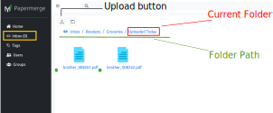

Upload Documents
================

There are different ways to upload documents to |project|: via web
user interface, like upload button, drag'n drop, or via command line
utilities like papermerge-cli. All methods have one thing in common: they use
REST API to perfrom the actual upload. In this sense all applications which
upload documents, even web user interface's described in this manual,
act as REST API clients:

.. figure:: ./upload_documents/rest-api-clients.svg

.. note:: REST API Server is web application. As any web application it is
   accessible with an url prefixed with http or https scheme e.g.
   https://my-example-dms.com, https://my-papermerge.local, http://localhost:8000/

.. note:: A fancy English word for "uploading" is *ingesting* i.e. "ingest
   documents to |project|" is same as "upload documents to |project|".

All documents are organized in folders. Each user has two special folders -
`Inbox` and `Home`. `Inbox` and `Home` folders are special in sense that they
are always there they cannot be renamed or deleted. Actually, whenever a new
user is added into the |project| the two special folders `Inbox` and `Home`
are automatically created for him/her.

.. note:: Internally the two special folders are named ``.home`` and ``.inbox`` -
    title starts with a dot and has only lowercase characters.

Upload Button
--------------

Uploading documents via user interface is the most straightforward method, just click
"upload" button:

.. figure:: ./user_interface/upload-documents.svg

Note that documents will be uploaded into your current folder. Current folder is
considered the one which you currently see as opened in web UI - that may be
Inbox folder, Home folder or any arbitrarily deeply nested folder inside Home
or Inbox.

.. figure:: ./upload_documents/deeply-nested-inside-home.svg

    Uploading documents into deeply nested folder inside Home

Again, using upload button, you can upload documents into randomly
deeply nested folder inside Inbox as well:

    Uploading documents into deeply nested folder inside Inbox

Drag'n Drop
-----------

This method is very similar to the above described method, the only difference
is that instead of clicking upload button - you drag'n drop documents, using
mouse, from your desktop to |project| web ui in your browser.

Command Line
------------

You can upload documents from your any local folder using :ref:`papermerge_cli` command
line utility::

    $ papermerge-cli import /path/to/local/folder/

Note that ``papermerge-cli`` will import all content of /path/to/local/folder/ directory
recursively i.e. it will preserve the structure of local folder in |project| as well.

You can upload one single document by providing path to the document::

    $ papermerge-cli import /path/to/document.pdf

.. note::
    By default all imported documents and folders will end up inside user's Inbox folder.

For more information about ``papermerge-cli`` check :ref:`papermerge_cli` section.

REST API
--------

For more information on how to use |project| via generic REST API clients e.g. curl
see :ref:`REST API <rest_api>`_ section.
